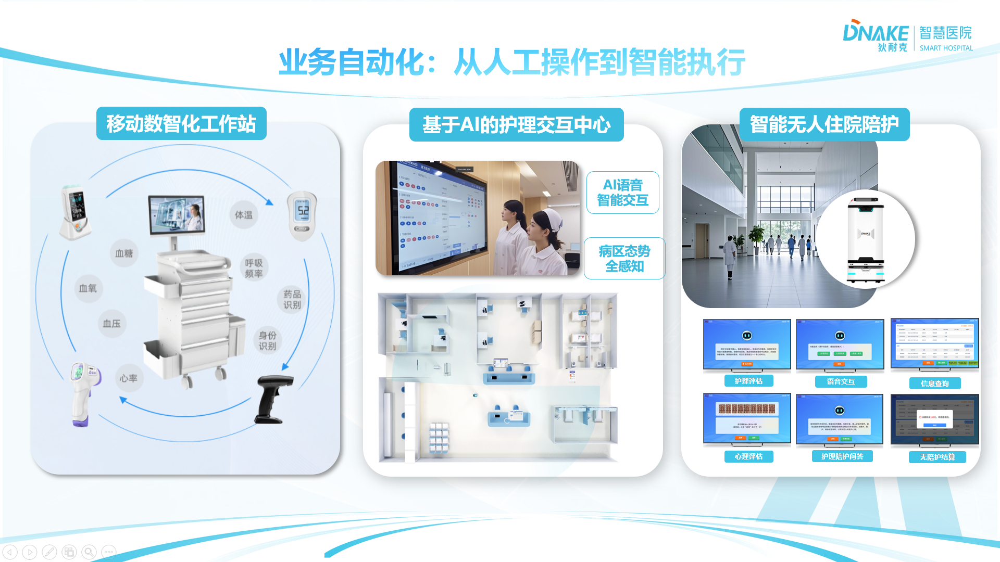
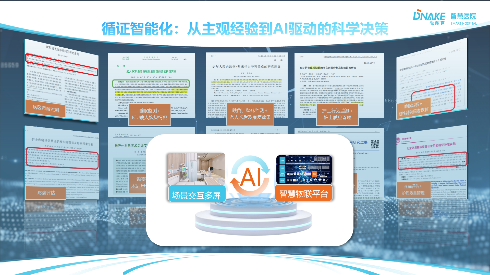
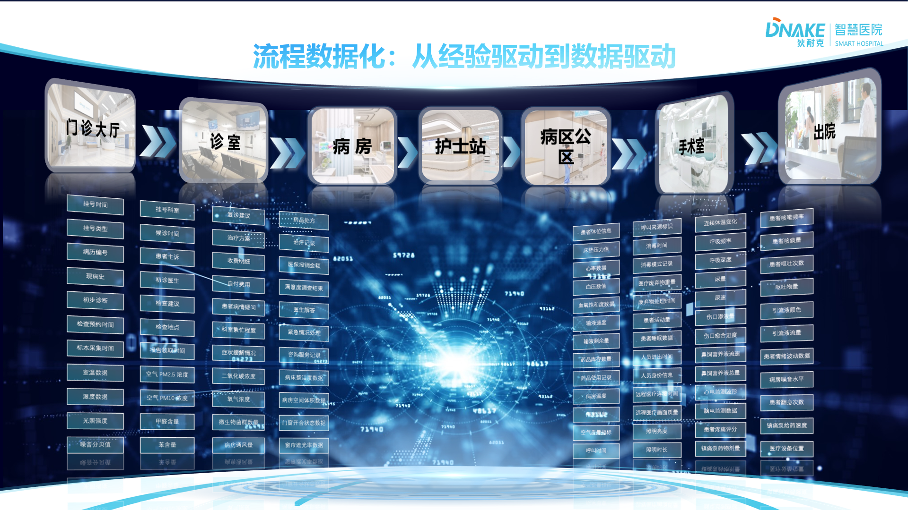
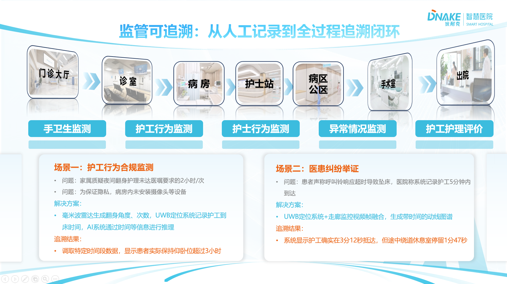
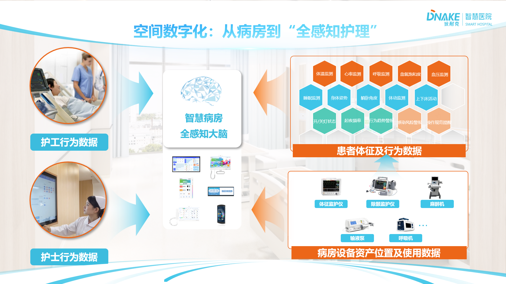

##  物联网+AI

### 业务自动化：从手工操作到智能执行
狄耐克智慧病房解决方案通过智能化手段实现业务自动化，显著提升医院运营效率：

1. **智能呼叫系统**：自动识别患者需求等级，智能分配护理资源，减少50%无效往返；
2. **移动护理工作站**：床旁完成医嘱执行、护理记录，避免重复往返护士站；
3. **智能配送系统**：轮式机器人实现药品、标本精准配送，减少护士跑腿时间；
4. **智能排班系统**：基于工作量自动优化人力资源配置，提升20%工作效率；
5. **物资管理系统**：智能药柜+机器人联动，实现药品自动盘点补货；
6. **床位调配系统**：实时监控床位使用情况，提高周转率15%；
7. **护理任务提醒**：智能交互大屏实时推送护理任务，确保工作无遗漏；
8. **设备管理系统**：基于RFID+蓝牙的医疗设备定位，实现设备全生命周期管理。

通过业务自动化，让医护人员从繁琐的日常事务中解放出来，专注于专业医疗服务，提升医院整体运营效率和服务质量。

{width=80%}

### 循证智能化：从主观经验到AI驱动的科学决策
狄耐克智慧病房解决方案通过物联网技术和实时数据采集，为循证护理提供全方位的数据支撑，显著提升护理质量和过程管理：

1. **全时空数据采集**：
   - 通过智能床旁终端、可穿戴设备、环境传感器等物联网设备
   - 实现患者生命体征、护理操作、环境参数等数据的实时采集
   - 建立完整的护理过程数据链，为循证护理提供基础数据支撑

2. **护理过程追溯**：
   - 基于RFID和二维码技术，实现护理操作全过程记录
   - 自动生成护理操作时间轴，支持过程追溯和质控分析
   - 提供护理操作规范性评估，提升护理质量

3. **实时数据监测**：
   - 通过智能床垫、毫米波雷达等设备，实时监测患者生命体征
   - 异常数据自动预警，支持及时干预
   - 建立患者状态变化趋势图，为护理决策提供依据

4. **护理效果评估**：
   - 基于多维度数据，建立护理效果评估模型
   - 实时评估护理措施的有效性
   - 支持个性化护理方案优化

5. **护理知识库建设**：
   - 基于海量护理数据，建立循证护理知识库
   - 支持护理方案智能推荐
   - 提供护理操作规范指导

6. **护理质量分析**：
   - 基于全流程数据，建立护理质量评价体系
   - 支持护理质量实时监控
   - 提供质量改进建议

通过智慧病房建设，狄耐克为医院构建了完整的循证护理数据体系，实现了护理过程的标准化、数据化和智能化，显著提升了护理质量和患者安全。

{width=80%}

### 流程数据化：从经验驱动到数据驱动
狄耐克智慧病房解决方案通过物联网技术和智能设备，将传统经验驱动的医疗流程转变为数据驱动的智能化流程，实现医疗服务的精准化和高效化：

1. **数据采集自动化**：
   - 通过智能床旁终端、可穿戴设备、环境传感器等物联网设备
   - 实现患者生命体征、护理操作、环境参数等数据的自动采集
   - 建立完整的医疗过程数据链，为流程优化提供基础数据支撑

2. **流程标准化**：
   - 基于国家电子病历评级要求，建立标准化医疗流程
   - 通过智能设备引导医护人员规范操作
   - 实现医疗过程的可控性和可重复性

3. **决策数据化**：
   - 基于实时采集的数据，建立医疗决策支持系统
   - 提供诊疗方案智能推荐
   - 支持个性化治疗方案制定

4. **质控实时化**：
   - 基于全流程数据，建立医疗质量评价体系
   - 支持医疗质量实时监控
   - 提供质量改进建议

5. **资源优化**：
   - 基于数据分析，优化医疗资源配置
   - 提高床位周转率，降低平均住院日
   - 实现医疗资源的高效利用

6. **绩效可视化**：
   - 建立医疗绩效评价体系
   - 实时展示关键绩效指标
   - 支持科学决策和持续改进

通过流程数据化建设，狄耐克为医院构建了完整的医疗数据体系，实现了医疗过程的标准化、数据化和智能化，显著提升了医疗质量和运营效率。

{width=80%}

### 监管可追溯：从人工记录到全过程追溯闭环
狄耐克智慧病房解决方案通过物联网技术和智能设备，构建了从人工记录到全过程追溯的闭环监管体系，实现了医疗过程的可追溯性和透明化：

1. **全过程记录**：
   - 通过智能床旁终端、可穿戴设备、环境传感器等物联网设备
   - 实现患者诊疗、护理、用药等全过程的自动记录
   - 建立完整的医疗过程数据链，为追溯提供基础数据支撑

2. **关键节点追溯**：
   - 基于RFID、二维码等技术，实现药品、耗材、设备等关键节点的追溯
   - 支持医疗过程的全生命周期管理
   - 确保医疗过程的可控性和可追溯性

3. **异常预警**：
   - 基于实时采集的数据，建立异常预警机制
   - 及时发现并处理医疗过程中的异常情况
   - 降低医疗风险，提高医疗安全

4. **质量分析**：
   - 基于全流程数据，建立医疗质量评价体系
   - 支持医疗质量实时监控和分析
   - 提供质量改进建议，持续提升医疗质量

5. **合规审计**：
   - 基于全流程数据，建立合规审计体系
   - 支持医疗过程的合规性检查和审计
   - 确保医疗过程符合国家和行业标准

6. **责任认定**：
   - 基于全流程数据，建立责任认定机制
   - 支持医疗纠纷的责任认定和处理
   - 提高医疗纠纷处理的效率和公正性

通过监管可追溯建设，狄耐克为医院构建了完整的医疗过程追溯体系，实现了医疗过程的可追溯性和透明化，显著提升了医疗质量和安全。

{width=80%}

### 空间数字化：从病房到全感知护理
狄耐克智慧病房解决方案通过物联网感知技术和智能设备，构建了从病房到全感知护理的数字化空间，实现了医疗环境的智能化和人性化：

1. **环境感知**：
   - 部署温湿度、光照、空气质量等环境传感器
   - 实时监测病房环境参数，自动调节至最佳状态
   - 为患者提供舒适的治疗环境，提升就医体验

2. **行为感知**：
   - 采用毫米波雷达+机器视觉双模感知技术
   - 实时监测患者活动状态，识别跌倒等异常行为
   - 及时预警，保障患者安全

3. **设备感知**：
   - 基于RFID和蓝牙技术，实现医疗设备实时定位
   - 监控设备使用状态，优化设备调度
   - 提高设备使用效率，降低运营成本

4. **人员感知**：
   - 通过智能床旁终端和可穿戴设备
   - 实时监测患者生命体征和医护人员位置
   - 实现精准医疗和高效护理

5. **流程感知**：
   - 基于物联网技术，自动采集医疗过程数据
   - 实时监控医疗流程执行情况
   - 优化医疗流程，提高医疗质量

6. **安全感知**：
   - 部署智能门禁和视频监控系统
   - 实时监控病房安全状态
   - 保障患者和医护人员安全

通过空间数字化建设，狄耐克为医院构建了全感知的智慧护理空间，实现了医疗环境的智能化和人性化，显著提升了医疗质量和患者体验。

{width=80%}

