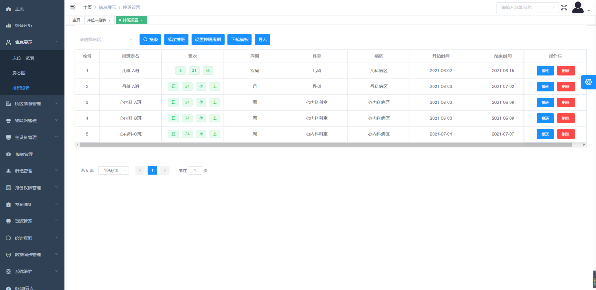
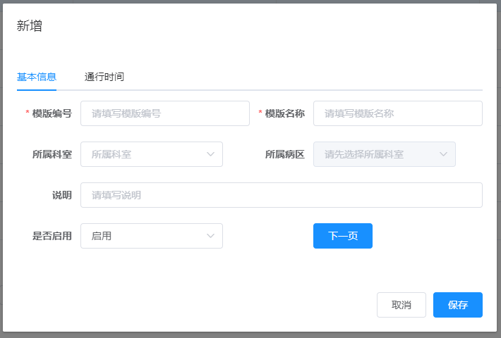
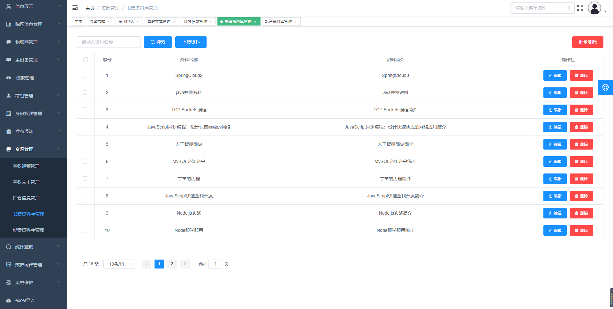
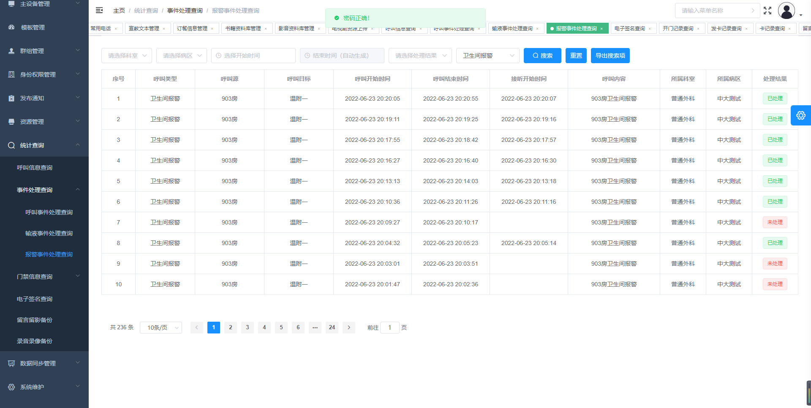
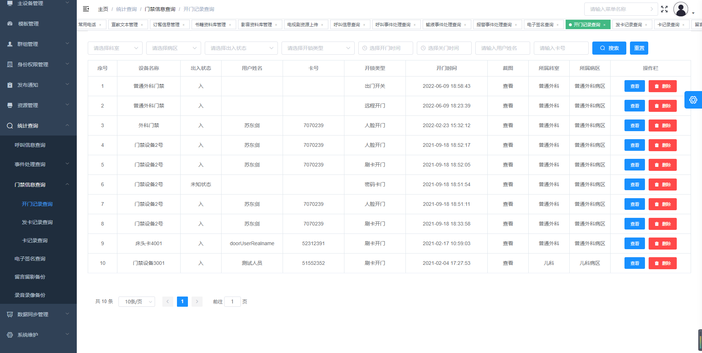

## 智慧病房综合管理平台

### 系统概述

本系统是以物联网为基础的辅助诊疗及智能护理一体化解决方案。智慧建设医院病房，通过先进的物联网技术，让患者与医务人员、智能护理设备紧密联接。通过对临床数据采集、筛选、整合，形成医疗大数据，为临床诊疗、护理提供智能辅助决策。提高医疗资源的利用率，更好地保障医疗安全，更好地以患者为中心，提供高品质的医疗服务。

数字化医院建设要求本系统的发展趋势是往数字化方向发展，本系统与HIS系统联网，将患者的基本信息发送到患者的病床分机上。本系统可以提供呼叫转移、双向通话、呼叫记录存储、护士定位、语音提醒、信息发布、远程探视、体征采集、输液检测、院内服务、营养点餐等功能，提高护理工作的自动化、数字化和人性化水平，实现医院护理信息管理系统向病房的延伸。

{width="6in"}

系统平台采用B/S模式构建，Web浏览无需安装控件，通过局域网远程访问，凭科室账户权限登录系统管理平台，能够实现对异地或区域相隔较远的分院等分支机构进行统一管理。

{width="6in"}

### 设计方案

系统方案主要围绕智慧服务、智慧护理、智慧管理三大应用场景规划打造，分别针对患者，医护和管理人员提供各种相关的应用服务。

{width="6in"}

1. 智慧护理

以数字化护理为核心，适用于临床护理全业务、全场景。通过智能交互屏打破医疗数据孤岛，所有信息在病区多个交互屏实时同步，实现病区各个环节间的信息互联互通，配合物联网通讯功能，患者信息一屏尽览，患者需求一键联动，医护人员不用随时守在患者身边，也能提供实时服务，为医、护、患三者之间搭建高效沟通的桥梁，助力医护更快速、高效工作，实现医护患一体化管理，提升医疗服务质量和安全。

2. 智慧服务

以改善患者就医体验为核心，适用于病房。以智能交互设备为纽带，整合医护患三方通讯，为患者家属及医护人员提供信息导航，实现患者从入院办理、入院安排、院前检查及缴费结算等一站式全流程化服务。并通过串联互动多媒体信息系统，提供多样化信息娱乐功能，提升患者服务满意度，真正实现以"患者为中心"的服务理念。

3. 智慧管理

以医院智慧管理为核心，适用于医院全场景、全流程、全业务。通过医疗数据资源的标准化建设，打通从医院建筑到医疗设备、从门诊到病房、从能源能耗到安全消防等医院各业务模块数据，实现资源穿透，数据互联，业务联动，并基于数字孪生技术搭建医院全方位三维可视化管理系统，实现医院管理者对全院资源的统一管理和调配，让医院管理清晰可见，精准可控，助力医院管理智能化。

### 功能介绍

**综合分析**

{width="6in"}

**数据可视化平台**

般提供给院长、医院管理者和信息科人员使用，为其提供可视化数据辅助决策支持。

主要软件功能有：

【综合总览】主要是对本院数据的综合概览，如院内医务人员情况，当月门诊、急诊、出入院数据，医疗耗材情况、各科室人流情况、手术情况统计、死亡及新生数据统计。

{width="6in"}

【病区概览】主要展示病区相关数据，如住院总床位使用率、各病区床位使用率、病区呼叫统计、病区平均住院天数。

{width="6in"}

【设备概况】展示的是病区使用设备的监控统计，如设备使用情况、设备在病区的分布、设备在线状态统计、告警的处理情况。

{width="6in"}

【患者情况】展示针对患者的可视数据，如患者的年龄分布、疾病排行、患者人数及区域分布情况。

{width="6in"}

【经营数据】展示院内相关运营经营数据，如门诊/住院的收入\\各科室的收入、院内收入类型情况、付费方式占比。

{width="6in"}

**床位一览表**

可以根据所属科室，所属病区，患者姓名等进行筛选，查看具体的在科床位，包含有患者的床位与空床；点击上面上方的总床位数、今日新入院人数、待入科人数、今日出院人数等，可按条件筛选。

{width="6in"}

点击床位后，弹窗显示患者信息，可对患者进行"出院"操作。数据定时同步HIS系统，以同步数据为准。

- 基本信息：可编辑患者信息。数据定时同步HIS系统，以同步数据为准。
- 换床：可编辑选择需更换的床位与更换时间，仅限同个病区下的床位更换。下方显示对应的换床记录。
- 服药提醒：可编辑患者的服药时间、周期、频率等。
- 手术信息：可查看患者的手术信息。
- 交接班：可查看患者最后一次的交班记录。

**房态图**

可以根据科室、病区、病房名称、是否满床作为筛选条件，点击搜索，查看具体满足条件的房号。

{width="6in"}

点击某个病房号，弹出窗口如下：可以查看到当前这个病房的名称，以及居住在此病房内的相关患者的姓名，责任医生，责任护士，及其他床头卡上面的一些粗略信息。

{width="6in"}

**排班设置**

主要用于显示不同病区下排班信息，用于电子白板上的同步显示；主要显示内容为班次，周期，科室，病区，开始时间，结束时间；排班的添加支持用模板批量导入来实现；常规情况下，都是直接同步HIS的数据。

{width="6in"}

优先点击设置排班周期，弹出窗口如下：

周期：排班周期，有周7天，双周14天，月30天。

班次：包括正，24，休，上，下。

是否开启自动排班：每周都会生成一份排班数据，开启后，会按照上一周的排班情况自动生成一份新的排班数据。

{width="6in"}

点击添加排班，弹出窗口如下：

排班表名：根据实际情况进行填写，常规书写XXX科-X班。

周期：设置过排班周期后，不用再另外选择，默认关联。

排班班次：设置过排班周期后，不用再另外选择，默认关联。

所属科室：根据实际情况进行选择绑定。

所属病区：根据实际情况进行选择绑定。

排班时间：根据实际情况设定初始的排班时间。

{width="6in"}

点击右侧排班按钮，弹出窗口如下：

此页面用来编辑成员的排班周期内每天的班次，需要注意的是，只有职工职务是护士，且用户类型是职工的成员，才能默认进入此页面列表里；每个班次都需要单独保存一次方可生效。

{width="6in"}

**院区信息管理**

设置医院的基础信息，如医院的LOGO，医院的名称，组织代码，详细地址，床位数量，医院的整体简介等基础信息；特别说明，序列号为每个项目的唯一标示符，所有上线的项目都需要经过授权注册，才能正常使用。

**科室管理**

管理显示科室名称，科室代码、外部代码、科室介绍等科室基础数据，可以添加、编辑、删除维护科室的信息。

注：科室代码唯一，由HIS或医院直接提供。

{width="6in"}

**病区管理**

默认定义一个护士站为一个病区，病区里可以设置多个科室，设置、数据对接默认均以病区为单位。

{width="6in"}

点击增加病区后会弹出创建界面，带星号为必填项目，否则无法保存：

病区代码：一般根据楼层或序号填写即可且必须唯一；如HIS或医院能提供，则按照提供的来进行编写即可。

门口机模板：此科室或病区，安卓门口机需要使用的初始模板样式。

床头卡模板：此科室或病区，安卓床头机需要使用的初始模板样式。

{width="6in"}

**病房管理**

病房的添加可以通过批量导入来实现，导入模板在平台栏目最后的一列条目excel导入模块里面去下载，下载时需要选择对应的导入类型来进行下载。

病房代码：根据实际规划填写，代码必须唯一，不能重复。

{width="6in"}

**床位管理**

床位代码：根据实际规划填写，代码必须唯一，不能重复。

{width="6in"}

**护士站管理**

管理维护护士站名称、代码、所属病区等基础信息。

护士站代码：根据实际规划填写，必须唯一，不能重复。

{width="6in"}

**区域管理**

用于配置实际物联位置归属。可维护物联网管理中楼栋、楼层、房间基础信息。可对楼层进行病区关联（非必填），可对房间进行病房关联（非必填）。

{width="6in"}

**物联网管理-智能总控**

展示开启总控策略房间以及对应的楼层。可查看楼层绑定的环境看板；可查看房间内的环境看板，可对房间内的设备、场景进行控制。

- 是否展示楼层、是否展示房间：可通过【物联网管理-总控策略-区域总控策略】进行权限编辑，房间仅展示总控策略中非【关闭总控】的房间。
- 是否可控制某一设备、场景：可通过【物联网管理-总控策略-终端控制绑定】进行权限绑定。
- 楼层环境看板数据展示：可通过【物联网管理-总控策略-环境设备绑定】进行绑定，若未绑定则不显示环境看板。

房间环境看板数据展示：数据来源当前房间配置的环境设备，若未配置环境设备则不显示环境看板。

**主设备管理**

维护管理所有的设备信息，有新增、修改、删除、查询、导入、导出、一键重启、一键开机、一键关机、设备升级等功能。主要用于显示设备的名称，SN，设备类型，对应的科室，对应的病区，病房，床位，IP地址，SIP账号，SIP密码，SIP的ID，位置等信息；设备的添加支持通过导入文件批量导入。

一键重启即直接给设备远程重启；一键开机与一键关机是关联使用，一键关机后仅能通过一键开机或断电操作进行开机；

远程控制：可以远程进行对设备IP修改，对讲音量的设置。

{width="6in"}

点击添加设备，弹出窗口如下：所选设备类型不同，所需填写的基本信息不同。

绑定门灯：若门灯接此床头机上，则需要打开绑定；若不接门灯，则默认不打开。

设备告警状态：当有呼叫被接听中的时候，会显示繁忙状态；没有呼叫则显示空闲状态。

设备忙闲状态：当有报警被接听中的时候，会显示繁忙状态；没有呼叫则显示空闲状态。

关联病房类型：常规选择普通病房即可，若是ICU则选择ICU重症病房；根据不同的类型，对应不同的规则。

{width="6in"}

**设备设置**

主要用于对病区设备批量下发一些修改操作；在创建完科室和病区后，会自动生成列表在此页面下，无需额外进行添加的操作。根据病区，设置设备的声音、屏幕、走廊屏等。操作下发设备后，就通知病区内的所有设备更新设置。

{width="6in"}

点击编辑将弹出以下窗口，除走廊屏外，其余设备设置包括声音设置、屏幕设置。

声音设置：设定病区下面设备的夜晚时间段，通话音量，提示音量，白天媒体音量，夜晚媒体音量。

屏幕设置：可以根据实际情况，设定病区下面设备的亮度，屏保时间，亮屏时间，息屏时间，还能设置夜间模式下的亮度，屏保时间。

{width="6in"}

{width="6in"}

走廊屏设备设置包括音量设置、走廊屏设置。

音量设置：最多可设置5个分时段及该时段内的音量，可选择是否启用该时段设置。

走廊屏设置：可设定该病区下走廊屏的亮屏时间、息屏时间、走廊屏提示语。

{width="6in"}

{width="6in"}

**设备类型管理**

维护系统的所有设备类型，有添加、删除、修改功能。

{width="6in"}

**模板管理**

配置门口机、床头机的页面模板，有新增、修改、删除、设计等功能。（研发人员使用），系统模板均根据病区配置，在病区维护中选择门口机模板和床头机模板。点击设计按钮，可以在默认的模板上进行一些微调操作，不建议医院人员自己操作，选中不同的区域，会有不同的栏目弹出，进行操作。

**群组管理**

此功能主要用于组呼，配置群组信息，有新增、修改、删除、查询等功能，具备超时转移配置功能。配置每个护士站对应的床头机、门口机的群组信息，然后选择该群组中对应的设备成员（设备成员：该群组设备类型所需要的呼叫设备）。除了呼叫管理主机外，还能同步让管理副机，走廊屏，门灯，门口机等都带有对应的提示。常规状态下需要创建2个组。

超时转移功能：当主呼叫组呼叫超时且无设备接听时，则将呼叫信息转移至与其相关联的超时转移组，转移后的主呼叫组与超时转移组中的设备成员一同呼叫。当有其中一个设备接听后，其余设备成员挂断呼叫。

群组编号：群组编号为3位数，且同一个项目下不能有重复的群组编号；

设备类型：设备类型为组里的最基础成员，如选择数字床头机，则设备成员里面就不选数字床头机，而是选择它要通知的对象即可。

超时转移组：选择病区后显示对应病区下的超时转移组。

{width="6in"}

{width="6in"}

{width="6in"}

**超时转移组**

群组编号：群组编号为3位数，且同一个项目下不能有重复的群组编号；

设备类型：设备类型为组里的最基础成员，如选择数字床头机，则设备成员里面就不选数字床头机，而是选择它要通知的对象即可。

超时时间：默认60秒。设定时间不可超过120秒。当主呼叫组呼叫未接听且超过此设定时间时，触发超时转移功能。

{width="6in"}

{width="6in"}

**身份权限管理**

用来添加门禁用户的基础信息和发卡操作，若用于访问平台的电脑没有连接读卡器，则默认提示连接失败：此页面可浏览用户的编号，姓名，用户类型，科室，病区，卡号，有效期，人脸等信息；用户的添加支持用模板批量导入；点击预览，可以直接添加过的用户人脸信息。

{width="6in"}

点击添加用户信息，弹窗如下：

上传人脸：上传人脸要清晰度高的人脸照片，否则会导致上传失败，无法识别人脸。

用户权限：需要优先在通行时间模板里面创建时间模板，然后在权限管理添加时间权限组，最后才能在用户权限选择对应的权限组，支持多选。

主IC卡号：根据读卡器读出的卡号，只支持阿拉伯数字填写。

卡记录：记录一系列对卡的操作记录，发卡，挂失，补卡，注销。

若是针对已经创建的用户，点击编辑后会在主IC卡号下面新增按钮，可以对用户的卡进行挂失，补卡，注销操作；对应的操作记录会上传到卡记录里面。

{width="6in"}

点击发卡，弹出窗口如下：

在此页面，选择对应的人员，可以进行发卡的操作，支持单独发卡和批量发卡。

{width="6in"}

**权限组配置**

此页面主要用于添加时间权限组，可以查看权限组编号，权限组名称，对应的科室，对应的病区，是否公开，是否启用，详细配置等内容。

{width="6in"}

时间模板：选择前面设定的通行时间模板。

{width="6in"}

{width="6in"}

**通行时间模板**

此页面主要用于添加通行的时间模板，即什么时间段用户可以开门；可以查看模板编号，模板名称，对应的科室，对应的病区，通行时间，是否启用等。

{width="6in"}

点击添加时间模板，弹出窗口如下：

{width="6in"}

{width="6in"}

**发布通知**

主要是用来发布公告通知，可以用来查看发布人，发布时间，公告标题，发布状态，点击编辑能看到具体发布的内容。

{width="6in"}

**紧急通知**

主要用于紧急事件的通知，目前是通知到电子白板上，其他设备暂未规划；可以查看发布人，标题，编辑日期，发布事件，通知范围等信息。

{width="6in"}

**检查提醒通知**

主要用于检查提醒的编辑与下发，是下发到管理机上，并非到床头机或者门口机上；床头机上的信息是由管理机下发。

{width="6in"}

**问卷调查**

用于发布调查问卷，可以预览问卷名称，创建时间，问卷统计，发布病区，是否发布等信息。

停用：患者就无法填写当前的问卷；

预览：可以预览整体的问卷画面效果；

统计数据：可以查看当前问卷调查结果。

{width="6in"}

**入院须知**

用于编辑入院须知的内容，不同科室可定义不同的须知内容。

{width="6in"}

**备忘录**

用于病区护理看板备忘录内容显示，在平台上编辑维护内容，下发到病区。

{width="6in"}

**宣教视频管理**

要用于宣教视频的添加，可以查看到视频名称，所属科室，所属的病区，说明内容，以及是否点播，是否启用。

{width="6in"}

**宣教文本管理**

主要用于宣教文本的创建，可以查看文本的标题，内容类型，所属科室，所属病区等信息

{width="6in"}

**订餐信息管理**

可以下发院内的订餐平台二维码、或者网页链接路径。

{width="6in"}

**书籍资料库管理**

主要用于床旁中我的娱乐中书籍资料的管理。支持批量上传文件。

{width="6in"}

点击上传资料，进入批量编辑与上传界面，如下图所示：

增加：点击增加可新增一行编辑行。

批量上传文件：选择数据行后点击批量上传文件，弹窗显示文件选择界面，确定后系统自动填写文件名称。

{width="6in"}

**影音资料库管理**

主要用于床旁我的娱乐中影音资料的管理。支持批量上传文件。

{width="6in"}

点击上传电影，进入批量上传电影界面，可批量编辑、批量导入视频。

增加：点击增加可新增一行编辑行。

批量上传文件：选择数据行后点击批量上传文件，弹窗显示文件选择界面，确定后系统自动填写文件名称。

{width="6in"}

点击上传电视剧，进入电视剧信息编辑页面，支持批量上传剧集。

{width="6in"}

选择剧集后进入批量编辑页面，在此页面可继续上传视频，可对剧集顺序进行排序。

{width="6in"}

**呼叫信息查询**

进入此页面前需输入访问密码。主要用于查询设备的呼叫记录，可以查看呼叫源，呼叫目标，呼叫开始时间，呼叫结束时间，接听开始时间，呼叫内容，呼叫类型，所属科室，所属病区；

{width="6in"}

**事件处理查询**

进入呼叫事件处理查询、输液事件处理查询、报警事件处理查询页面前需输入访问密码。

**呼叫事件处理查询**

可以查看呼叫的类型，呼叫源，呼叫目标，呼叫开始时间，呼叫结束时间，接听开始时间，呼叫内容，所属科室，所属病区，处理结果信息。

{width="6in"}

**输液事件处理查询**

主要用于查询呼叫类型为输液完毕的呼叫。

{width="6in"}

**报警事件处理查询**

主要用于查询呼叫类型为卫生间报警的呼叫。

{width="6in"}

**门禁管理**

主要用于查询开门记录，可以查看设备名称，用户姓名，卡号，开锁类型，开门时间，截图，所属科室，所属病区信息。

{width="6in"}

**发卡记录查询**

主要用于查询发卡记录，可以查看设备用户姓名，用户状态，用户类型，所属科室，所属病区，卡号，发卡人，发卡时间信息。

{width="6in"}

**卡记录查询**

主要用于查询对卡的操作记录，可以查看操作类型，用户姓名，用户状态，用户类型，所属科室，所属病区，卡号，操作人，操作时间信息。

{width="6in"}

**电子签名查询**

主要用于查看宣教视频以及入院须知发送阅读后的，电子签名记录；可以看到对应的病区，科室，病房，病床，住院流水号，姓名，确认时间等信息；

{width="6in"}

**留言留影备份**

主要用于留影留言的备份上传，可查看具体的病区，具体的科室，管理机名称，SN，录音/录像时间，上传时间，时长，大小等信息；点击播放即可预览播放，点击下载即可把选中的备份下载到本地电脑上；

{width="6in"}

点击右上角备份限制，弹出窗口如下：

最大保留时间：至少需要90天以上。

最大限制容量：不能超过可用备份容量。

{width="6in"}

**录音录像备份**

主要用于录音录像的备份，仅用于ICU探视系统，可以查看探视机的SIP，接收端的SIP，录音时间等信息；点击播放，即可预览播放；点击下载，即可下载视频到本地；

{width="6in"}

### 系统亮点

1. **支持国产化、数字化系统**

借助**鸿蒙操作系统、国产化高性能硬件方案、国产服务器操作系统、国产数据库**四个方面入手，打造全套的国产化智慧医护空间解决方案。

具备自主可控的国产化优势，满足国家对医疗行业信息安全的政策要求，解决智慧医院建设的后顾之忧。

{width="6in"}

2. **生态开放、万物互联**

以狄耐克智能床旁交互终端为核心，联合鸿蒙操作系统、医护对讲系统、床旁交互系统、护理白板系统等智能化系统为智慧医护空间提供了数字化、可持续、高效率的开放生态系统。

以长远规划、逐步升级的理念，为智慧医院打**造可持续发展建设的生态平台**。