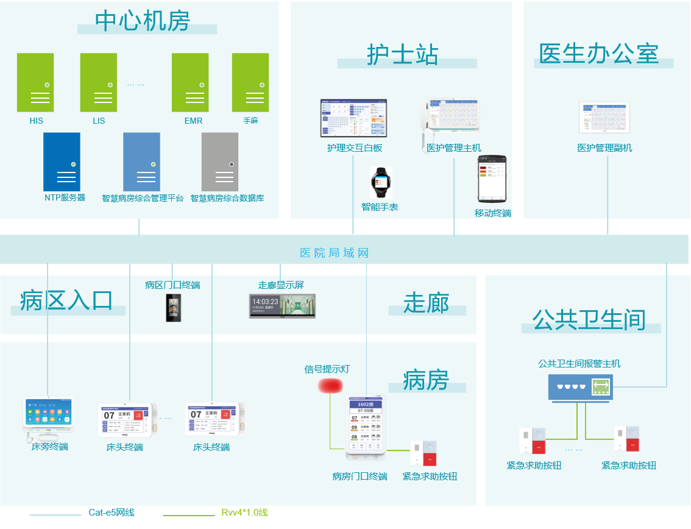
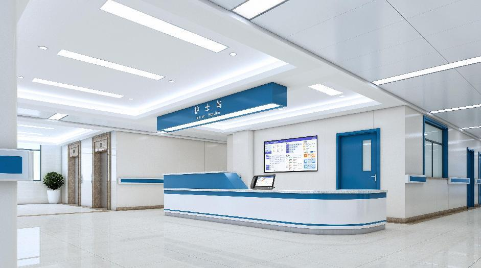
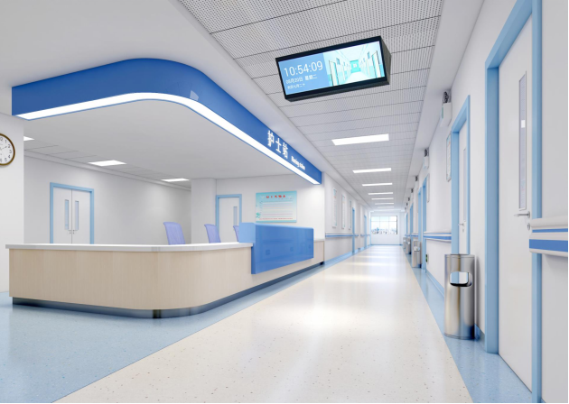
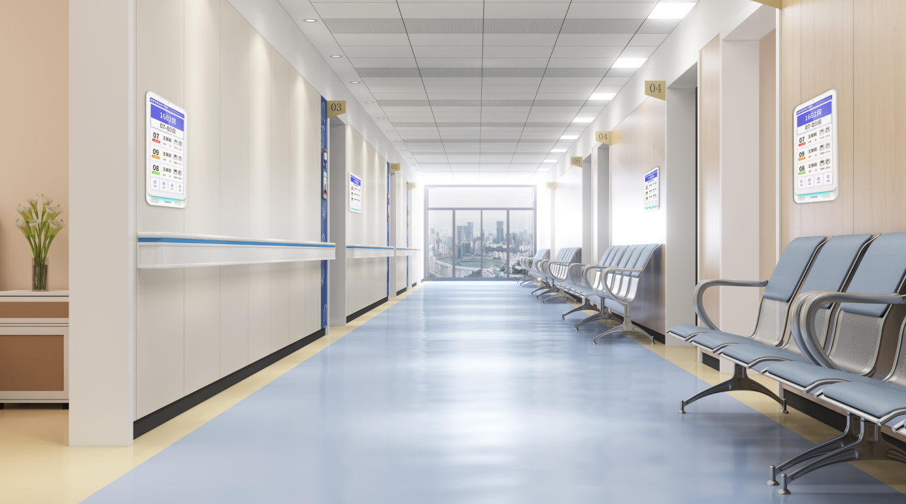
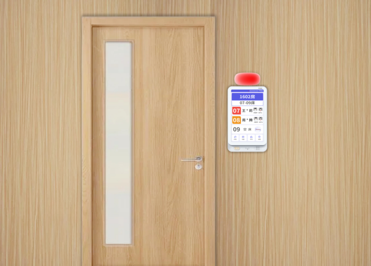
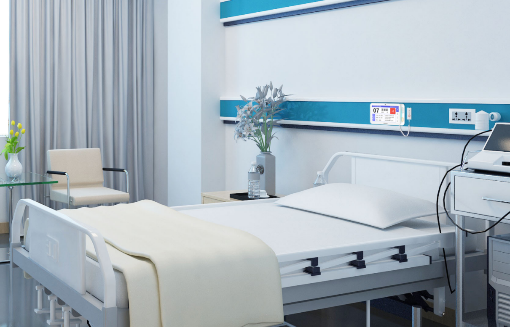

### 设计方案

#### 网络架构

{width="6in" height="5in"}

- **网络平台：** 可以是医院的局域网络，系统要求带宽：中心出口10Mbps，终端节点1Mbps，支持wifi无线网络。图中交换机传输速率仅需百兆即可。

- **智慧病房服务器：** 用于接收HIS数据、医生、护士、病房等主机、手机及穿戴设备传来的信息，实时生成最新的医护信息。

- **HIS数据对接：** 是与医院已有HIS系统进行通讯，它可以设计为双网模式，保证HIS系统安全，一般与智慧病房护理呼叫服务安装在同一台服务器。

- **病区门禁终端：** 用于管理病区进出权限。

- **护士站护理看板：** 用于显示区域病房内病床相关信息，并对报警情况做出相对颜色块提醒，同时伴随医护值班情况及安排等操作。可显示科室病房的住院人数、空闲床位数、护理等级人数，完全取代传统记事板。

- **护士站管理终端：** 加装护士端管理软件，护士台方便查询患者医护状态及处理医护指令，一个护士台至少需安装一个护士管理终端。

- **管理终端副机：** 加装医生端管理软件，医生方便查询患者医护状态及发布医护指令，安装于医生办公室。

- **走廊显示终端：** 可显示病床呼叫、紧急呼叫、输液报警、护理增援等状态信息。无呼叫信息时，可显示系统时间所发布的其它信息。

- **病区门口终端：** 安装在病区的出入口，用于封闭式病区管理。通过人脸识别、刷卡或呼叫护士站远程开锁等方式开门。

- **病房智能终端：** 用于显示病房信息、病房内病床综合信息。可与信号提示灯相连，根据病床呼叫终端报警状态、卫生间呼叫、输液报警器报警，信号提示灯按相对颜色闪烁，提示报警。

- **床头智能终端：** 用于显示病床患者信息，并对相应患者状况做出相对提醒，可连接卫生间紧急报警器延长到床旁使用。

- **信息提示灯：** 安装于病房门口，能联动病房内设备，根据不同类型的呼叫信息，信息提示灯会以不同颜色（三色）来进行提醒。

**数据层：** 用于院区信息的采集、汇总。

**应用层：** 实现数据及内容的组织、调度控制，并接受医生、护士的交互触发事件，生成信息显示列表。

**表现层：** 由网络终端对收到的数据进行解析并生成显示数据。

#### 系统应用场景

狄耐克IP医护对讲应用场景主要有【护士站】【病区走廊】【病房门口】【病床床头】。

{width="4.5in"}

**护士站：** 护士站主要部署功能包含信息查询、对讲呼叫、信息管理等设备：

1. 墙面挂载护士站护理白板，显示科室病房的住院人数、空闲床位数、护理等级人数、护理交接班情况、值班的医护人员、职工排班、患者生命体征、病区环境信息以及要事留言。

2. 部署一到多台医护管理终端和移动对讲移动终端，用于接听病房呼叫及病房信息查询，也可呼叫医生值守终端。

3. 部署一到多病区管理中心电脑，用于将病人床头卡信息及病房门口信息分别发送到病床护理呼叫终端及病房门口呼叫终端上。

{width="4.5in"}

**病区走廊：** 病区走廊主要部署功能包含病房信息、呼叫信息、报警提示等设备：

走廊上方吊挂部署双面液晶走廊信息屏，用于显示病床呼叫、紧急呼叫、输液报警、护理增援等状态信息。无呼叫信息时，可显示系统时间、病区温湿度和发布的其它信息。

{width="4.5in"}

**病房门口：** 用来内置简易的护士站，主要查看病房床位一览、呼叫对讲（增援、求救多种呼叫类型）任务提醒与处理、护理定位、环境信息。安装方式可"横屏"也可"竖屏"，尺寸有10寸、13.3寸、15.6寸。

{width="5in"}

病房门口上方可部署信号提示灯，当病床分机呼叫、卫生间呼叫、输液报警器报警时，信号提示灯将有不同颜色的亮灯提醒，起到信号提示的作用。

{width="5in" height="4in"}

**病床床头：** 病房内部病床床头主要部署功能包含病房呼叫、病床报警、费用清单查询、医嘱查询、输液监护、护理定位等：

1. 病床床头各部署一台病床护理呼叫终端，用于呼叫医护管理终端，也可查看相关信息。支持扩展功能，如营养点餐、信息查询。

2. 洗手间部署紧急报警器，对洗手间紧急情况进行及时报警，与信号提示灯、床头机、门口机、护士站管理机相互联动。
