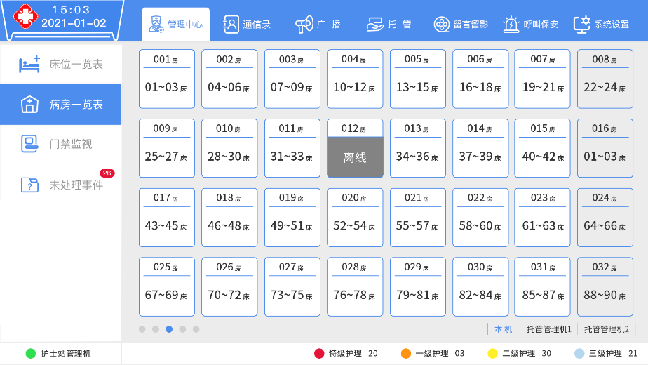
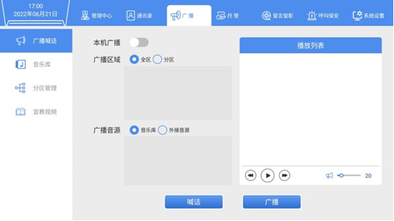
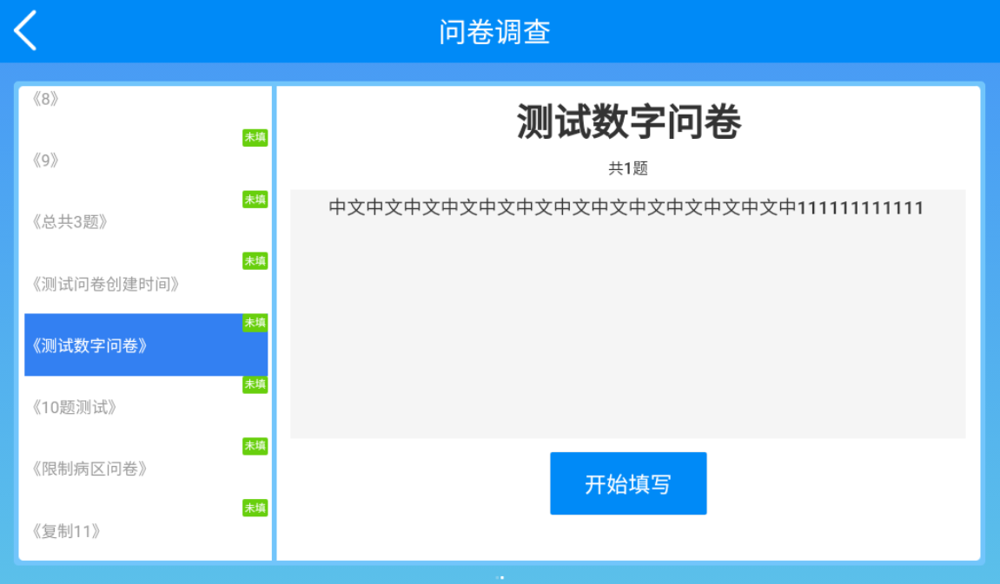

### 功能介绍

狄耐克IP医护对讲系统布局结构划分为：护士站、医生办公室、病房走廊、病房内部，每个区域可配备完善信息化设备，包括但不限于：计算机、护理呼叫护士站管理终端、护理呼叫医生值守终端、病员信息显示屏、病房门口护理呼叫终端、病床护理呼叫终端、信号提示灯、紧急呼叫按钮、走廊信息显示屏、智能控制面板等等。以上作为功能实现及管控的智慧病房护理呼叫系统须同时具备医患人员对讲呼叫、病员信息电子看板、移动接收终端、输液监护等一系列的功能模块，详细功能如下：

**(1).护士站管理机**

1. 病区患者遇到紧急情况时，可通过床头呼叫按钮或求助按钮进行呼叫，护士可通过护士站管理机收到呼叫并进行通话。

{width="6in" height="3in"}

2. 护士站管理机呼叫病房床头机，点击病房床头机界面上的病床，跳出病床病人信息窗口，点击"呼叫"，即可与该病床病人通话。还可以给该病床推送"消息提醒"和"视频宣教"。

{width="6in" height="3in"}

3. 点击呼叫，系统将进入通话界面。勾选"麦克风"，可以打开麦克风进行通话，单击"挂断"图标，可以挂断本次通话。上方为呼叫队列，显示当前所有呼叫。

4. 患者体征查阅，展示患者心率波形、呼吸率波形、人员状态、床位监测历史,床位监测历史：显示设备状态历史、体征异常历史。设备状态包括"设备恢复在线"、"设备离线"；体征异常包括"呼吸异常"、"心率异常"

{width="6in" height="3in"}

5. 点击开锁，门禁设备开锁。可控制病区门锁开闭，并能与探访人对讲，实现门禁管理。

{width="6in" height="3in"}

6. 单击"病房门口机"，系统将进入所示界面：在该界面可以查看每个病房里面的病床信息。

{width="6in" height="3in"}

7. 单击"门禁监视"图标，系统将进入如下图所示界面：可查看各门禁名称，点击门禁格子可查看门禁的视频画面。在此期间门禁不可进行人脸识别与对讲。

{width="6in" height="3in"}

8. 单击"未处理事件"图标，系统将进入如下图所示界面：未处理事件分为'呼叫事件'和'其他事件'。可以查看未处理事件的类型、名称、时间若该事件已经处理可以点击"确认"来完成时间的处理。

{width="6in" height="3in"}

9. 视频通话功能：医护管理机与床头对讲分机都带摄像头时，医护管理机主动呼叫床头对讲分机时，管理机可以看见床头分机图像但床头分机看不见管理机图像，实现双向通话；床头对讲分机呼叫医护管理机时，默认开启双向视频通话对讲。（安卓床头对讲分机选配摄像头可实现视频通话）

{width="6in" height="3in"}

10. 管理机模式切换：切换为传染病区管理机。在【系统设置---设备设置---管理机模式】中可将管理机设置为传染病区管理机模式，此模式下在标准版的基础上新增家属探视机列表，需要实现探视功能需要增加家属探视分机。

{width="6in" height="3in"}

11. 点击接听，进入双向视频通话。可设置探视时长，即设定一个时间，时间倒计时结束后，直接断开探视主机与探视分机的双向视频通话。可分配探视床位，点击选择床位，弹窗显示床位格子。

{width="6in" height="3in"}

{width="6in" height="3in"}

分配床位后，管理机可监视探视机视频画面与床头分机视频画面，默认在监听状态的时候探视主机与分机无法听到管理机声音。可进行插话、结束探视等操作。

    插话：点击后，可直接说话，探视主机与探视分机均能听到。 
    结束探视：强制直接断开探视主机与探视分机的双向视频对讲。
    音量：可以直接调整插话的音量。

{width="6in" height="3in"}

12. 留言留影功能：点击留言，可进行语音留言；点击留言留影，可进行留言留影。支持护士在本机上交接班留影留言，可通过本机进行录制、播放（可定时上传到服务器）。

{width="6in" height="3in"}

{width="6in" height="3in"}

{width="6in" height="3in"}

13. 内部通讯功能：在通讯录界面显示所有局域网内在线的设备编号。选择所要呼叫的对象，并单击"呼叫"即可进行呼叫。

{width="6in" height="3in"}

14. 广播功能：单击"广播喊话"图标，系统将进入如下图所示界面：可设置广播区域、广播的内容和是不是本机的广播等。

    广播区域：可以选择全区和分区播放，若全区播放则直接点击广播区域中的"全区"图标即可，若分区广播，则点击广播区域中的"分区"图标，然后选择所有播放的区域。
    广播音源：可以选择音乐库里面的也可以选择外部音源。若是选择音乐库里面的则直接点击"音乐库"图标，选择所需的音乐内容，最后保存即可。
    播放列表：可以选定上一首和下一首，播放或暂停以及音量的大小等。

{width="6in" height="3in"}

{width="6in" height="3in"}

{width="6in" height="3in"}

{width="6in" height="3in"}

{width="6in" height="3in"}

15. 托管功能：单击"托管"图标，系统将进入如下图所示界面：勾选自动托管、设置托管的时间段及选择要托管的主机，单击"开始托管"。托管成功后，若有网络分机向该管理机进行报警或呼叫，则会自动转至托管的管理机上进行处理。

{width="6in" height="3in"}

16. 呼叫保安功能：从通讯录中选中要设置的安保地址，确认后可直接呼叫保安。

{width="6in" height="3in"}

{width="6in" height="3in"}

**2. 病房门口机**

病房门口主机放置于病房门口，用于展示该病房患者的基本情况及责任医生护士，支持患者呼叫提醒、输液完毕提醒、进入护理、接听患者呼叫、宣教视频、呼叫护士站管理机功能，是病区信息化展示的窗口。

1. 医院信息展示。展示医院名称、通知消息。

2. 病房信息展示。展示病房信息（包括病房号、床位范围）及病房内患者基本信息、护理等级、责任医护信息及照片、病房内环境信息（当房间有配置空气盒子时显示）。

{width="3in" height="6in"}

3. 护理定位功能。当医生/护士查房时按下病房门口机上的"护理"按键，进入护理倒计时300秒界面，联动门灯显示绿灯常亮。同时护士站管理机同步显示该房间在护理中，护士站的护士可通过管理机看到该房间在护理中。

{width="3in" height="4in"}

4. 患者呼叫提醒、护士接听功能。当病人有问题需要处理时在床头按下呼叫，门口机显示呼叫信息，联动门灯显示红灯慢闪，护士可以在病房门口主机收到呼叫，按下接听进行处理，当接听呼叫后。

5. 卫生间报警功能展示。当病人在卫生间有紧急情况进行报警，护士可以收到病房门口机报警提醒，联动门灯显示红色慢闪。

6. 呼叫增援请求。当护士需要增援时，点击"呼叫"护士站，联动门灯显示蓝灯慢闪，护士站可以收到呼叫提醒，接听通话。

7. 宣教视频功能：在特定时间，展示日常宣教视频。

{width="3in" height="4in"}

8. 室内环境展示：根据所绑定的温湿度传感器或空气盒子显示参数，无参数则不显示。最多显示8个参数，分别为温度、湿度、照度、CO2、甲醛、TOVC、噪声、PM2.5（空气质量）。

{width="2in" height="4in"}

9. 屏幕方向适配。可适配横向门口屏、纵向门口屏。可适配单人病房、多人病房、一对一责任医护、多对一责任医护模式。

**3. 病床分机**

通过在床头或床旁增设床头信息终端实现床头卡电子化及临床信息展示，并完善床旁患者服务建设，如病程提醒、健康宣教。

**3.1 电子床头卡**

支持展示患者基本信息，主要分为操作栏和患者信息两个部分，患者信息的数据来源于管理中心医护管理软件，具体介绍如下：

首页状态栏：可通过管理后台的系统参数管理中配置是否显示LOGO。

操作栏：包括床头卡、功能、增援、护理四个部分。

患者信息：主要包含患者基本信息、护理信息。

患者基本信息：包括床位号、患者姓名、患者年龄、患者性别、护理级别、入院时间、住院编号、责任医师、责任护士。

护理级别：分为特级护理、一级护理、二级护理、三级护理。护理级别底部颜色将根据级别的变化而变化。

护理信息：包括饮食状况、过敏类型、安全防范。点击将弹窗显示完整信息。

{width="6in" height="4in"}

**3.2 进入功能展示**

在操作栏中点击'功能'，进入功能页面。功能页面包括入院须知、医院介绍、科室介绍、宣教视频、费用查询、检验检查、医嘱查询、吸氧倒计时、主动息屏、消息通知、问卷调查等十一个功能模块，如下图所示。

{width="6in" height="4in"}

1. 入院须知

点击'入院须知'进入入院须知页面。认真阅读后勾选'我已阅读'方可退出。若未勾选，则系统将提示'请勾选"我已阅读"'。入院须知页面如下图所示。同时可以语音播报该部分内容，便于不便阅读的患者获取信息。

{width="6in" height="3in"}

2. 医院介绍

点击'医院介绍'进入医院介绍界面即可阅读医院信息，如下图所示。同时可以语音播报该部分内容，便于不便阅读的患者获取信息。

{width="6in" height="3in"}

3. 科室介绍

点击'科室介绍'进入科室介绍界面即可阅读科室信息，如下图所示。可通过【管理后台-院区信息管理-科室管理】编辑科室简介。同时可以语音播报该部分内容，便于不便阅读的患者获取信息。

{width="6in" height="3in"}

4. 展示宣教视频

宣教视频可通过【管理后台-资源管理-宣教视频管理】处编辑。管理机可向床头分机下发宣教视频，下发后床头分机将接收并弹窗播放宣教视频。若想再次观看，可点击功能页中的'宣教视频'，进入宣教视频页面，页面显示该床头分机接收的所有宣教视频，点击视频即可进入观看。宣教视频分为'未观看'和'已观看'状态，若当前观看的视频状态为'未观看'时，退出时系统将提示'您将退出播放，请确认是否已观看'。

{width="6in" height="3in"}

5. 费用查询

数据同步HIS系统。左侧展示患者的缴费类型、住院编号、住院时长、合计金额、费用列表。右侧展示相应的收费项目、单位、数量、金额。如下图所示。

6. 检验检查

检验检查信息分为检查信息和检验信息两个部分。

影像检查：左侧展示检查报告列表，显示检查名称、报告时间，右侧展示报告详细信息，包括检查名称、患者名称、性别、检查部位、报告时间（根据PACS可提供数据而定）、影响所见、光镜观察、检查结果。

{width="6in" height="3in"}

实验室检验：点击'检验信息'，左侧展示检查报告列表，显示检查名称、报告时间，右侧展示报告详细信息，检验名称、患者名称、性别、检验项目、检验时间、报告时间、报告列表（项目名称、结果、单位、参考范围、结果提示）。如下图所示。

{width="6in" height="3in"}

7. 医嘱查询

患者可以查看自己的医嘱信息。数据同步HIS系统。长期医嘱展示医嘱的详细内容，包括状态（分为停用/执行，用于区分用药状态）、开始时间、医嘱内容、用量、单位、用药方式、频率、开嘱医生/时间、停嘱医生/时间。

{width="5in" height="3in"}

临时医嘱展示医嘱的详细内容，包括状态（分为停用/执行，用于区分用药状态）、开始时间、医嘱内容、用量、单位、用药方式、频率、执行人/时间、停止执行人/时间。

{width="6in" height="3in"}

8. 吸氧计时

护士可以设置吸氧时间，当吸氧时间结束，床头分机会自动呼叫管理机。

{width="6in" height="3in"}

当点击'开始计时'后，界面跳转至倒计时界面，如下图所示。

{width="6in" height="4in"}

倒计时结束后，系统显示定时报警弹窗并语音播报信息。如下图所示。

{width="6in" height="3in"}

9.  主动息屏

当点击'主动息屏'，床头分机将熄灭屏幕，再次点击可唤醒屏幕。

10. 消息通知。

消息通知可通过管理机向床头终端下发消息。床头分机接收下发的消息，床头分机显示消息列表弹窗。初次接收的消息需弹窗显示，另外，消息通知可在功能页中的"消息通知"模块重复查看，消息通知模块分为消息通知、公告通知两个部分。

消息通知。消息通知页面列表显示所有消息，如下图所示。

{width="6in" height="3in"}

公告通知。公告通知页面列表显示所有公告的标题，点击'查看'可阅读公告详情。

{width="6in" height="3in"}

{width="6in" height="3in"}

11. 问卷调查。

点击进入调查问卷页面，显示问卷调查简介，问卷调查分为未填写和已填写两个状态。

{width="6in" height="3in"}

{width="6in" height="3in"}

**3.3呼叫功能展示**

1.进入呼叫，当病人有问题需要处理可以直接呼叫管理机。其它设备将接收并语音播报该床头分机的呼叫信息。发起呼叫界面如下图所示。

{width="6in" height="3in"}

2.进入护理，护士点击"进入护理"可以告知其他护士当前护理位置，若设置携带门灯，则门灯亮起并显示绿色。当护理结束时自动发出通知给管理机告知当前护理结束。

{width="6in" height="4in"}

3.请求增援，护士可通过床头分机向管理中心请求增援，若设置携带门灯，则门灯状态变更为红色常亮状态。

{width="6in" height="3in"}

4.换药提醒，患者输液完毕后通过床头分机的手柄按键向管理中心告知已输液完毕。

{width="6in" height="3in"}

**4.走廊显示屏**

1. 病区时间信息以及环境信息展示。可展示当前时间和环境信息，环境信息为当前楼层的温度、湿度数据，若无配置则不显示。

{width="6in" height="2in"}

2. 呼叫信息展示。可展示病房紧急呼叫信息，便于不在护士站的查房护士及时获知呼叫消息。

单条信息播报：

{width="6in" height="2in"}

多条信息播报：

{width="5in" height="1in"}

{width="5in" height="1in"}

{width="5in" height="1in"}

3. 护理增援信息展示。可展示增援信息，便于不在护士站的护士及时获知需要增援消息。

4. 求助信息展示。可展示求助报警信息，便于不在护士站的护士及时XX房报警求助信息。

**5.信号提示灯**

信号提示灯根据不同颜色显示病房内不同的护理级别。

**6.求助按钮**

求助按钮在病房卫生间内，当病人发生紧急情况可以按一下求助按钮进行求助，护士收到求助信息会第一时间进行处理。