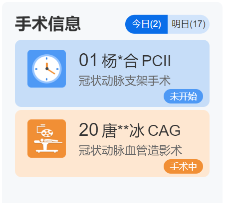

## 护理白板交互系统

### 系统概述

护理交互白板作为临床数据和信息汇聚中枢，旨在通过全面互联互通和深度智能化的集成平台，优化病区的管理和护理流程。它不仅是护理人员日常工作的得力助手，更是提升患者安全和护理服务质量的重要工具。该系统的核心功能涵盖数据采集、标准化转换、数据整合与共享等多个方面，使护理人员能够快速获取患者的基本信息、护理项目、医护值班情况等关键信息。通过护理交互大屏，护理人员可以实时掌握患者动态，及时响应护理需求，确保护理措施的准确性和及时性。此外，护理交互白板还通过智能化的ISBAR交班功能，提升了信息传递的效率和准确性，确保护理工作的连续性和科学性。

### 设计方案

狄耐克护士站智能交互系统以智能屏为媒介，围绕护理信息进行智能化、场景化、生态化的交互融合再现；护理交互屏实现全方位的护理信息展示，从病区护理、重症护理、专科护理全方位触达，医护人员可以在护理交互屏上清晰了解患者护理信息、患者的实时体征监测信息、危急值预警信息，还可以通过护理交互屏查看病区的环境状态，包括病房的温度、湿度、灯光等，实时掌握病房的舒适环境，为患者提供及时、安全、舒心的护理服务。实现临床数据的全息化互联互通管理，创新优质护理服务的同时，提升医院护理精细化管理形象。

系统通过从不同信息系统中抽取住院患者基本信息、体征、医嘱、危急值、护理安全风险预警等信息进行汇总整合，达到护理信息综合性共享与数据多样化呈现，从而推动病区工作效率和护理质量的进一步提升。

{width="6in" height="3in"}

### 需求场景
- **总视图**：
  - 显示患者基本信息、护理项目、护士排班、值班信息、通讯录及手写板功能。
  - 应用场景：护理人员快速获取病区整体情况，便于日常管理和沟通。
  - 价值：提供全面的病区信息，提升护理人员的工作效率和信息获取的便捷性。

- **工作表**：
  - 自动解析医嘱信息，实时汇总同步显示患者护理项目动态信息。
  - 应用场景：护理人员实时跟踪和执行医嘱，确保护理措施的及时性和准确性。
  - 价值：减少手动记录和信息传递的误差，提高护理工作的准确性和效率。

- **病患一览**：
  - 以颜色角标区分病情、护理等级重点关注患者，可对不同患者类型进行快速筛选。
  - 应用场景：护理人员快速识别和关注重点患者，便于制定和调整护理计划。
  - 价值：提高护理工作的针对性和有效性，确保重点患者得到及时关注和护理。

- **病房一览**：
  - 空床信息管理，一览病区男女患者床位管理，新入院患者依据性别快速定位病房。
  - 应用场景：病房管理和新入院患者的床位安排。
  - 价值：优化病房资源配置，提高床位管理的效率和准确性。

- **信息看板**：
  - 显示当前病区患者检查检验项目和手术安排情况与状态。
  - 应用场景：护理人员和医生实时了解患者的检查和手术安排。
  - 价值：提供及时的检查和手术信息，便于护理人员和医生协调工作，提高工作效率。

- **交班信息**：
  - 显示科室交接班情况，按时段自动提取显示新入、手术、出院等需交接班数据。
  - 应用场景：护理人员交接班时的信息传递和记录。
  - 价值：确保交接班信息的完整性和准确性，减少信息遗漏，提高交接班效率。

- **医护排班**：
  - 显示病区科室医护人员周排班信息。
  - 应用场景：护理人员和管理者查看和调整排班计划。
  - 价值：提供清晰的排班信息，便于排班管理和人员调度。

- **资产管理**：
  - 管理病区仪器设备借用信息，解决借出物品丢失及不定期归还等情况。
  - 应用场景：病区仪器设备的借用和归还管理。
  - 价值：提高设备管理的规范性和效率，减少设备丢失和损坏。

- **知识宣教**：
  - 展示和播放护理知识宣教、知识学习、科室推广宣传等文件。
  - 应用场景：护理人员的培训和患者的健康教育。
  - 价值：提高护理人员的专业素养和患者的健康知识，促进护理质量的提升。

- **病区统计**：
  - 多维度查看科室重要项目数据的患者比例，自动统计并形成统计报表。
  - 应用场景：护理管理者进行数据分析和决策支持。
  - 价值：提供科学的数据支持，便于护理质量的评估和改进。

- **患者详情**：
  - 显示患者病情、医嘱、检查结果、护理记录等数据。
  - 应用场景：适用于护理人员和医生查看患者的详细信息。
  - 价值：提供全面的患者信息，便于制定和调整护理和治疗计划。

- **呼叫联动提醒**：
  - 与病区护理呼叫系统互通，实时显示当前病区呼叫情况。
  - 应用场景：护理人员及时响应患者的呼叫需求。
  - 价值：确保护理人员能够及时响应患者的需求，提高患者的安全感和满意度。

- **物联设备**：
  - 可视化患者输液进度及体征监测信息，并提供状态通知。
  - 应用场景：实时监测患者的输液情况和生命体征。
  - 价值：提供准确的输液和体征数据，确保护理人员能够及时发现和处理异常情况，提高护理质量和患者安全。

### 功能介绍

- **护理信息一览**

护理信息模块化显示，全局视图展现科室重点护理项目信息，清晰明了。

{width="6in" height="3in"}

护理白板首页显示病区概况、患者总数、高危管理、护理信息、患者导管、手术信息。其中病区概况、患者总数、护理信息可编辑子菜单，子菜单将与后端数据进行比对与过滤，若有数据则将显示在对应的菜单下。

{width="6in" height="3in"}

病区概况显示菜单与统计人数，右侧显示患者信息，若内容超过当前可显示区域，可手动滑动查看。默认菜单：病重、危重、特级护理、一级护理、二级护理、三级护理。

{width="6in" height="2in"}

患者总数显示菜单与统计人数，右侧显示床位号。默认菜单：今日入院、今日出院、转入、转出。

{width="5in" height="2in"}

患者总数显示菜单与统计人数，右侧显示床位号。当菜单为"换床"时，右侧显示床位更换过程（旧床位号---\>现床位号），可在【后台管理-床位一览表-患者信息-换床】中进行换床操作，最终以HIS同步结果为准。

{width="4in" height="3in"}

高危管理显示高危跌倒/坠床、高危压疮、高危拔管、高危压力性损伤、高危跌倒对应的统计人数与床位号。

{width="6in" height="4in"}

护理信息显示菜单与统计人数，右侧显示床位号。默认菜单：心电监听、持续房颤、血压、血糖。

{width="5in" height="4in"}

患者导管显示患者床位号、姓名（脱敏）、导管风险、导管名称、置管周期、换药时间。

{width="5in" height="4in"}

手术信息分为今日手术信息、明日手术信息，手术信息显示床位号、患者姓名（脱敏）、手术名称、手术状态。

- **患者护理信息一览**

护理白板默认显示患者提醒、备忘录、预约检查、值班信息、特殊用药、备忘录。

{width="5in" height="3in"}

{width="5in" height="3in"}

{width="6in" height="3in"}

患者提醒显示床位号、患者姓名（脱敏）、提醒时间、标题、内容。点击该区域，可弹窗查看全部患者提醒。

{width="5in" height="4in"}

备忘录可在【管理后台-发布通知-备忘录】或护理白板中编辑。

备忘录分为普通备忘录与重要备忘录，普通备忘录背景色为蓝色，重要备忘录背景色为红色。显示备忘录内容、时间。点击可弹窗查看全部备忘录。

{width="6in" height="3in"}

在此页面可添加、删除备忘录。点击添加，进入'新增备忘录'页面。

{width="5in" height="4in"}

预约检查显示床位号、患者姓名（脱敏）、完成状态、检查名称、检查时间。点击可弹窗查看全部预约检查信息。

{width="4in" height="4in"}

值班信息显示值班人姓名、电话号码。点击可弹窗查看全部值班信息。

{width="5in" height="3in"}

显示值班人姓名、电话、隐私保护状态。可新增、删除、修改值班信息。点击增加或修改进入编辑页面。

{width="5in" height="4in"}

特殊用药显示床位号、患者姓名（脱敏）、药物名称、用药频度、用药时间。

- **宣教视频展示**

{width="6in" height="3in"}

宣教视频可在【管理后台-资源管理-宣教视频管理】中上传宣教视频，系统定时同步管理后台-资源管理中对应病区的宣教视频，显示视频封面、视频名称、上传时间信息。点击单个视频进入播放页面。

- **今日治疗展示**

{width="6in" height="3in"}

今日治疗显示班组，右侧显示对应班组的内容。右侧显示排班职工、治疗项目、频度、床号，可滑动查看全部内容。

- **职工交班**

进入职工交班页面前需经过密码校验。校验成功即可进入交班信息页面。

{width="6in" height="3in"}

职工交班页面显示当前病区全部患者的交接班记录，包括患者信息、交班记录等。可滑动查看全部患者交接班记录。

患者信息：床位号、患者姓名、患者性别、患者年龄、护理等级、住院号、入院天数、主治医生、责任护士、饮食、花粉过敏、入院时间、诊断。

交班记录：记录时间、护理记录内容。

查看生命体征信息（床位号、患者姓名、性别、年龄、入院时间），菜单（常量、特殊量）。

常量：显示日期、血糖、血压、脉搏、体温。

特殊量：日期、雾化吸入、呼吸、出入量。

{width="6in" height="3in"}

查看检查报告信息（床位号、患者姓名、性别、年龄、入院时间），检验报告列表、检查报告列表。显示对应报告的详细内容，包括患者姓名、住院号、送检医生、临床诊断、性别、样本编号、科室与报告信息。

{width="6in" height="3in"}

支持手动书写护理记录，护理记录左侧显示患者信息（床位号、患者姓名、性别、年龄、入院时间、诊断），护士根据病人情况书写护理记录。

{width="6in" height="3in"}

- **患者信息一览**

{width="6in" height="3in"}

显示当前病区所有患者的信息，包括患者床位号、护理等级、姓名、性别、岁数、入院时间、住院号、诊断、注意事项描述、责任医生、责任护士。

- **职工排班展示**

{width="6in" height="4in"}

查看所选月份的排班信息，包括排班名、排班班次、排班周期、排班开始日期、排班结束日期、该班次所有职工。默认显示当前月份的排班信息。

- **智能控制**

{width="6in" height="3in"}

显示对应病区下的房间，房间分为公共区域、病房区域，显示对应房间的环境数据、场景、设备，并可控制场景、设备，长按设备卡片可对设备卡片进行排序。管理后台中配置设备、场景，在总控策略中管理护理白板控制权限。

环境看板：有参数则显示，无参数则不显示。点击温度、湿度、CO2、PM2.5、甲醛环境数据可查看该参数的日、周、15天的历史图表。

场景卡片：点击场景卡片可执行该场景，点击'查看'可查看该场景的执行详情。

设备卡片：点击设备卡片可开/关该设备，点击右下角按钮可查看设备控制详情

- **输液监控**

顶部：左侧显示XX病区输液监控，统计正在输液的人数。右侧显示时间、日期、星期、LOGO。

{width="6in" height="3in"}

余量刻度表：显示输液余量≤15ml的床位号，跟据余量大小从小到大、从下至上排列。

输液一览表

数据分页：超过当前页面可分页显示。

输液格子：显示床位号、患者姓名、输液余量、输液剩余时间、输液滴速、输液桶、输液状态。

患者姓名：脱敏显示。

输液余量：显示剩余量/总量。

输液剩余时间：精确到分。

滴速：输液滴速 d/min。

输液桶：显示输液进度。

输液状态：包括以下8种状态。

输液中：输液正常进行。

滴速过慢：滴速小于正常的滴速值。

滴速过快：滴速大于正常的滴速值。

输液停止：输液余量大于0且滴速等于0。

即将结束：当输液剩余量低于某刻度时，或当输液余量等于0时，提示"即将结束"。此种状态下，将触发输液报警。

低电量：当电量低于某值时提示。

病人离开：病人携带设备仪器离开。

暂无输液：指该床位未绑定输液设备。

报警提醒：当输液状态为"即将结束"时，发起"XX床输液报警"提醒。

- **体征监护**

体征监护：展示各床位体征状态。进入此模块，则一直停留在此页直至手动退出该模块。

{width="6in" height="3in"}

消息提醒：

显示某床位关于心率异常、呼吸异常的异常提醒，最新的异常提醒排在最上方。

点击可进入对应床位的详情监测，左滑可取消此提示标签。

体征监护一览表：可筛选全部、在床、离床、设备故障。

体征监护格子：

当该床位已绑定设备且设备正常时：显示床位号、护理等级颜色、患者姓名、患者状态、性别、年龄、呼吸、心率。护理时显示"护理中"。点击格子可进入体征详情弹窗。

床位号：最多显示5个字，超出部分用省略号代替。

护理等级颜色：各护理等级颜色可在管理后台配置。

患者姓名：最多显示5个字，超出部分用省略号代替。

患者状态：可显示患者在床、离床状态，监测到睡眠状态时显示睡眠标签。

当该床位已绑定设备但设备离线时：提示"设备离线"。点击格子提示"设备离线中"。

当该床位未绑定设备时：显示床位号、护理等级颜色、患者姓名，提示"无设备"。点击格子提示"暂无设备"。

当该床位无患者时：提示"空床"。点击格子提示"暂无患者"。

{width="6in" height="3in"}

### 特色功能：ISBAR交班
ISBAR沟通模式是一种以证据为基础的，标准的沟通方式，在紧急情况下保证了信息的准确性。也是世界卫生组织所提出的标准化沟通模式。护士交班是护理工作的一个重要部分，也是易发生护理缺陷的环节之一，是保证治疗护理不间断和护理工作连续性、提高护理质量的重要环节。狄耐克智慧病房的护理交互白板特别设计了ISBAR交班功能，ISBAR交班功能与电子病历等信息化应用集成，利用AI模型的总结归纳赋能，显著提升了交班过程的效率和准确性。ISBAR并非仅限于交班场景，ISBAR是一种多功能的智能化管理工具，可以应用于多个护理和医疗场景中，提升工作效率和管理水平，确保信息的准确传递和及时处理，优化护理流程和资源配置，提升护理质量和服务水平。

- **日常交接班**：
  - 自动汇总并显示每位患者的基本信息（如姓名、年龄、性别、住院号等）、当前病情、病史背景、最新评估结果和护理建议。护理人员可以在交接班时，逐一查看并确认每位患者的信息。
  - 客户价值：减少交接班时间，提高交接班效率，确保信息传递的准确性和完整性，减少信息遗漏和误传。

- **突发情况处理**：
  - 实时更新并显示患者的最新生命体征、实验室检查结果和影像学检查结果，提供科学的护理建议和应急处理方案。系统还具备紧急情况提醒功能，确保护理人员能够及时响应。
  - 客户价值：提供及时、准确的患者信息，帮助护理人员迅速做出决策，采取有效的护理措施，提高应急处理的效率和效果。

- **新入院患者管理**：
  - 自动提取并显示新入院患者的基本信息、病史背景、初步诊断和护理建议。系统还支持新入院患者的快速录入和信息更新，确保信息的及时性和准确性。
  - 客户价值：提供全面、详细的新入院患者信息，帮助护理人员制定个性化的护理计划，提高护理服务的针对性和有效性。

- **多学科协作**：
  - 自动汇总并显示患者的全面信息，包括病情概况、病史背景、最新评估结果和护理建议。系统支持多学科团队成员的权限管理和信息共享，确保协作的顺畅和高效。
  - 客户价值：提供全面、共享的患者信息，促进多学科团队的协作，提高医疗服务的整体质量和效率。

通过这些具体功能设计，狄耐克智慧病房解决方案设计了对ISBAR沟通模式的支持，从HIS中自动汇总多个场景所需的患者信息，交班功能在不同应用场景中展现了其针对性和客户价值。它不仅提高了信息传递的准确性和效率，还增强了护理决策的科学性，减少了护理人员的工作负担，促进了多学科团队的协作，真正实现了以患者安全为中心的全场景智慧医疗生态服务。

ISBAR交班功能，为护理人员提供了一个标准化、系统化的信息传递工具，显著提升了交班过程的效率和准确性。具体价值包括：
- 提高信息传递的准确性：标准化的信息传递，减少了信息遗漏和错误，确保护理人员准确获取患者信息。
- 提升护理工作的连续性：提供全面、及时的患者信息，确保护理工作的无缝衔接，提高护理质量。
- 增强护理决策的科学性：AI模型自动总结和生成护理建议，帮助护理人员制定科学、有效的护理计划。
- 减少护理人员的工作负担：自动提取患者信息，减少了手动记录和信息传递的工作量，提高工作效率。

通过ISBAR交班功能，狄耐克智慧病房为护理人员提供了一个高效、准确的信息传递工具，显著提升了护理质量和患者安全，真正实现了以患者安全为中心的全场景智慧医疗生态服务。这种全方位的智慧化建设，推动了医院向更高水平的智慧医疗迈进，提升了整体医疗服务的质量和效率。

### 特色功能：场景化的信息布局+AI意图识别
狄耐克智慧病房的护理交互白板基于对业务的深入理解，利用NFC近场物联网感知技术、大数据分析、AI语音指令等技术，设计并实现了意图早识别功能，主动切换至最符合场景需求特点的信息布局，减少信息过载，让护士在繁忙工作中能够快速定位到最符合场景的信息，充分体现科技实现的智慧。以下为举例，具体项目时根据应用医院科室的差异和场景化特点会有专门的调整：
- **出院管理**：
  - 当护士靠近护理交互大屏时（利用护士工卡的NFC近场感知），识别护士身份角色排班、结合当前时间、历史数据（近似时间段、近似护理人员排班角色、以往关注哪个主题分类的数据页面）等信息，识别出护理人员的意图，切换至出院管理信息主题布局。
  - 设计布局：在护理交互大屏的显示屏上，出院患者名单位于页面顶部，姓名和病房号以大字体显示，出院时间和医嘱紧随其后，确保护士一目了然。
  - 客户价值：减少护士查找出院信息的时间，提高出院管理的效率和准确性。

- **医嘱执行**：
  - 每日的医嘱执行时间段，存在一定的数据分布特点，也可在后台设定，系统的AI功能也可依据时间段的页面切换显示关注数据规律，主动切换至与医嘱执行意图匹配度高的页面展示。
  - 设计布局：在页面中部显著位置显示，患者名单和药物信息表格形式呈现，药物名称和剂量以醒目颜色标注。
  - 客户价值：确保护士能够快速获取发药信息，减少给药错误，提高用药安全。

- **护理计划**：
  - 护士在交接班时靠近护理交互大屏，系统自动识别并显示当前病区的护理计划和重点关注的患者。
  - 设计布局：重点关注患者的信息以高亮显示，护理目标和注意事项以列表形式呈现。
  - 客户价值：提高交接班效率，确保护理计划的连续性和准确性。

- **生命体征监测**：
  - 护士在特定时间（如每小时）靠近护理交互大屏时，系统自动识别并显示需要监测生命体征的患者。
  - 信息需求：需要监测的患者名单、上次监测的时间和结果、特殊关注的生命体征（如高血压、低氧等）。
  - 设计布局：生命体征监测信息在页面右侧显示，患者名单和监测结果以图表形式呈现，特殊关注的生命体征以红色标注。
  - 客户价值：确保护士能够及时监测和处理患者的生命体征变化，提高患者安全。

- **紧急情况响应**：
  - 在发生紧急情况（如报警或呼叫）时，靠近护理交互大屏的护士会自动收到相关信息。
  - 信息需求：紧急患者的病房号、病情描述、需要的紧急处理措施等。
  - 设计布局：紧急情况信息在页面顶部以弹窗形式显示，病房号和病情描述以大字体和红色高亮显示，紧急处理措施以步骤列表呈现。
  - 客户价值：确保护士能够迅速响应紧急情况，采取有效的处理措施，提高应急处理效率。

- **设备管理**：
  - 护士在设备维护时间（如保养周期临近、或其它AI智能感知）靠近护理交互大屏时，系统自动识别并显示需要维护或检查的设备。
  - 设计布局：设备管理信息页面左侧显示，设备名称和维护记录表格形式呈现，下次维护时间以醒目颜色标注。
  - 客户价值：确保护士能够及时了解设备的维护状态，减少设备故障，提高设备使用的安全性和可靠性。

- **护理质量监测**：
  - 护士在特定时间（如每月初），或特定身份的护理人员（护士长、院感科）靠近护理交互大屏时，系统自动识别并显示护理质量指标和改进建议。
  - 信息需求：护理质量指标（如感染率、并发症发生率）、改进措施、培训需求等。
  - 设计布局：护理质量监测信息页面右侧显示，质量指标图表形式呈现，改进措施和培训需求以列表形式显示。
  - 客户价值：提供护理质量的实时监测数据，帮助护理人员识别问题并采取改进措施，提高护理服务质量。

- **团队协作**：
  - 在团队会议或交接班时，靠近护理交互大屏的护士（多个内置iBeacon的护士工卡）会自动收到团队成员的任务分配和进展信息。
  - 信息需求：每位团队成员的任务、进展状态、需要协作的事项等。
  - 设计布局：任务分配和进展状态甘特图或进度条形式呈现，需要协作事项以高亮显示。
  - 客户价值：促进团队成员之间的协作和沟通，确保任务的顺利完成，提高团队工作效率。

此功能设计和实现的核心关键是：

- **场景识别**：通过传感器和定位技术，结合大数据判断当前工作场景，识别护士信息交互意图。
- **信息优先级**：根据不同场景的需求，自动调整信息的优先级，重要的信息放置在页面的显著位置。
- **动态切换**：根据护士的操作和关注点，动态切换信息布局，确保护士能够快速获取所需信息，减少翻页和查找的时间。
- **个性化推荐**：系统根据护士的历史操作和偏好，个性化推荐相关信息，提高信息获取的效率和准确性。

通过AI驱动的阅读者意图识别和信息布局优化，狄耐克智慧病房的护理交互白板的优势和客户价值是：

- **减少信息过载**：通过智能识别和动态调整，减少信息过载，确保护士能够专注于最重要的信息。
- **提高工作效率**：通过优化信息布局和动态切换，减少护士查找信息的时间，提高工作效率。
- **增强信息准确性**：通过个性化推荐和优先级调整，确保信息传递的准确性和及时性，减少错误和遗漏。
- **提升护理质量**：通过提供实时、准确的信息支持，帮助护理人员做出科学的护理决策，提高护理服务质量和患者安全。

狄耐克智慧病房的护理交互白板通过这些设计和技术应用，真正实现了以患者安全为中心的全场景智慧医疗生态服务，推动了医院向更高水平的智慧医疗迈进。