## 床旁交互系统

### 系统概述

随着医疗行业的不断发展，新形势下人们的医疗需求发生变化，"以病人为中心"的医疗服务理念正逐步替代传统的的理念。随着医院信息化建设的不断开展，医院病房内相关业务应用型系统增加，致使病房将接入更多的信息系统，从而使病房内的需求多种多样。建设以床旁交互系统为核心，围绕"以患者为中心"提供完善的医疗服务，通过接入更多的软件系统以扩展业务功能，还应充分建立与患者的沟通，同时必要的信息及时共享，让医护在床旁可以更高效的完成工作，构建良好的医患关系。

### 网络结构

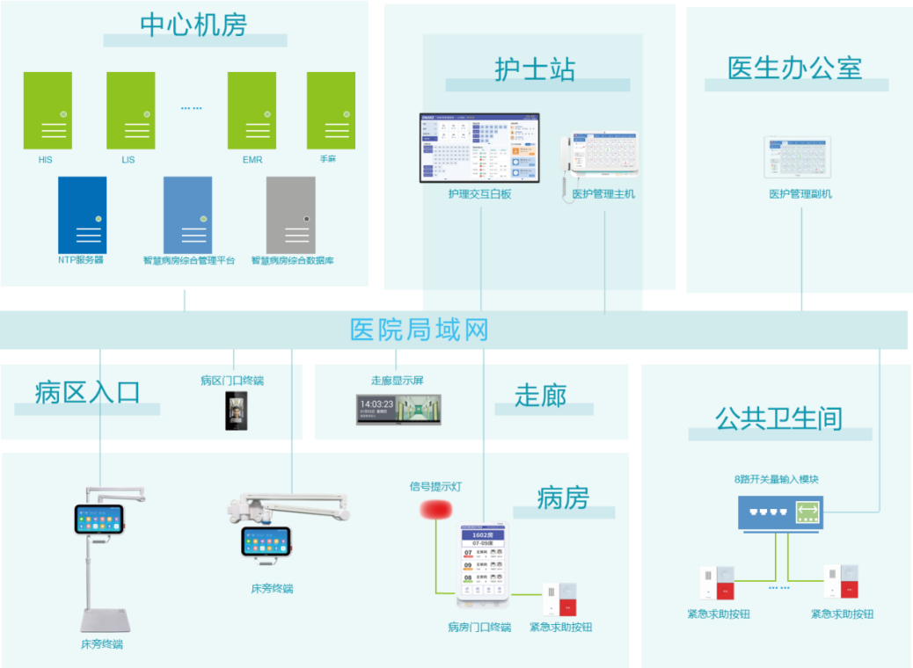{width="5in" height="4in"}

### 系统优势

在现代医疗环境中，患者的满意度和舒适度是提升医疗服务质量的重要指标。医院病房中的床旁交互终端提供的软件交互系统，能够在多个方面为患者带来价值，尤其是在与私人手机的比较中，展现出其独特的优势。

床旁交互终端在智慧病房中具有重要价值，主要体现在以下几个方面：

- **信息获取与沟通**：终端提供患者实时的健康信息和治疗计划，帮助他们更好地理解病情。同时，患者可以直接与医护人员沟通，方便提出问题和请求，减少沟通障碍。
- **舒适度提升**：通过控制病房内的环境设置，如温度、灯光和窗帘，终端为患者创造更舒适的就医体验。此外，终端还提供娱乐内容，如电影和音乐，帮助患者放松心情。
- **个性化服务**：终端能够根据患者的需求提供定制化的健康教育和饮食建议，增强患者的参与感和满意度。同时，支持多语言界面，确保不同语言患者的信息传达无障碍。

床旁交互终端与私人手机相比，具有以下几个显著优势：

- **信息整合与集中**：床旁交互终端提供的信息由医院系统直接整合，确保其准确性和专业性，而私人手机上的信息来源可能较为分散且不可靠。此外，终端能够集中管理患者的所有医疗信息，避免了私人手机上信息难以整合的问题。

- **使用便利性**：床旁交互终端的界面设计注重患者的使用便利性，特别是针对老年人或身体不便的患者，操作更加简单直观。患者在住院期间无需依赖个人手机，避免了因手机电量不足或信号不良而导致的信息获取困难。

- **环境适应性**：床旁交互终端的设计和功能专为医疗环境而设，能够满足医院的特殊需求，如消毒和耐用性等。而私人手机在医院环境中可能面临使用限制。此外，床旁交互终端提供相对安静的环境，减少了私人手机带来的社交媒体和消息通知等干扰，有助于患者更好地休息和恢复。

床旁交互终端提供的软件交互系统在提升患者满意度和舒适度方面具有显著优势。通过提供实时信息、个性化服务和安全的沟通渠道，床旁交互终端能够有效改善患者的就医体验。与私人手机相比，床旁交互终端在信息整合、使用便利性和环境适应性等方面展现出更强的优势。因此，医院在投资和建设病房环境时，应重视床旁交互终端的应用，以提升患者的整体体验和满意度。

### 改变宣教方式、提高患者“知信行”

我们的精准宣教软件解决方案旨在通过个性化的信息传递和互动式学习，提升患者的理解和依从性，减少焦虑，促进康复，从而提高整体护理质量。

#### 个性化信息推送

- **患者评估模块**：通过初步评估患者的健康状况、文化背景、教育水平和心理状态，系统能够生成个性化的宣教计划，确保信息的相关性和有效性。
- **动态内容更新**：根据患者的治疗进展和反馈，实时调整和更新宣教内容，确保患者始终获得最新的信息。

#### 多媒体宣教工具

- **多种形式的内容**：结合文字、图表、视频和音频等多种形式，满足不同患者的学习需求和偏好。患者可以选择最适合自己的学习方式，增强信息的吸收和理解。
- **互动式学习**：通过内置的互动功能，患者可以在学习过程中提问，护士可以实时解答，确保信息的准确传达和理解。

#### 信息透明与信任建立

- **清晰的信息展示**：软件提供清晰、易懂的界面，患者可以轻松浏览自己的病情、治疗方案和康复计划，减少对未知的恐惧和焦虑感。
- **信任机制**：通过精准的宣教，增强患者对医务人员的信任，促进良好的医患关系。

#### 自我管理与进度追踪

- **自我管理工具**：患者可以通过软件记录自己的健康数据、遵医行为和康复进度，增强自我管理能力。
- **进度跟踪与反馈**：系统定期向患者提供进度报告，帮助他们了解自己的康复情况，并根据需要进行调整。

#### 评估与效果反馈

- **宣教效果评估**：在宣教后，系统通过小测验或反馈问卷评估患者对信息的理解和接受程度，必要时进行补充宣教，确保信息的有效传达。
- **数据分析与改进**：通过收集和分析患者的反馈数据，持续优化宣教内容和方式，提高宣教的整体效果。

通过个性化的信息传递和互动式学习，帮助患者更好地理解自己的疾病和治疗方案，增强依从性，减少焦虑，促进康复。通过这一解决方案，医院能够提升护理质量，改善患者体验，最终实现更好的治疗效果和生活质量。

### 依从性管理

在传统的病房护理中，患者的依从性往往被忽视，护士们在忙碌的工作中难以全面关注每位患者的遵医行为。患者在治疗后的康复过程中，常常缺乏足够的支持和指导，导致依从性差，影响治疗效果和康复进程。尤其是在无陪护的情况下，患者对医嘱的遵循程度更是难以保障。护理人员在住院期间发现患者的依从性差，及时进行干预和教育显得尤为重要。如何提高患者的依从性、增强他们的参与感，并确保他们在出院后的家庭康复阶段能够继续遵循医嘱，成为智慧病房建设中亟待解决的重要课题。

为了应对这一挑战，我们在床旁交互终端上引入了患者依从性管理软件应用，旨在通过技术手段提升患者的依从性和参与度。以下是具体的业务场景和解决方案：

#### 依从性评估功能

- **自助评估工具**：患者可以通过床旁终端进行自助评估，回答与依从性相关的问题，例如对咳嗽和深呼吸练习的参与度、早期下床活动的频率、饮食调整的遵循情况等。系统将根据患者的回答生成依从性评分，并提供反馈。
- **依从性监测**：系统记录患者的自助评估结果，护士可以实时查看患者的依从性数据，及时识别依从性差的患者，便于进行针对性的干预和支持。

#### 教育与培训模块

- **个性化教育内容**：根据患者的手术类型和依从性评估结果，系统将推送个性化的教育视频和资料，帮助患者理解依从性的重要性。例如，针对肺手术患者，提供咳嗽和深呼吸练习的指导视频；针对糖尿病患者，提供胰岛素注射的培训内容。
- **互动学习**：患者可以通过终端与护士进行互动，提出问题并获得解答，增强对依从性管理的理解和重视。

#### 激励机制

- **奖励系统**：设计激励措施，例如通过完成自助评估和遵循医嘱获得积分（奖励积分可以在门口机展示）。这种激励机制可以提高患者的参与度和依从性。
- **进度跟踪**：患者、亲属可以在终端上查看自己的依从性进度，看到自己的努力和进步，增强自我效能感。

#### 家庭康复支持

- **出院指导**：在患者出院前，系统将提供详细的出院指导，包括家庭康复的注意事项、饮食调整、锻炼计划等，确保患者在无陪护的情况下也能遵循医嘱。
- **远程监测**：出院后，患者可以通过手机下载与病房相同的APP，持续管理自己遵医嘱依从性，继续记录自己的康复情况，护士可以定期进行远程监测和随访，及时给予指导和支持。

#### 依从性管理与康复的关系

患者的依从性在治疗后的恢复过程中起着至关重要的作用。以下是与依从性相关度高的疾病及其狄耐克针对性的专门技术应用设计与实现。

- **肺手术后的强化呼吸锻炼**：患者术后强化呼吸锻炼的依从性直接影响肺部功能恢复。若患者能够积极参与这些练习，可以显著减少术后慢性咳嗽的发生率。
  - 我们的设计与实现：肺手术术后强化呼吸锻炼的详细的教育和指导，使用激励措施（如奖励机制）鼓励患者进行强化呼吸锻炼。
- **心脏手术后的早期下床行走**：患者对早期下床行走的依从性与术后并发症（如深静脉血栓、肺部并发症）的发生率密切相关。早期活动有助于促进血液循环和加速康复。
  - 我们的设计与实现：在护士确定鼓励下床行走后，通过毫米波雷达检测是否在床，依照个性化的活动计划，提醒和鼓励患者在安全的环境中进行活动。
- **糖尿病患者的胰岛素注射**：糖尿病患者对胰岛素注射的依从性直接影响血糖控制和并发症的发生。定期监测血糖和按时注射胰岛素是关键。
  - 我们的设计与实现：APP中提供胰岛素注射依从性的相关教育和培训，帮助患者掌握注射技巧，使用提醒工具来建立患者习惯，提高依从性。
- **胆囊切除术后的饮食调整**：患者在手术后对饮食调整的依从性影响术后恢复和并发症的发生。遵循低脂饮食可以减少消化不良和腹泻的风险。
  - 我们的设计与实现：在床旁终端的营养点餐中，伴随场景的提示，对患者依从性做监督和预训练；提供饮食指导和食谱，帮助患者理解饮食调整的重要性。
- **口服药用药依从性要求**：患者必须按时服用（如血压药物，以确保血压保持在正常范围内，降低中风和心脏病的风险），并且不能随意停药或更改剂量；
  - 我们的设计与实现：提供用药教育，解释高血压的危害及氨氯地平的作用。患者可下载我们开发使用药物提醒工具APP，或使用我们推荐的APP。在医院期间，患者的遵医嘱依从性数据与护士形成反馈，以便护士及时纠正患者的依从性。

通过床旁交互终端的患者依从性管理系统，医院能够有效提升患者的依从性，早期识别依从性差的患者，并在住院期间进行针对性的教育和支持。这不仅有助于改善患者的治疗效果和生活质量，也为患者在出院后的家庭康复阶段提供了持续的支持。护士们在这一过程中将发挥更大的作用，成为患者康复的引导者和支持者。通过这种方式，患者在无陪护的情况下也能更好地遵循医嘱，积极参与到自己的康复过程中。

### 护患协同

护患协同软件解决方案旨在通过床旁终端，帮助医院实现患者与护理人员之间的高效协作。该解决方案通过自助数据收集和实时监测，支持多种疾病的护理管理，提升患者的自我管理能力，确保护理质量和治疗效果。

- **出入量管理**：主要针对疾病：心衰、肾功能不全、肝硬化、重症感染等。
  - **功能实现**：患者可以通过床旁终端自助记录每日的出入量，系统实时监测液体平衡。当出入量达到预警值时，自动发送警报至护士和医生端，确保及时干预，防止液体潴留或其他并发症。
  
- **营养管理**：主要针对疾病：慢性疾病（如癌症、糖尿病）、消化系统疾病、术后患者、老年患者等。
  - **功能实现**：患者可以记录每日的饮食摄入，系统分析营养摄入情况，提供个性化的营养建议，并在必要时提醒护士进行干预，确保患者在治疗期间获得足够的营养支持。
  
- **疼痛管理**：主要针对疾病：癌症、术后疼痛、慢性疼痛综合症、急性损伤等。
  - **功能实现**：患者可以通过终端记录疼痛程度和位置，系统分析疼痛数据，帮助护士及时调整疼痛管理方案，确保患者的舒适度。
  
- **血糖监测**：主要针对疾病：糖尿病、胰腺疾病、重症患者等。
  - **功能实现**：患者可以记录血糖水平，系统分析数据并提供趋势图，帮助患者和护理人员及时调整治疗方案，控制血糖水平。
  
- **排泄管理**：主要针对疾病：肾功能不全、消化系统疾病、术后患者等。
  - **功能实现**：患者可以记录尿量和排便情况，帮助护理人员评估患者的排泄功能和恢复情况。
  
- **活动和功能评估**：主要针对疾病：中风、骨折或关节置换术后、老年患者等。
  - **功能实现**：患者可以记录日常活动情况，系统评估活动能力和康复进展，帮助护理人员制定个性化的康复计划。
  
- **心理健康评估**：主要针对疾病：抑郁症、焦虑症、慢性疾病患者、术后患者等。
  - **功能实现**：患者可以通过问卷评估心理状态，系统分析结果并提供反馈，帮助护理人员及时识别心理健康问题并进行干预。

护患协同软件解决方案通过床旁终端，赋予患者自助完成护理工作所需的数据收集能力，促进护患之间的高效协作。通过实时监测和数据分析，护理人员能够及时获取患者的健康信息，做出快速反应，从而提升护理质量和患者的治疗效果。该解决方案不仅提高了患者的自我管理能力，也为医院提供了更为高效的管理工具。

### 自助评估

在智慧病房中，自助评估的实施可以极大地提升患者和家属的参与度，但并非所有评估都适合自助进行。以下是一些可以自助评估和不可以自助评估的示例：

#### 可自助评估的项目

- **疼痛评估**：通过视觉模拟评分（VAS）或数字评分法（NRS）自我评估疼痛程度。
- **情绪状态评估**：使用标准化问卷（如抑郁自评量表）让患者自我报告情绪状态。
- **活动能力评估**：根据自身的活动能力进行自我评估，例如使用功能独立性测量（FIM）量表。
- **营养状态评估**：患者可以填写营养筛查工具（如MNA）来评估自身的营养状况。
- **睡眠质量评估**：使用简易的睡眠质量问卷，让患者自我评估睡眠情况。

#### 不可自助评估的项目

- **导管状况评估**：需要专业护士进行检查，以确保导管的正确位置和无感染风险。
- **伤口评估**：伤口的愈合情况、感染迹象等需要专业的观察和判断。
- **生命体征监测**：如血压、心率、呼吸频率等，需使用专业设备进行测量。
- **药物反应评估**：对药物的副作用和反应需要专业人员进行评估和判断。
- **复杂病情评估**：如心脏病、糖尿病等慢性病的综合评估，需要专业知识和技能。

狄耐克的智慧病房解决方案，在病房床旁交互终端上部署自助评估软件应用，患者和家属自行进行多次评估，护士在健康宣教教育患者和家属后，也可以将评估任务推送到床旁终端。

#### 自助评估功能

- **评估任务推送**：护士可以通过智慧病房信息化平台，将自助评估任务推送到患者床旁的Android平板终端上。患者和家属可以根据提示进行疼痛、情绪、活动能力等自助评估，增强他们对自身健康的掌控感。
- **多次评估**：患者和家属可以根据病情变化，自行进行多次评估，系统自动记录每次评估结果，便于后续分析和跟踪。这种实时反馈不仅能帮助护士更好地了解患者的状况，也能让患者感受到自己的声音被重视。
- **请求护理评估**：在自助评估过程中，若患者或家属有疑问或需要专业帮助（如导管状况、伤口评估等），可以通过终端发起请求。护士接到请求后，能够迅速到床旁进行专业评估，确保患者在关键时刻得到及时的关怀和支持。

#### 专科评估

- **专业评估模板**：系统内置多种专科评估模板，涵盖不同疾病和康复阶段，确保评估的专业性和全面性。护士们可以依靠这些模板，快速而准确地进行导管状况、伤口评估等专业评估，减轻她们的心理负担。
- **个性化评估**：根据患者的具体病情和康复需求，护士可以定制个性化的评估方案，并推送到床旁终端上。这种个性化的关怀，让每位患者都能感受到被重视和理解。

#### 数据安全与集成

- **信息化平台集成**：自助评估软件应用与智慧病房整体解决方案的信息化应用集成，数据实时同步到医院的信息化平台，确保信息的完整性和一致性。护士们可以更专注于患者，而不是在繁琐的数据处理中耗费时间。
- **数据安全**：软件应用遵循医院的信息化标准体系和数据安全体系要求，确保患者数据的安全和隐私保护。护士们可以放心地使用系统，确保患者的信息不被泄露。

### 客户价值

- **提升评估效率**：自助评估功能让患者和家属能够主动参与，减少护士的工作负担，提高评估效率。护士们可以将更多的时间和精力投入到患者的护理中，专注于那些需要专业判断的评估任务。
- **增强患者参与度**：患者和家属的主动参与，不仅让他们更了解自己的病情，也增强了他们对治疗的信心和积极性。通过自助评估，患者能够感受到自己在康复过程中的重要性，进而提高治疗效果。
- **确保评估专业性**：内置的多种专科评估模板，确保评估的专业性和全面性，帮助护士更准确地了解患者病情，提升护理质量。护士们可以依靠系统提供的专业支持，减少评估中的主观性和误差。
- **优化护理流程**：通过信息化平台集成和数据实时同步，优化护理流程，提升护理质量和管理水平，让护士们的工作更加高效。护士们可以更快地获取患者的评估结果，从而做出更及时的护理决策。
- **提高患者满意度**：通过健康宣教和互动教育，增强患者和家属的信任和满意度，提升住院体验。患者在病房中不仅是接受治疗的对象，更是护理团队共同努力的伙伴。通过这种方式，患者的住院体验将变得更加温暖和人性化。

### 总结

通过以上解决方案，智慧病房床旁交互终端自助评估系统不仅显著提升了评估效率和专业性，更重要的是增强了患者和家属的参与感，让他们在治疗过程中感受到关怀与尊重。这种转变不仅提升了护理质量，也为医院的智能化和精细化管理铺平了道路。每一位护士都能在这个过程中，充分发挥她们的专业能力，守护每一条生命，真正实现“以患者为中心”的护理理念。

在这个充满挑战的护理环境中，我们相信，通过智慧病房的建设，护士们将能够更轻松地应对工作压力，患者和家属也能在关怀中找到希望与力量。让我们共同努力，创造一个更加温暖、高效的护理环境，让每一位患者都能在这里感受到生命的尊严与关爱。

### 昏迷促醒

昏迷促醒软件解决方案旨在通过床旁终端，利用声光电等外部刺激手段，帮助医护人员有效评估和促进昏迷患者的意识恢复。该解决方案结合了数据记录、刺激互动、信息教育、沟通支持和个性化设置等多种功能，为昏迷患者的护理提供全面支持。

#### 评估与数据记录

- **神经评估工具**：提供标准化的神经评估工具和量表（如格拉斯哥昏迷评分），帮助医护人员评估患者的意识水平和反应能力。通过系统化的评估，医护人员可以更准确地了解患者的状况。
- **记录与数据管理**：系统自动记录患者的反应和评估结果，生成数据报告，便于后续分析和决策。这些数据可以帮助医护人员跟踪患者的恢复进展，及时调整护理策略。

#### 刺激与互动

- **声音刺激**：通过床旁终端播放患者熟悉的声音、音乐或语音，刺激其听觉，观察反应。可以设置定时播放，帮助患者逐步恢复意识，增强对外界的感知。
- **视觉刺激**：显示图像、视频或动画，刺激患者的视觉感官，促进意识恢复。使用柔和的光线和色彩，避免过度刺激，确保患者在舒适的环境中接受刺激。
- **触觉互动**：患者可以通过触摸屏幕进行简单的互动（如滑动、点击），帮助其进行触觉刺激，观察反应。这种互动不仅能刺激感官，还能增强患者的参与感。

#### 信息与教育

- **健康教育**：提供有关昏迷、恢复过程和护理措施的信息，帮助家属理解患者的状况和护理需求。通过教育，家属能够更好地支持患者的康复过程。
- **护理计划展示**：系统展示患者的护理计划和治疗方案，确保医护人员和家属了解当前的护理措施和目标，促进团队协作。

#### 沟通与支持

- **视频通话**：允许家属通过视频通话与患者进行互动，提供情感支持，帮助患者感受到亲人的关心。情感支持在昏迷恢复过程中起着重要作用。
- **医护人员沟通**：提供医护人员之间的即时通讯功能，方便团队成员共享信息和讨论患者的护理计划，确保信息的及时传递和协作。

#### 数据分析与反馈

- **数据分析工具**：提供数据分析功能，帮助医护人员评估患者的恢复进展，识别潜在问题并及时调整护理策略。通过数据驱动的决策，提升护理效果。
- **反馈机制**：允许医护人员记录和反馈患者的反应，形成闭环管理，确保护理措施的有效性。及时的反馈有助于优化护理方案。

#### 个性化设置

- **个性化内容**：根据患者的喜好和需求，定制播放的音乐、视频和图像，增强刺激的针对性和有效性。个性化的内容能够提高患者的反应和参与度。
- **适应性调整**：根据患者的反应，实时调整刺激的强度和频率，确保患者在舒适的状态下接受刺激，避免过度刺激带来的不适。

昏迷促醒软件解决方案通过床旁终端，利用声光电等外部刺激手段，帮助医护人员有效评估和促进昏迷患者的意识恢复。通过全面的功能支持，医护人员能够更好地管理患者的护理过程，提高昏迷患者的恢复效果，最终实现更好的治疗结果和患者体验。

### 教学查房

床旁终端在教学查房中可以发挥多种重要作用，提升查房的效率和质量。以下是一些具体的用处：

#### 实时访问患者信息

- **病历查看**：医护人员可以在床旁终端上实时查看患者的电子病历，包括病史、检查结果、治疗方案等，确保信息的准确性和及时性。

#### 资料展示与教学

- **病例展示**：床旁终端展示患者的影像学检查结果（如X光片、CT图像等），便于进行病例讨论和分析。
- **教学资源**：可以访问医学文献、指南和教学视频，帮助医护人员在查房过程中进行知识补充和学习。

#### 促进互动与讨论

- **实时记录**：医护人员可以在床旁终端上记录查房过程中的重要信息和讨论要点，便于后续跟进和复习。
- **互动交流**：参与者可以通过终端进行互动，提出问题或分享经验，促进团队之间的沟通与合作。

#### 整合多种功能

- **多媒体展示**：床旁终端可以支持多媒体内容的展示，如视频、图表等，丰富教学查房的形式。
- **数据分析与决策支持**：通过集成的数据分析工具，帮助医护人员进行临床决策，提高诊疗的科学性。

#### 提升工作效率

- **快速信息检索**：医护人员可以快速检索所需信息，节省查房时间，提高工作效率。

床旁终端在教学查房中不仅可以提供实时的患者信息和教学资源，还能促进医护人员之间的互动与讨论，提高患者的参与度，最终提升医疗服务的质量和效率。通过合理利用床旁终端，教学查房可以变得更加高效和富有成效。

### 无陪护支持与管理

无陪护病房护工管理软件解决方案旨在通过床旁终端，提升护工的工作效率和患者的护理体验。该解决方案通过建立护工与患者及其家属之间的信任关系，提供实时互动和评价机制，确保护理质量和患者满意度。

#### 护工认识与信任建立

- **护工信息展示**：通过床旁终端，患者及其家属可以查看护工的基本信息、专业背景和工作经验，增强对护工的了解和信任感。
- **护工介绍视频**：提供护工的自我介绍视频，让患者和家属更直观地了解护工的工作态度和专业素养，促进信任关系的建立。

#### 虚拟键呼叫支持

- **一键呼叫功能**：患者可以通过床旁终端一键呼叫护工，确保在需要帮助时能够及时获得支持。该功能简化了沟通流程，提高了响应速度。
- **实时状态反馈**：护工在接到呼叫后，可以通过系统反馈处理状态，让患者和家属了解当前的服务进度，增强透明度。

#### 亲属了解护工人员的工作

- **工作日志展示**：护工可以在系统中记录每日的工作日志，包括护理内容、患者状态和特殊事件，家属可以随时查看，了解护工的工作情况。
- **互动反馈渠道**：家属可以通过系统向护工提出问题或建议，促进护工与家属之间的互动，增强沟通效果。

#### 护工工作考核

- **考核指标设定**：系统设定护工的工作考核指标，包括工作效率、患者满意度、护理质量等，确保考核的全面性和公正性。
- **数据记录与分析**：系统自动记录护工的工作数据，定期生成考核报告，帮助管理层评估护工的工作表现，进行合理的激励和调整。

#### 满意度评价

- **患者满意度调查**：在患者出院后，系统自动发送满意度调查问卷，收集患者对护工服务的反馈，评估护理质量。
- **反馈机制**：患者和家属可以通过系统对护工的服务进行评价，提供具体的意见和建议，帮助护工不断改进服务质量。

#### NFC近场感知功能

- **护工操作记录**：护工在床旁终端上进行操作时，需通过NFC功能进行身份验证和记录。这一过程确保每一项护理操作都与具体的护工身份相对应，增强了操作记录的真实性和可追溯性。

#### 增强服务质量管理

- **实时监控与反馈**：通过NFC记录的操作数据，管理层可以实时监控护工的工作情况，及时发现潜在问题并进行干预。这种实时反馈机制有助于提升护理质量和患者安全。
- **数据分析与改进**：系统将收集的护工操作记录进行分析，评估服务质量和效率，为后续的培训和管理提供数据支持。通过数据驱动的决策，管理层可以制定更有效的护工培训和激励措施。

无陪护病房护工管理软件解决方案通过床旁终端的NFC近场感知功能，增强了护工操作记录的真实性和透明度。这一技术特性不仅提升了患者对护工服务质量的信任感，也为护理管理提供了更为可靠的数据支持。通过实时监控和数据分析，医院能够更好地管理护工的工作，确保患者在无陪护环境中的护理质量，最终实现更高的患者满意度和护理效果。

### 住院费用查询

住院费用查询软件解决方案旨在通过床旁终端，为患者提供便捷、透明的住院费用查询服务。该解决方案使患者能够随时了解自己的住院费用情况，增强对医疗费用的掌控感，提升患者的满意度。

#### 实时费用查询

- **费用明细展示**：通过床旁终端随时查询住院期间的费用明细，包括药品费用、检查费用、护理费用等，确保费用透明。
- **动态更新**：系统实时更新费用信息，患者可以查看最新的费用变化，避免因信息滞后而产生的误解。

#### 费用预估功能

- **费用预估工具**：患者在住院期间可以使用费用预估工具，根据当前的治疗方案和预计的住院天数，获取大致的费用预估，帮助患者做好经济准备。
- **个性化建议**：根据患者的病情和治疗方案，提供个性化的费用管理建议，帮助患者合理安排医疗支出。

#### 费用咨询支持

- **信息反馈渠道**：可以通过系统反馈对费用查询和支付过程的意见和建议，帮助医院不断优化服务。

住院费用查询软件解决方案通过床旁终端，为患者提供便捷、透明的住院费用查询服务。通过实时费用展示、费用预估、便捷支付和在线咨询等功能，患者能够更好地掌控自己的医疗费用，提升整体就医体验和满意度。

### 出院准备

出院准备软件解决方案旨在通过床旁终端，为患者提供系统化的出院准备支持。该解决方案帮助患者了解出院后的注意事项、康复计划和自我管理要求，确保患者在出院后能够顺利过渡到家庭康复阶段。

#### 出院指导信息

- **个性化出院计划**：根据患者的病情和治疗情况，系统生成个性化的出院计划，详细列出出院后的注意事项、康复目标和自我管理要求。
- **出院教育材料**：提供相关的教育材料和视频，帮助患者和家属理解出院后的护理要求和康复过程。

#### 药物管理

- **用药指导**：系统提供出院后需要继续服用的药物清单及用药指导，包括剂量、服用时间和注意事项，确保患者能够正确用药。
- **用药提醒功能**：患者可以设置用药提醒，确保按时服用药物，减少漏服和误服的风险。

#### 康复计划与跟踪

- **个性化康复计划**：根据患者的具体情况，系统制定个性化的康复计划，包括锻炼方案、饮食建议和复诊安排。
- **康复进度跟踪**：患者可以通过床旁终端记录自己的康复进度，系统提供反馈和建议，帮助患者保持积极的康复态度。

#### 家属参与与支持

- **家属教育材料**：提供家属教育材料，帮助家属了解患者的病情和护理要求。

出院准备软件解决方案通过床旁终端，为患者提供全面的出院准备支持。通过个性化的出院指导、药物管理、康复计划、家属参与等功能，确保患者在出院后能够顺利过渡到家庭康复阶段，提升整体护理质量和患者满意度。

### 订餐应用

订餐应用软件解决方案旨在通过床旁终端，为住院患者提供便捷的餐饮服务。该解决方案使患者能够根据个人口味和营养需求，轻松选择和订购餐食，提升住院期间的就餐体验。

#### 个性化菜单选择

- **营养均衡菜单**：系统提供多样化的菜单选项，包括主食、配菜、汤品和饮品，确保患者在住院期间获得营养均衡的饮食。
- **个性化饮食需求**：患者可以根据个人的饮食偏好、过敏信息和特殊饮食需求（如低盐、低糖、素食等）进行选择，系统会自动推荐适合的餐食。

#### 便捷的订餐流程

- **一键订餐功能**：患者通过床旁终端轻松浏览菜单并进行一键订餐，简化了订餐流程，提升了就餐效率。
- **实时订单跟踪**：患者可以实时查看订单状态，了解餐食准备和送达的进度，增强就餐体验的透明度。

#### 营养信息展示

- **营养成分标注**：每道菜品都提供详细的营养成分信息，包括热量、蛋白质、脂肪、碳水化合物等，帮助患者做出更健康的饮食选择。
- **饮食建议**：系统根据患者的健康状况和饮食需求，提供个性化的饮食建议，帮助患者合理安排饮食。

#### 反馈与评价机制

- **餐食满意度调查**：在用餐后可以通过系统对餐食进行评价，提供反馈意见，帮助医院不断优化餐饮服务。
- **数据分析与改进**：系统收集患者的反馈数据，分析餐饮服务的满意度，为后续的菜单调整和服务改进提供依据。

订餐应用软件解决方案通过床旁终端，为住院患者提供便捷的餐饮服务。通过个性化菜单选择、便捷的订餐流程、营养信息展示、反馈机制等功能，确保患者在住院期间获得营养均衡的饮食，提升整体就餐体验和患者满意度。

### 娱乐消遣应用

娱乐消遣软件解决方案旨在通过床旁终端，为住院患者提供多样化的娱乐和消遣活动。该解决方案帮助患者在住院期间缓解压力、放松心情，提升整体住院体验和心理健康。

#### 多样化娱乐内容

- **视频和电影**：患者可以通过床旁终端观看最新的电影、电视剧和纪录片，丰富住院期间的娱乐选择。
- **音乐**：患者可以根据个人喜好选择听音乐，放松心情。

#### 互动游戏

- **休闲游戏**：系统提供多种休闲游戏（如拼图、数独、纸牌等），患者可以在闲暇时间进行娱乐，锻炼思维能力，缓解焦虑。

#### 阅读和学习

- **电子书和杂志**：患者可以通过床旁终端访问电子书和杂志，阅读感兴趣的内容，丰富知识和视野。
- **在线课程**：提供多种在线学习课程，患者可以利用住院期间的时间学习新技能或知识，提升自我。

#### 心理健康支持

- **冥想和放松练习**：系统提供冥想和放松练习的音频和视频指导，帮助患者缓解压力，改善心理健康。
- **心理健康资源**：提供心理健康相关的文章和视频，帮助患者了解心理健康的重要性，提供自我调节的方法。

娱乐消遣软件解决方案通过床旁终端，为住院患者提供丰富的娱乐和消遣活动。通过多样化的娱乐内容、互动游戏、阅读学习、心理健康支持等功能，帮助患者在住院期间缓解压力、放松心情，提升整体住院体验和心理健康。

### 功能介绍

床旁交互系统从医院与患者的真实需求出发，以患者为中心，打造了各类特色功能，帮助医院改善客户体验，提升服务品质。

床旁交互系统为自主研发，结合床旁数字终端服务系统及多元的床旁娱乐服务，让患者得到周到细致的医疗体验。同时也是医护人员最实际有效的工作利器，辅助有权限的医护人员在患者的床旁设备上进行各种医疗数据的存取，包括问卷调查、医疗信息、病嘱提醒和宣教视频文件等，医护人员也可随时随地进行远程数据管理，简化作业流程，大幅提高医护人员的工作效率，推动医疗服务智慧化发展。

**1.患者医疗服务**

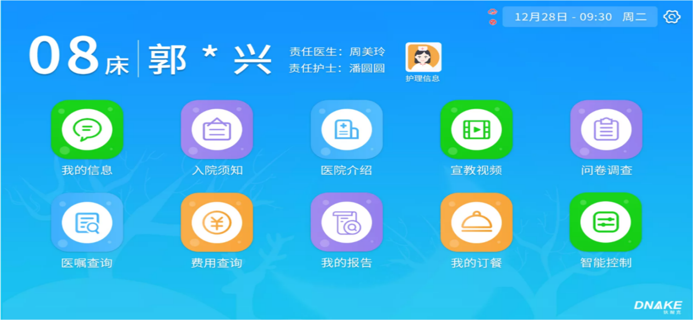{width="6in" height="3in"}

床旁终端展示患者床号、姓名、责任医生、责任护士等内容。以及我的信息、入院须知、医院介绍、宣教视频、问卷调查、医嘱查询、费用查询、我的报告、我的订餐、智能控制等功能入口。

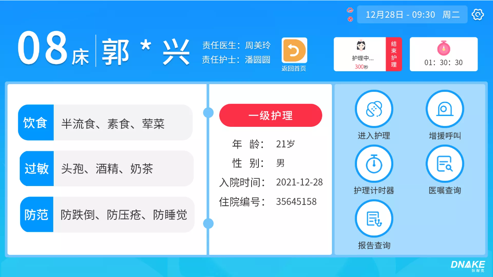{width="6in" height="3in"}

护理信息页展示患者信息，信息同步HIS系统，包括饮食事项、过敏事项、防范事项、护理等级、年龄、性别、入院时间、住院编号。点击饮食、过敏、防范区域可弹窗显示全部内容。代替医院传统的纸质床头卡，当患者信息有变化时，系统自动更新，减少护士信息维护工作量。

护理定位功能：护士按下床旁终端上的"进入护理"按键，该病房门口门灯常亮绿色，离开时可再次按下此键解除该功能，有护理300秒倒计时显示。

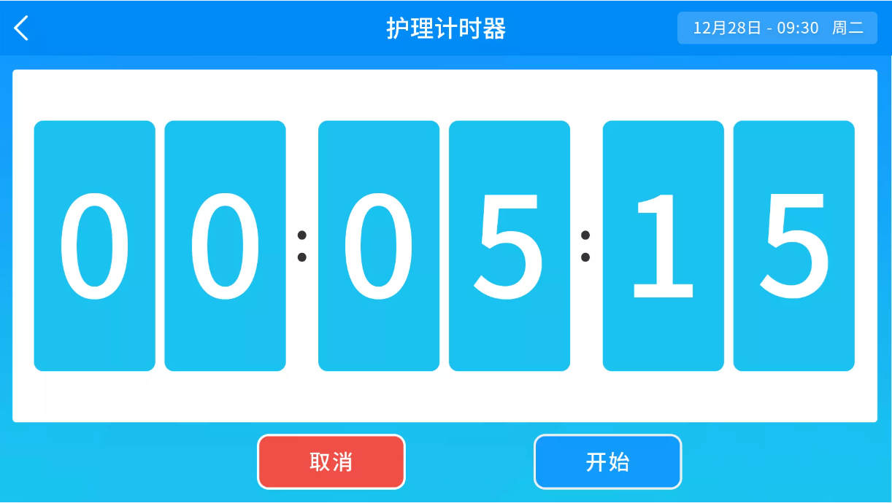{width="6in" height="3in"}

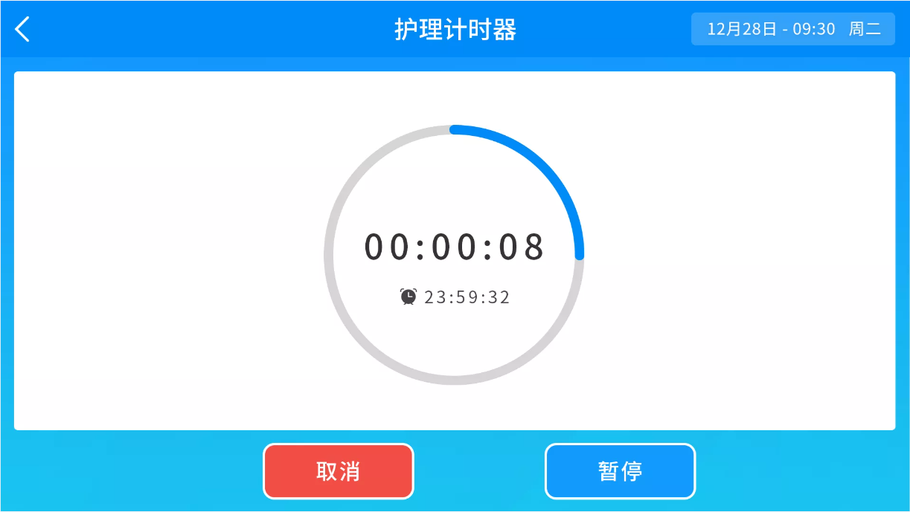{width="6in" height="4in"}

护理计时器：护士可以在床旁设置计时器，如：吸氧计时，输血计时，定时体征采集等。设定后床旁会进入计时，当计时完成后，床旁终端会主动上报护士站。提醒护士要及时到病房进行相应处理。

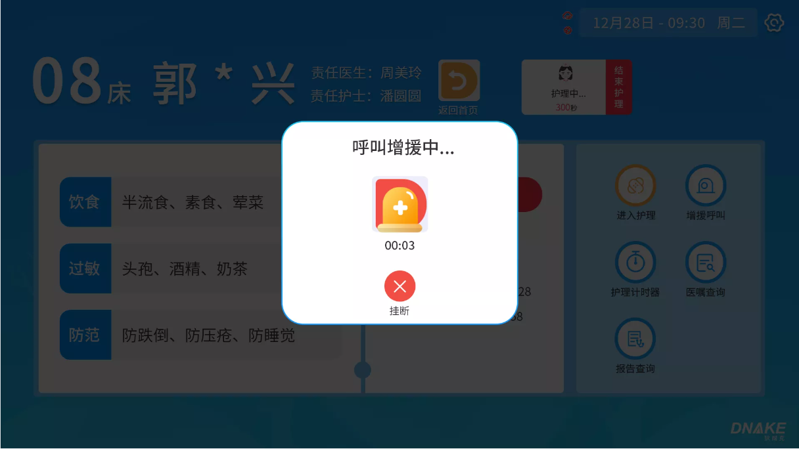{width="6in" height="3in"}

增援呼叫：当护士在护理过程中，遇到需要增援的情况，可以在床旁发起增援，门灯联动红色。便于增援人员快速到达定位。

**我的诊疗**

患者可以通过我的诊疗模块查看出入院须知、我的信息、医嘱查询、每日清单、诊疗单、患者报告查看，在床旁即可全方位查看诊疗明细，提高医患信息沟通效率。

- 住院信息

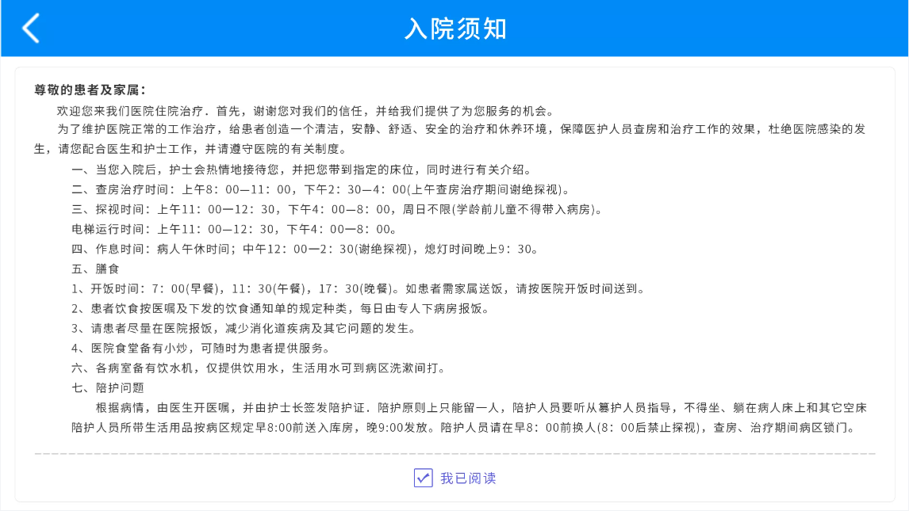{width="6in" height="3in"}

主要包括入院指引和出院指引，患者入院和出院时，提供详细的说明信息，提升患者的住院体验，避免患者出院的时候多跑路，进一步减少医患矛盾，提升医院的信息化水平。

**消息通知**

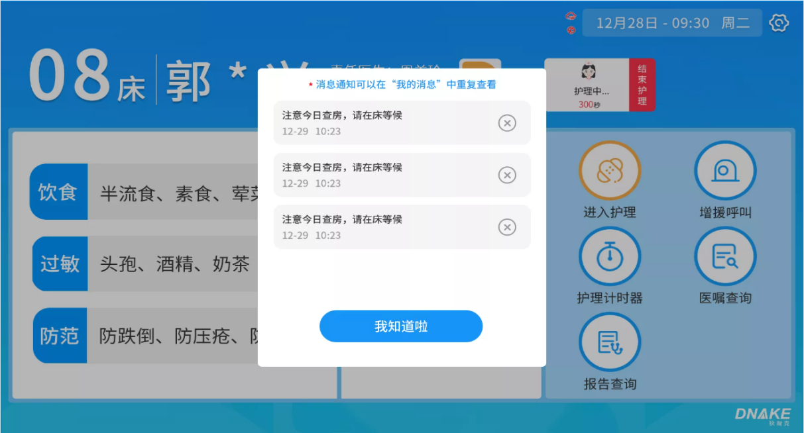{width="6in" height="4in"}

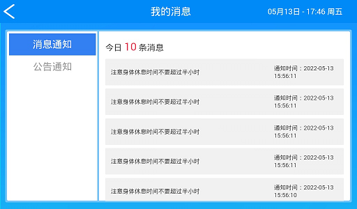{width="5in" height="3in"}

消息提醒包含病区公告、检查、检验通知、用药提醒，其中病区公告主要是接收平台推送的消息，便于患者在院期间了解病区情况；检查、检验通知是指患者今天需要检查检验内容，对接HIS系统的检验检查信息，到时提醒患者及时去检验检查；用药提醒是指对接HIS系统的医嘱信息，到时间提醒患者用药。

**我的费用**

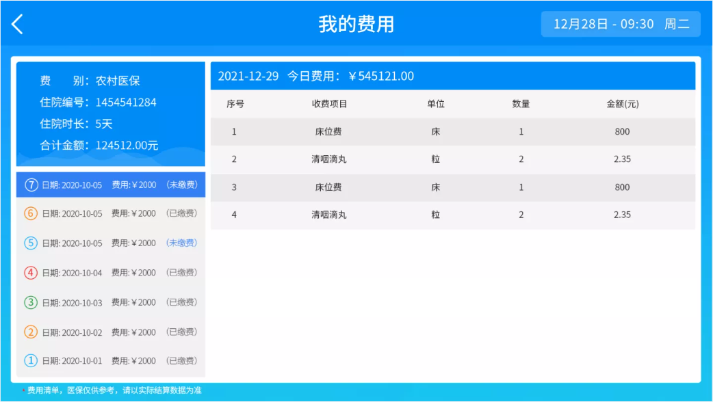{width="5in" height="3in"}

患者通过每日清单可以住院期间每天的诊疗详情以及费用情况，包含预交金总额、当前余额，以及各项费用详情。数据同步HIS系统。患者和陪护人员可以查询每日费用清单，护士可以通过费用清单了解到患者的费别，缴费情况等信息，以免延误治疗，特别是自费类患者。

**医嘱查询**

医嘱信息是通过同步HIS系统数据展示每位患者关于医生出具的医嘱信息；护士可以在床旁终端方便快捷的查询长期医嘱/临时医嘱。有助于护士进行三查七对工作，并且表明医嘱状态，可以提升护士的护理质量，减少医疗事故的发生，同时也让医生的床旁查房时更加方便快捷的核对医嘱，不容易遗漏关键信息，提升医疗质量和护理质量。

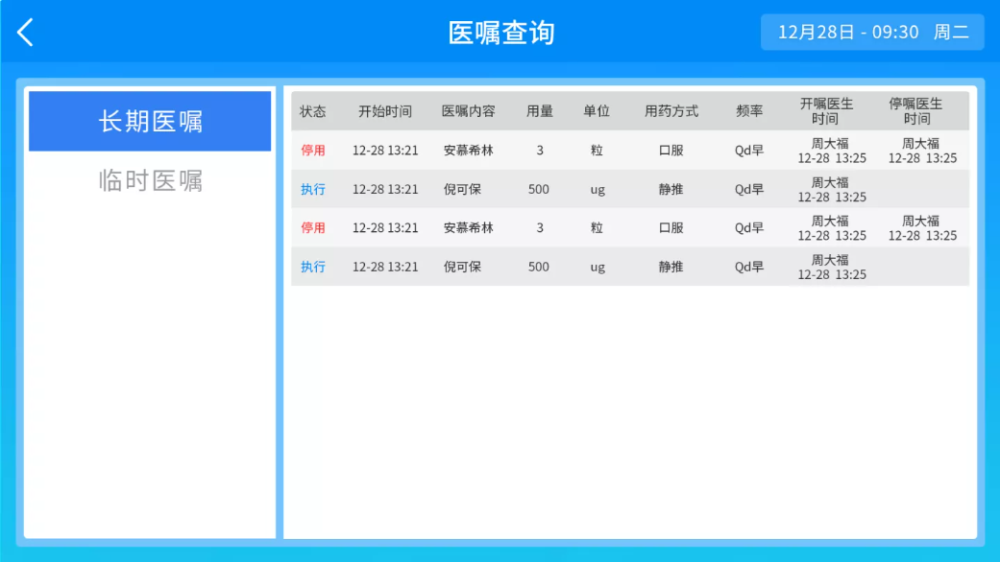{width="6in" height="3in"}

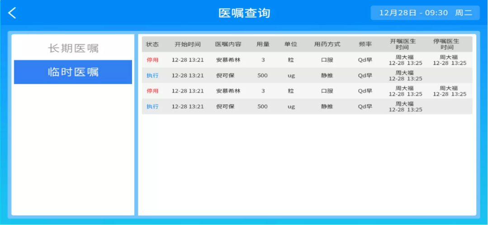{width="6in" height="3in"}

**我的报告**

患者可以在床旁终端上及时查看检查报告和检验报告，减少患者或家属来回跑动拿取纸质报告的负担。医生和护士在床旁就可以查看患者的相关报告，同时也让医生查房时在床旁终端设备上更加方便快捷的核对病情发展，不容易遗漏关键信息，提升医疗质量和护理质量。

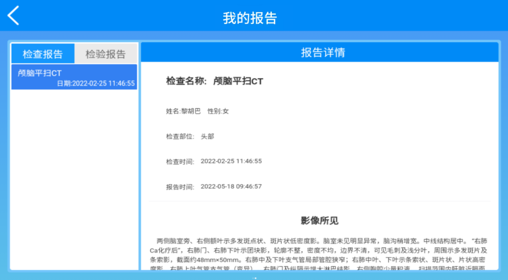{width="5in" height="3in"}

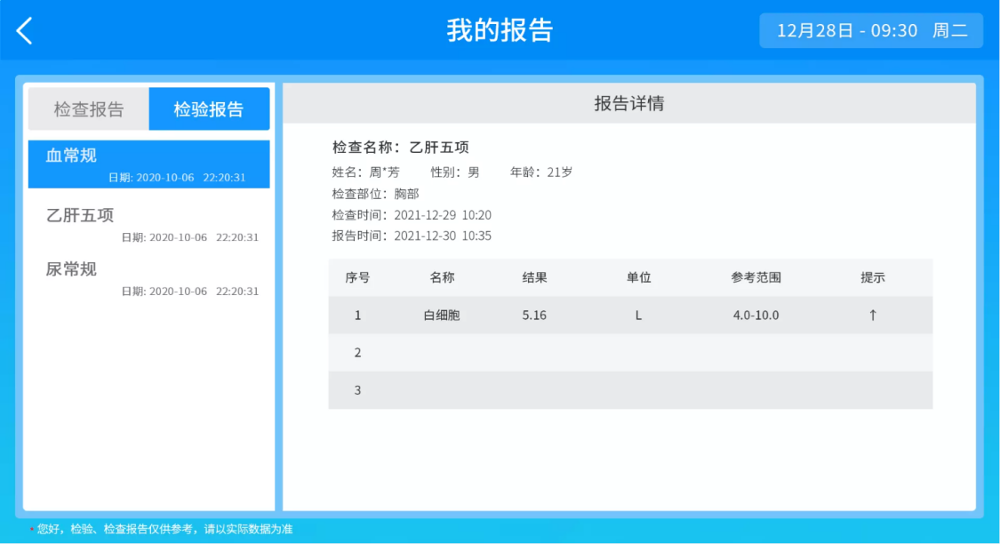{width="5in" height="3in"}

**2.医院信息服务**

**医院介绍**

主要包括医院简介、科室简介等功能，患者可以通过床旁终端查看医院和科室的相关信息，通过了解自己所住科室的强项，历史等信息，解除患者焦虑，入住更加安心。

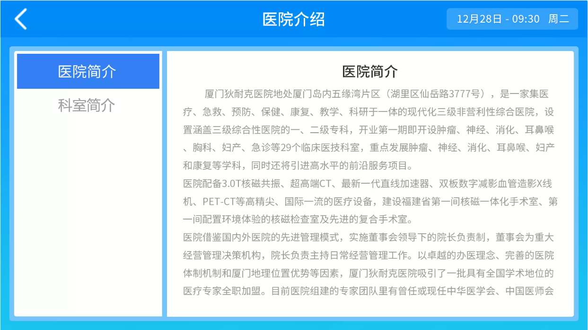{width="6in" height="3in"}

**健康宣教**

健康宣教资源将会根据不同的科室在管理平台进行下发视频资源，护士可以通过管理机远程向患者发送宣教视频，为患者展现与自己疾病相关的宣教资料。系统兼容图片、文字、视频格式，点击后将会进入预览和播放程序；减轻护士每日宣教的工作量，患者观看后可以点击"我已观看"，将观看结果进行反馈，大大减轻了护士的工作量。

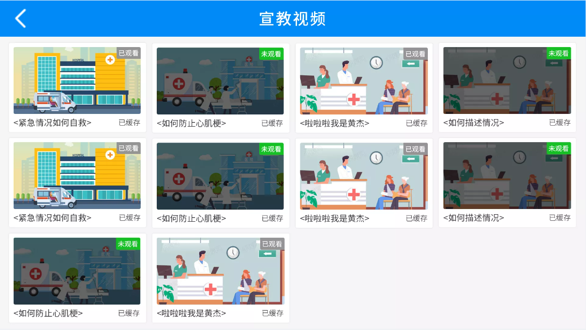{width="6in" height="3in"}

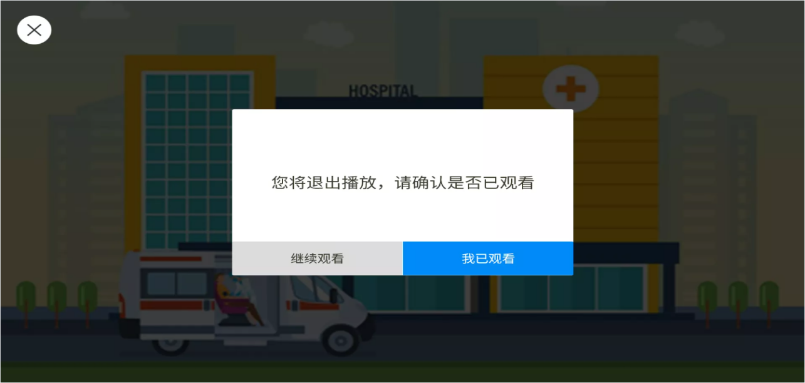{width="6in" height="3in"}

患者可以点击健康宣教视频，进行查看。便于患者更加了解当前病症的防止手段，注意事项。通过视频宣教的方式，可以更加生动的进行宣教，并更利于患者记忆。

**问卷调查**

系统提供问卷调查的功能，通过后台系统配置问题，患者可以方便且匿名进行服务反馈，护理质量反馈；患者提交后，可以在管理后台查看每份问卷的统计信息。便于病区管理层对服务质量、护理质量等方面进行评估，持续改进，和持续收集反馈；帮助医院提供服务水平，同时也监督了医护人员的工作，优化科室和医院的服务管理水平。

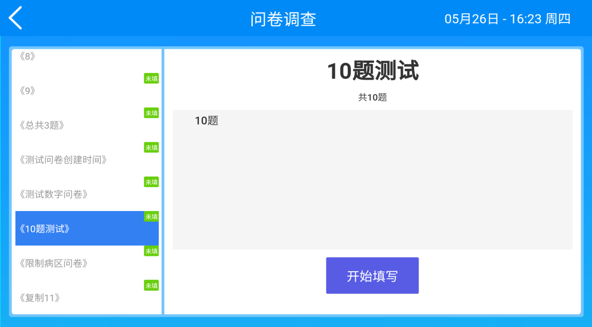{width="6in" height="3in"}

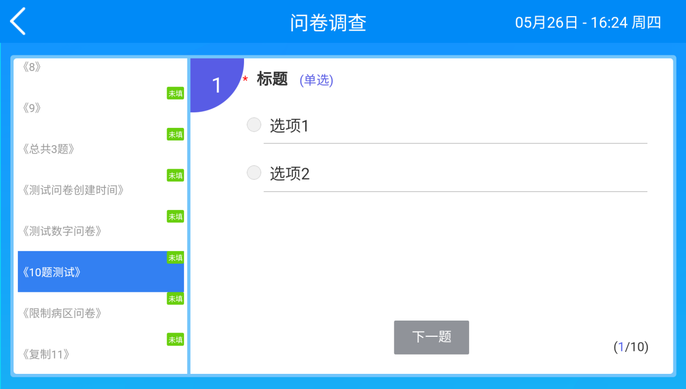{width="6in" height="3in"}

**3.拓展服务**

**在线点餐**

- 如果医院餐厅已有第三方点餐平台，则可对接第三方平台进行点餐，在患者床旁终端设备上添加点餐入口二维码，便于医院及时更新订餐途径，并完成在线支付，订单生成后将同步至第三方平台，餐厅人员根据订单完成餐品配送至患者病房；方便患者进行点餐，也让医院有效的引导患者健康饮食。

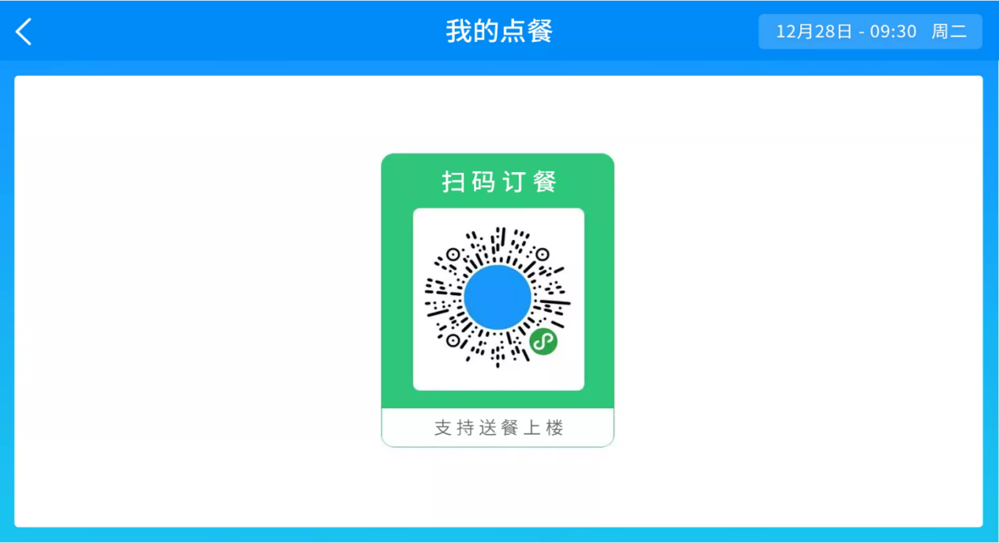{width="6in" height="3in"}

**4.智能控制**

面向住院患者和陪护人员，可通过床旁交互终端便捷控制病房灯光和场景，如：更衣隐私、夜晚场景等。实现让信息多跑路，患者少走路，让患者家属切实享受医疗服务改善带来的便捷、便利。

- 支持病房公共设备和病床私有设备的智能控制
- 实时监控病房环境参数，包括温度、湿度、PM2.5、CO2、照度、TVOC、噪音等7项指标
- 提供病房场景的一键切换功能

{width="6in" height="3in"}

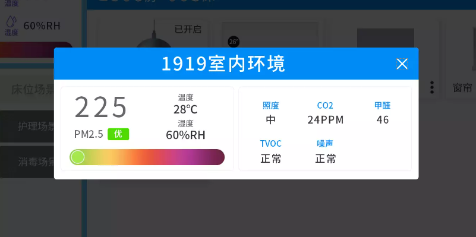{width="6in" height="3in"}

5.  **视频探视**

该功能为系统功能，无图标入口，可以接听管理机转接的探视画面。在疫情常态化的情况下，很多时候限制了家属的陪护。家属在医院可以进行视频探视，床旁终端也可以更加清晰的让患者和家属进行探视，大屏幕双方画面展示更好，沟通更加顺畅。

根据系统设置选项判断是否自动接听还是手动接听。默认设置3秒自动接听，若3秒内手动点击接听，即可接通画面。

6.  **睡眠报告**

主要应用在提供给患者或者医护方便查看个人的每日睡眠监测报告，为医生诊断和分析患者睡眠状况的重要依据。

每日睡眠报告：

- 展示人睡眠监测员睡眠评分、清醒、浅睡、深睡、离床的时长以及占比
- 展示睡眠监测人员的入床时间、起床时间、有效睡眠时长、翻身次数、最大呼吸率、最小呼吸率、离床次数、离床记录

每月睡眠报告：

- 睡眠质量：
  - 本月每日睡眠评分与上月相比变化曲线图
  - 本月每日深睡时长与上月相比变化曲线图
  - 本月每日睡眠时长与上月相比变化曲线图

- 心率情况：
  - 本月每日平均心率与上月相比变化曲线图

- 呼吸率情况：
  - 本月每日平均呼吸率与上月相比变化曲线图
