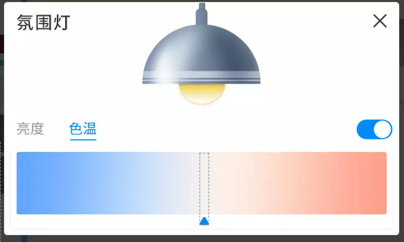

## 病房控制系统

### 系统概述

狄耐克无线病区智能控制系统打破传统的病房病区灯光、电器控制方式，采用全新的无线智能控制，拥有多项独有核心技术，通过病床旁终端一键控制全屋灯光、无需重新布线，一个智能化的病房病区环境，可以让成员随时随地、随心所欲享受智能带来的舒适、方便和乐趣。系统整体架构图如下所示：

{width="6in"}

### 设计方案

#### 关键技术介绍

本系统采用ZigBee无线通信技术，zigbee技术是一种新兴的、短距离、低速率、低功耗、低成本、自组网、低复杂度、安全可靠、高扩展性的双向无线通信技术。ZigBee的基础是IEEE802.15.4，这是IEEE无线个人区域网（PersonalAreaNetwork，PAN）工作组的一项标准，被称作IEEE802.15.4 ZigBee技术标准，主要适用于自动控制和远程控制领域，支持地理定位功能。

狄耐克无线病区智能控制系统采用国际领先的zigbee无线组网技术，将前端设备床旁终端、灯光、窗帘、空调、新风等组成通讯组网，用户可以通过智能面板以及床旁交互屏互联网通信终端等方式，一键搞定所有控制设备，随时了解病房病区的实时信息，完成对设备的各项控制。

**系统亮点**

| 特性       | 描述                                                                                       |
|------------|--------------------------------------------------------------------------------------------|
| 无线遥控   | 采用Zigbee无线通讯技术，360度无线遥控控制，信号能穿透墙壁和障碍物，有效控制距离非空旷15米，空旷可达40米 |
| 自由组合   | 可以在任何时候、任何空间内安装，也可分期分批地增加系统部件和功能，不同区域之间无需任何布线，随心扩展     |
| 超低功耗   | 超低功耗保证了设备电池供电时的续航能力，使系统外设的扩展更加灵活、方便                                 |
| 传输时延   | 优异的硬件性能，确保了无线信号传输的低时延，单个信号时延40-70ms                                         |
| 多设备传输 | ZigBee信号支持一对多传输                                                                               |
| 扩展性强   | ZigBee可采用星状、片状和网状网络结构，可支持多个网络节点，保证系统容量能满足未来扩展需要                 |
| 安全性高   | ZigBee具备特有的安全层，采用128K高级加密技术，具有非常高的安全性                                         |
| 可靠性高   | 采用了调频和扩频技术，有着极强的抗干扰能力                                                             |
| 精准反馈   | 实时信号反馈，设备端或APP端做了操作指令，关联设备可以实时显示设备的控制状态                              |

#### 系统优势

**（一）无线传输，自由组合**

现代投入使用的医院可能根据自己的需要空间进行局部的改变，如增设病房，多数病区智能控制产品采用中控方式对所有的设备进行集中控制，在空间改变时，所有新增设备必须重新布管引线到中控主机，必须对整条控制线路进行重新布管布线，势必破坏医院的装修，为建筑空间的最大杀手。

狄耐克无线病区智能控制系统采用ZigBee无线组网方式，当空间发生改变时，无需破坏原有线路，就可实现新增区域的病区智能控制控制，系统的扩容性得到极大满足。空气宝、智能插座等设备，可移动式安装，可以在系统随意增加，既是病区智能控制终端，又是精美的装饰摆件。

**（二）标准协议，无穷潜力**

狄耐克无线病区智能控制系统采用标准ZIGBEE通讯协议，可以轻松兼容、接入各种标准ZIGBEE通讯设备，保证了系统源源不断的升级和扩展空间。

**（三）多元合一，轻松掌控**

狄耐克病区智能控制系统用现代化手段，将灯光照明、温度空调、电器控制、安防报警、智能传感等控制系统有机融合，功能真正做到All In One，为您提供"安全、舒适、便捷、高效、节能"的全新护理体验。

#### 体系结构

{width="6in"}

#### 功能说明

**平台总控说明**

通过接口获取平台的物联网设备状态数据，为智慧病区的整体数据展示提供基础信息支持。

面向医院管理人员，可以通过平台连接医院服务器对各病区楼层的智能场景，灯光环境等进行控制。

面向信息化科室人员，可以通过平台远程配置不同病区相应的场景。

{width="6in"}

{width="6in"}

{width="6in"}

1. 通过管理平台控制各楼层设备，可区分病房和非病房。
2. 可通过总控看板，预览各楼层的总体环境状态
3. 楼层和病房环境看板，查看详细环境信息以及周期记录。
4. 根据环境设备的配置，最高支持7种环境监测设备。
5. 区域智能控制，可远程控制各区域的智能设备和智能场景。

**病区集中控制**

面向病区管理人员，通过护理白板可以集中控制并且切换夜间/日间灯光环境，暖通环境等。

根据不同时间，可配置不同的应用场景，再时间到达时，由系统自动切换场景，无需人员介入，实现病区环境的智能管理。

{width="6in"}

{width="6in"}

{width="6in"}

{width="6in"}

1. 可集中控制病区内的公共区域和各个病房。
2. 可监控不同区域的环境信息，最高支持7种环境参数：温度、湿度、PM2.5、CO2、照度、TVOC、噪音。
3. 可查看病区历史记录，日记录，周记录，15日记录。
4. 可一键切换病区场景，可查看场景详细配置。
5. 可详细控制智能设备详细参数，如灯光色温，空调温度，风速等。
6. 可同步病区智能设备的设备状态，以便查看设备详情

**床旁交互终端控制**

面向住院患者和陪护人员，可通过床旁交互终端便捷控制病房灯光和场景，如：更衣隐私、夜晚场景等。实现让信息多跑路，患者少走路，让患者家属切实享受医疗服务改善带来的便捷、便利。

{width="6in"}

1. 可控制病房公共设备和病床私有设备。
2. 可监控病房的环境信息，最高支持7种环境参数：温度、湿度、PM2.5、CO2、照度、TVOC、噪音。
3. 可一键切换病房场景。
4. 可详细控制智能设备详细参数，如灯光色温，空调温度，风速等。

{width="6in"}

**智能灯光控制**

通过将传统的普通机械开关替换成智能控制型智能开关，即可实现本地灯光控制、远程控制、定时控制、集中控制，如需在特定时间照明，可利用定时装置和传感装置控制系统，在合适的时间提供合适的照明。

{width="6in"}

{width="6in"}

**调光灯**

- 支持开/关灯
- 支持调节亮度、亮度同步、亮度记忆

**色温灯**

- 支持开/关灯
- 支持调节亮度、亮度同步、亮度记忆
- 支持调节色温、色温同步、色温记忆

**智能窗帘控制**

通过智能触摸窗帘面板或数字终端实现本地控制、远程控制窗帘拉开、闭合、暂停，亦可配置窗帘遥控器进行控制。

{width="6in"}

{width="6in"}

**窗帘控制**

- 支持全开/全关
- 支持中途停止

**窗口控制（带开度控制）**

- 支持全开/全关
- 支持自定义开度

**空调控制**

{width="6in"}

{width="6in"}

{width="6in"}

**空调面板**

- 支持空调开/关
- 支持温度调节
- 支持模式切换、智能模式（自动模式）
- 支持风速切换、智能风速（自动风速）

**新风控制**

{width="6in"}

{width="6in"}

**新风面板**

- 支持风速调节，风速同步
- 支持开/关

**地暖控制**

{width="6in"}

{width="6in"}

**地暖控制**

- 支持开/关
- 支持温度调节

**环境监测**

可通过不同类型的环境监测设备，结合多屏多端设备，实现对于公共区域，病房区域等不同区域的全方位环境数据监测和历史数据查询。

{width="6in"}

环境监测可联动场景切换，如：CO2，达到一定档位区间，可开启新风系统。温度达到一定温度，可开启空调设备。

{width="6in"}

1.通过护理白板可查看病区各个区域的环境信息。

{width="6in"}

2.通过床旁交互终端可查看当前病房环境信息。

{width="6in"}

3.通过病房门口机，可快速预览病房内环境信息也可查看详细环境参数。

{width="6in"}

4.通过走廊屏，可快速预览当前病区温湿度。平台端可绑定环境监测设备。

{width="6in"}

**智能安防控制**

安装烟雾探测器，对病房的烟雾进行浓度探测，当烟雾浓度超标时，烟雾探测器及声光报警器同时发出报警信号，并推送至护士站看板终端显示。

门窗安装门磁，在布防模式下，门窗被非法开启，推送报警消息到管理终显示。