## 云服务+ICU探视系统

### 系统概述

云服务+ICU探视系统是专门为了医院重症监护病房住院病人与亲属之间的沟通和探视，而设计开发的一套运用现代化科技电子技术的图像视频、音频传输系统。它运用了高集成度、高速、高稳定性的电脑微处理器，保证了系统长期稳定的工作，保证了图像视频和音频信号的高清晰度和高稳定性，以及高连续性。

重症监病房收治的患者，是整个住院期间抵抗力最低，病人病情危重，且处于空气净化环境中，家属进入病人区域进行探视容易将有害细菌带入，对术后或危重病人造成感染影响健康，为此通过专业视频设备进行隔离探视，能避免感染。保证医护人员与患者的信息沟通通畅及时了解患者的病情。患者与外界的交流的窗口，家属通过探视系统为患者带去关怀与信心，提高诊治效率。因此从保护患者及方便家属探视的角度出发，采用严格的探视管理制度和隔离制度是相当的必要。

### 设计方案

#### 网络架构

- 医院：采用数字化云服务+ICU探视系统可以为医院增加新的功能，提升医院的数字化建设水平，也有利于提升医院的公众形象。
- 施工方：施工安装而言，设备线材都很简单，为采购提供了便捷，成本上也更经济，采用标准化的布线与安装方式、使得安装与维护都非常简单。
- 医护人员：对于使用系统的医护人员而言，可靠的系统带来的投诉更少、管理和维护容易，可大大减轻劳动强度。
- 病人：数字化云服务+ICU探视系统提供了全数字的高科技、高品质、舒适、安全、便捷的体验。
- 家属：无需进入医院，可通过云服务技术实现居家远程探视，为探视患者带来更便捷的服务，提升患者及家属就医体验。

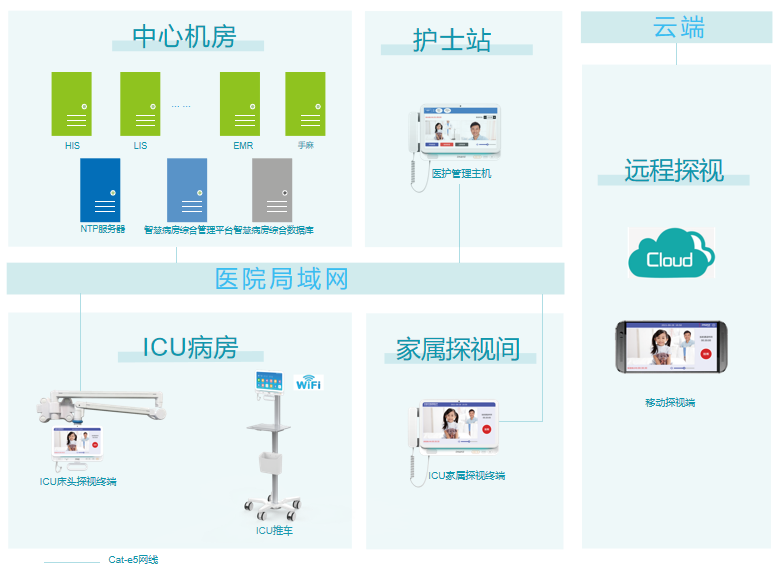{width="6in"}

主要由护士站管理电脑、ICU医护管理终端、家属终端（含云端）、ICU床头终端、病区门口机等组成。

系统说明：

- 一个ICU病区设病区管理中心一个（护士站），大型病区可在护士站设置多台医护主机，便于优质化服务及工作效率。
- 在病区联网建设上，采用高品质的网络交换机，来实现病区的数字交换、传输等功能。
- 在传输材料上，远距离连接宜采用光纤和光纤收发器进行连接，病区内部采用五类线进行传输。
- 病区出入口根据现场实际情况，每个出入口设置一台病区门口机，便于探视者与护士站可视对讲来确认身份。医护人员出入通过多种方式（如，刷卡、指纹识别、人脸识别等）通行。
- 家属端进行远程探视，可运用移动端实现家属的探视预约，线上远程探视，方便家属随时随地对患者进行探视请求。

**系统优势：**

狄耐克数字化云服务+ICU探视系统的技术优势主要表现在：

- 布线简单：联网采用TCP/IP协议传输数据，可以利用病区已有的综合布线网络，无须单独敷设线路，大大简化布线工程，施工周期和费用也大大减少。病区内部采用五类线连接ICU病床分机、ICU医护主机、ICU探视分机、病区门禁机。
- 施工方便：组网材料主要是超五类线，线材简单，终端产品可以即插即用，系统布线到位后直接插到网络端口上即可，整体施工维护都很方便。
- 远距离传输：采用 TCP/IP 协议联网对传输距离没有限制，系统扩容方便，可适合大型医院的组网需求。
- 多通道通讯：采用 TCP/IP 技术联网，可实现点对点信号传输，联网支持多通道呼叫对讲，联网线路不会存在占线现象。
- 系统开放性：对讲系统采用规范化标准化的传输协议，提供标准化开放性的接口，为和其他系统集成提供了方便。
- 抗干扰能力强：各音视频、控制信号采用数字化联网，传输无损耗，不受线路干扰，不受距离限制，信号稳定可靠。
- 升级扩展方便：数字化 ICU 探视系统具有很强的扩展性，产品软硬件均采用模块化设计，这样一些用户个性化的需求比较容易满足，今后的扩展升级也十分方便。
- 支持云端探视：家属可以居家实现远程探视，便于患者和家属更便捷的沟通，同时满足院内探视管理减少院感风险，提升患者及家属就医体验。

#### 系统应用场景

狄耐克云服务+ICU探视系统应用场景主要有【家属探视区】【家属远程探视空间】【护士站】【病床床头】【病区门口】。

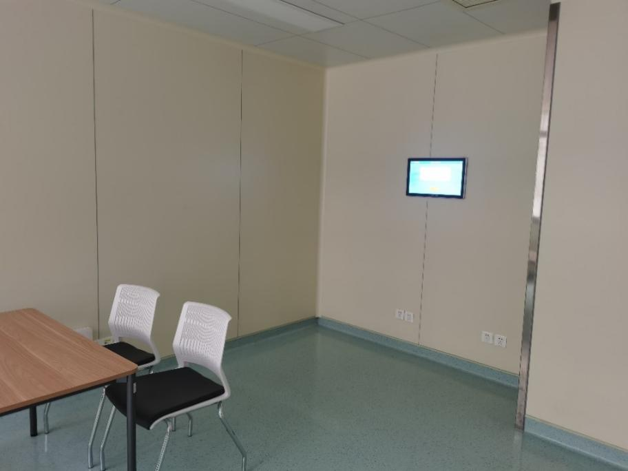{width="6in"}

**家属探视区：**

- 家属探视区主要部署功能包含对讲呼叫、视频通话等设备。
- 桌面放置家属探视主机，用于向护士站发出探视请求，并且可实现与患者之间进行视频通话。

{width="6in"}

**家属远程探视空间：**

- 家属通过微信小程序可以实现居家远程实现远程探视。
- 家属首先进行探视预约，待预约申请由护士通过后可在指定时间内对患者发起探视。

**护士站：**

护士站主要部署功能包含信息查询、对讲呼叫、信息管理等设备：

1. 墙面挂载护士站护理白板，显示科室病房的住院人数、空闲床位数、护理等级人数、护理交接班情况、值班的医护人员、职工排班、患者生命体征、病区环境信息以及要事留言。
2. 部署一到多台医护管理终端，用于接听病房呼叫及病房信息查询，也可呼叫医生值守终端；并可接收家属探视机的呼叫请求，及时转移到病床，实现家属与患者之间的视频通话

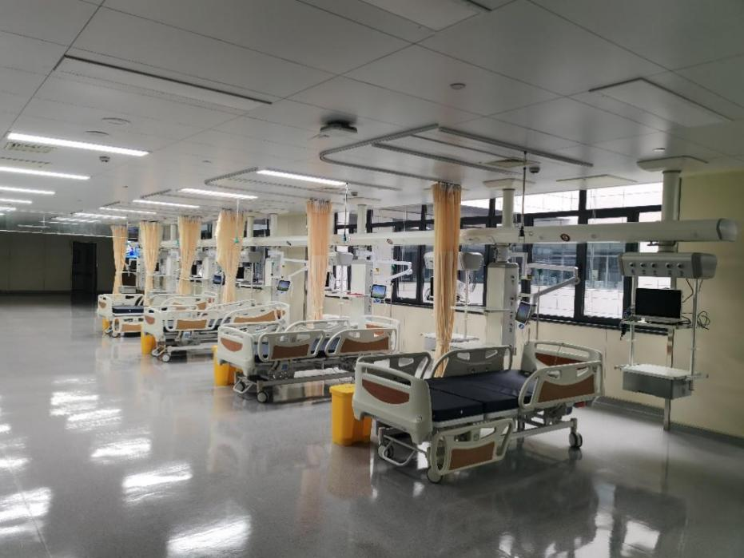{width="6in"}

**病床床头：**

ICU病床床头主要部署功能包含病房呼叫、病床报警、费用清单查询、医嘱查询、护理定位等：

1. 病床床头各部署一台ICU床头终端，用于呼叫医护管理终端，也可查看相关信息。
2. 可实现与家属之间双向视频通话。

### 功能介绍

#### ICU医护管理终端

1. 病区患者遇到紧急情况时，可通过床头呼叫按钮进行呼叫，护士可通过ICU医护管理终端收到呼叫并进行通话。

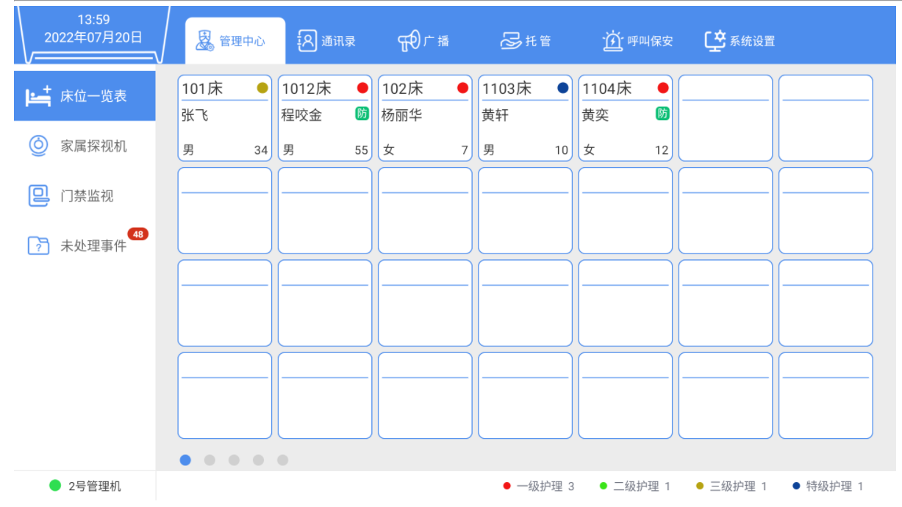{width="6in"}

2. 可视对讲

- 由家属端先呼叫ICU医护主机，主机如下图所示界面

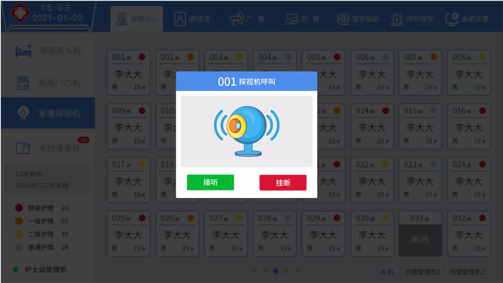{width="6in"}

- 由医护人员通过ICU医护主机接听后与家属沟通需要探视的病人，医护人员确认病人允许探视情况后选择探视的患者床位，并可以设置探视时间。

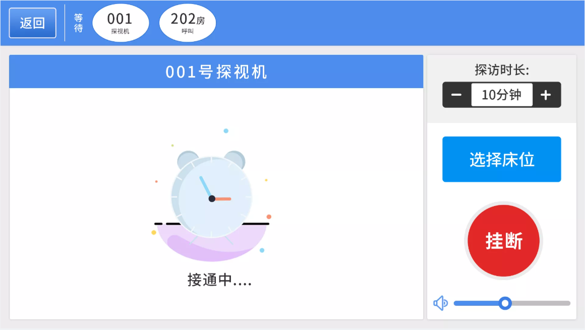{width="6in"}

{width="6in"}

- 医护人员选择床位后，家属与患者开始探视会有画面显示家属和患者两端的画面。

{width="6in"}

3. 录音录像

- 可对通话的过程进行录音录像，并可记录呼叫、通话的时间，录音录像文件可存储在分机和主机上直接播放，也可导出至电脑播放并存储；支持分机、主机空闲时，能自动将录音录像文件传到指定的服务器上。

4. 监听/监视/强拆通话

- 在家属与患者进行探视期间，医护人员可通过护士站主机可对家属与病人的通话过程进行监听、监视，甚至根据患者的状态，可进行强行切断通话。

5. 插话

- 在家属与患者进行探视期间，医护人员可通过护士站主机对其中一方进行插话操作，此时另外一方会播放一段友好提示音，主要是增加医护人员对家属与患者间的友好提示功能。

{width="6in"}

7. 查看病床

- 护士站主机支持查看病床上的病人病情，达到监视病情目的。

8. 病区门开锁

- 护士站主机可控制病区门锁的开闭，并能与探访人可视对讲，以实现病区门口的出入探视管理等级等情况。

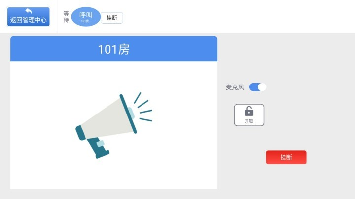{width="6in"}

#### ICU家属终端

**1. 院内探视**

1. 家属探视机一键呼叫管理机，实现与ICU医护管理机通话
2. 家属探视机发起探视由医护人员通过ICU医护管理机通过转接到对应的床位，实现双向视频探视，双向可视对讲。

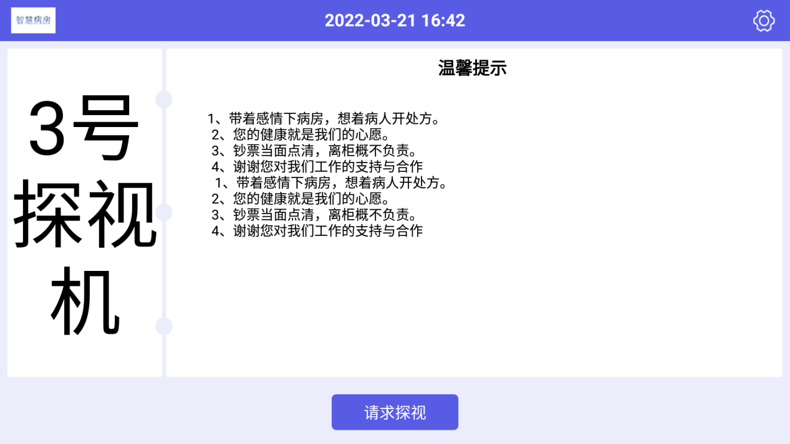{width="6in"}

**2. 远程探视**

通信方案：

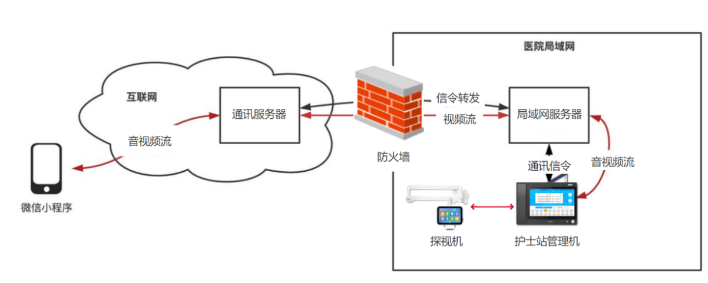{width="6in"}

功能说明：

1.  探视需求提醒，在家属预约前需要做相关的探视预约注意事项提醒

2.  探视时段选择，支持家属选择合适的时段对家属进行探视，科室的可预约时间与号源数量支持后台自定义

3.  预约信息查询，支持家属查询所有的探视预约信息，与预约的审核状态

4.  发起探视，对符合发起探视的预约做高亮提醒，对超过时段或者未到探视时间的做限制探视处理

5.  预约审核，支持护士对家属提交的预约信息进行审核操作、查看操作、驳回操作

6.  探视统计，支持对不同科室的探视时长进行汇总统计

7.  探视记录查询，支持对所有的探视记录信息的查询，支持符合条件搜索。

**ICU床头终端**

**1.电子床头卡**

支持展示患者基本信息，主要分为操作栏和患者信息两个部分，患者信息的数据来源于管理中心医护管理软件，具体介绍如下：

首页状态栏：可通过管理后台的系统参数管理中配置是否显示LOGO。

操作栏：包括床头卡、功能、增援、护理四个部分。

患者信息：主要包含患者基本信息、护理信息。

患者基本信息：包括床位号、患者姓名、患者年龄、患者性别、护理级别、入院时间、住院编号、责任医师、责任护士。

护理级别：分为特级护理、一级护理、二级护理、三级护理。护理级别底部颜色将根据级别的变化而变化。

护理信息：包括饮食状况、过敏类型、安全防范。点击将弹窗显示完整信息。

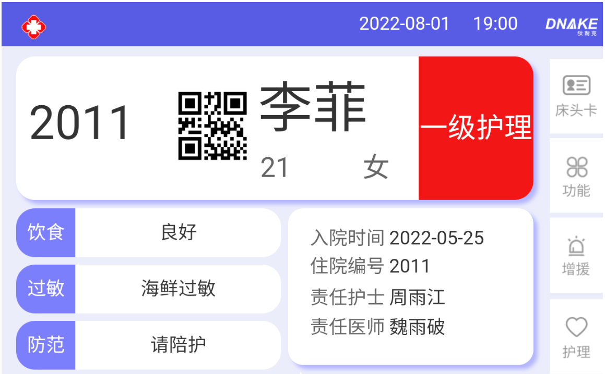{width="6in"}

**2.进入功能展示**

在操作栏中点击'功能'，进入功能页面。功能页面包括入院须知、医院介绍、科室介绍、宣教视频、费用查询、检验检查、医嘱查询、吸氧倒计时、主动息屏、消息通知、问卷调查等十一个功能模块，如下图所示。

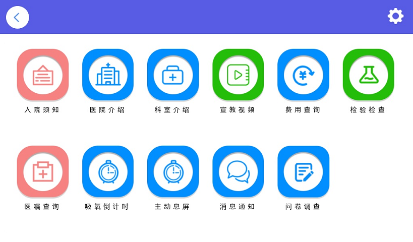{width="6in"}

2.1入院须知

点击"入院须知"进入入院须知页面。认真阅读后勾选"我已阅读"方可退出。若未勾选，则系统将提示，请勾选"我已阅读"'。入院须知页面如下图所示。

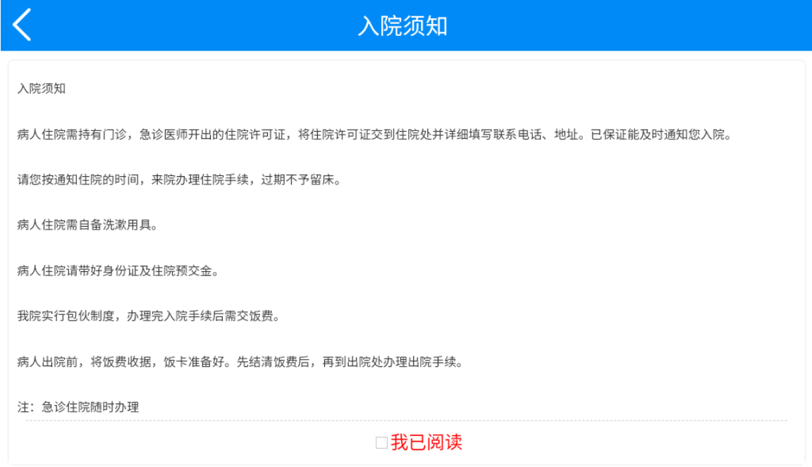{width="6in"}

2.2医院介绍

点击"医院介绍"进入医院介绍界面即可阅读医院信息，如下图所示。

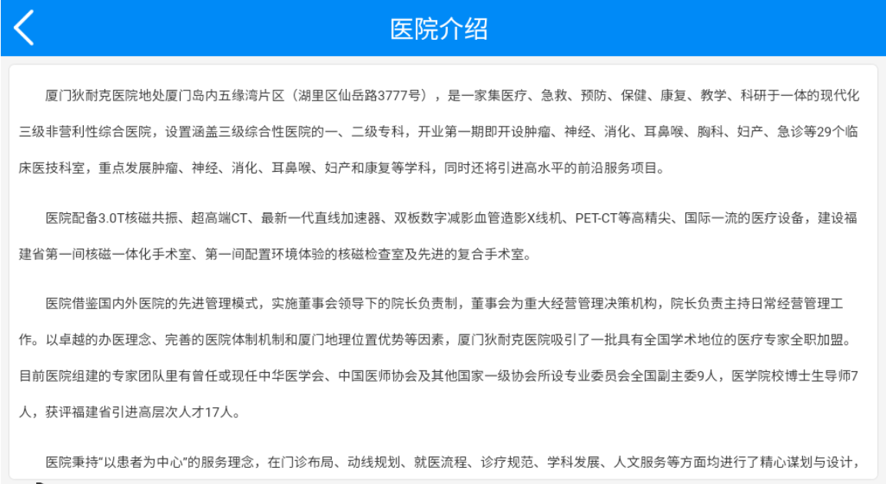{width="6in"}

2.3科室介绍

点击"科室介绍"进入科室介绍界面即可阅读科室信息，如下图所示。可通过【管理后台-院区信息管理-科室管理】编辑科室简介。

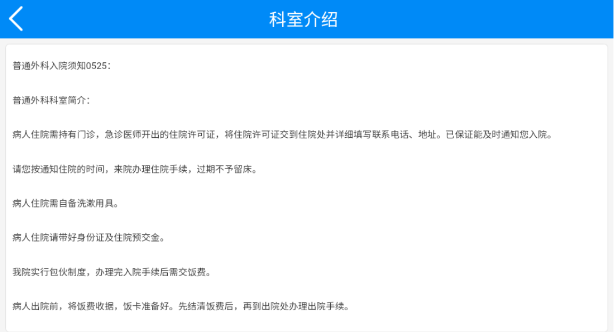{width="6in"}

2.4展示宣教视频

宣教视频可通过【管理后台-资源管理-宣教视频管理】处编辑。管理机可向床头分机下发宣教视频，下发后床头分机将接收并弹窗播放宣教视频。若想再次观看，可点击功能页中的'宣教视频'，进入宣教视频页面，页面显示该床头分机接收的所有宣教视频，点击视频即可进入观看。宣教视频分为'未观看'和'已观看'状态，若当前观看的视频状态为'未观看'时，退出时系统将提示'您将退出播放，请确认是否已观看'。

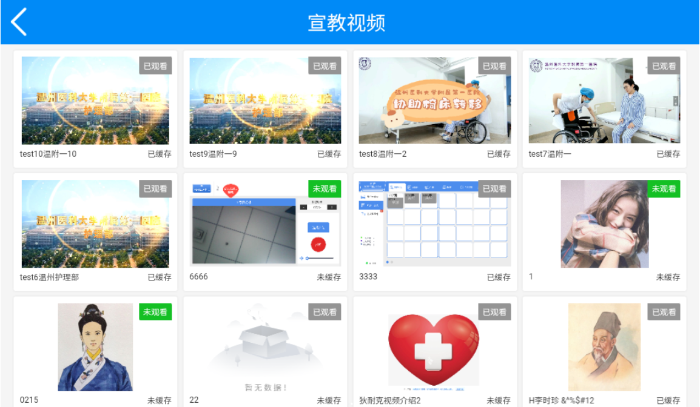{width="6in"}

2.5费用查询

数据同步HIS系统。左侧展示患者的缴费类型、住院编号、住院时长、合计金额、费用列表。右侧展示相应的收费项目、单位、数量、金额。如下图所示。

2.6检验检查

检验检查信息分为检查信息和检验信息两个部分。

检查信息。检查报告：左侧展示检查报告列表，显示检查名称、报告时间，右侧展示报告详细信息，包括检查名称、患者名称、性别、检查部位、报告时间（根据PACS可提供数据而定）、影响所见、光镜观察、检查结果。

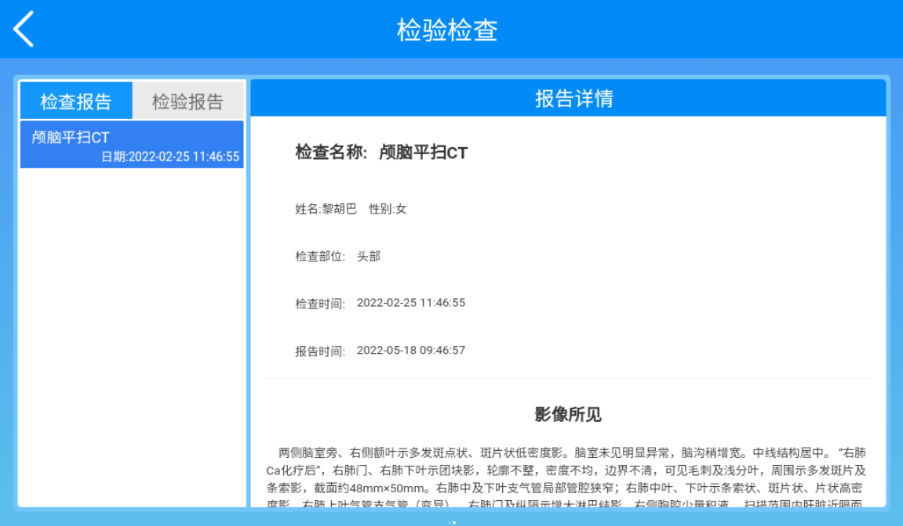{width="6in"}

检验信息。点击'检验信息'，左侧展示检查报告列表，显示检查名称、报告时间，右侧展示报告详细信息，检验名称、患者名称、性别、检验项目、检验时间、报告时间、报告列表（项目名称、结果、单位、参考范围、结果提示）。如下图所示。

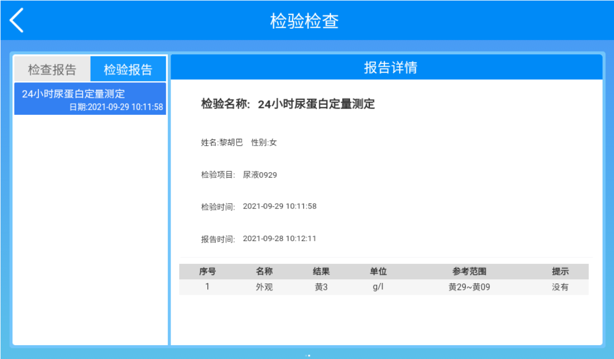{width="6in"}

2.7医嘱查询。

患者可以查看自己的医嘱信息。数据同步HIS系统。长期医嘱展示医嘱的详细内容，包括状态（分为停用/执行，用于区分用药状态）、开始时间、医嘱内容、用量、单位、用药方式、频率、开嘱医生/时间、停嘱医生/时间。

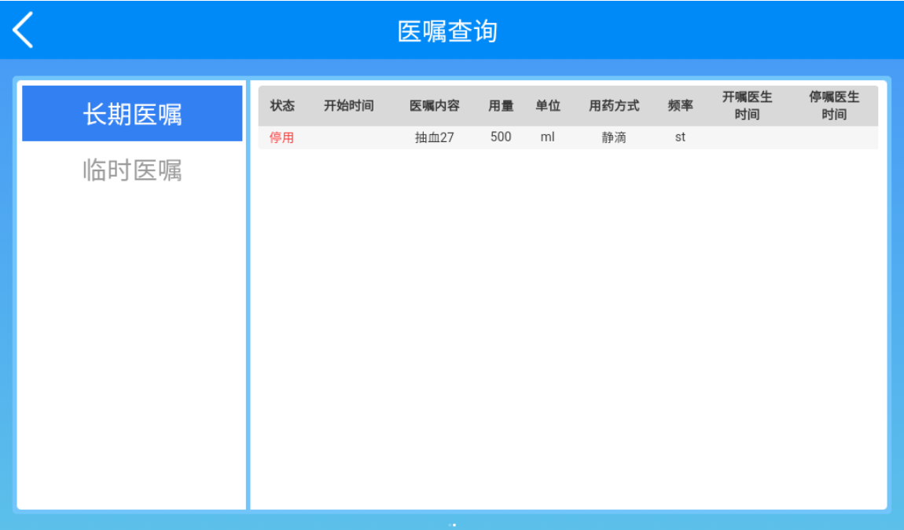{width="6in"}

临时医嘱展示医嘱的详细内容，包括状态（分为停用/执行，用于区分用药状态）、开始时间、医嘱内容、用量、单位、用药方式、频率、执行人/时间、停止执行人/时间。

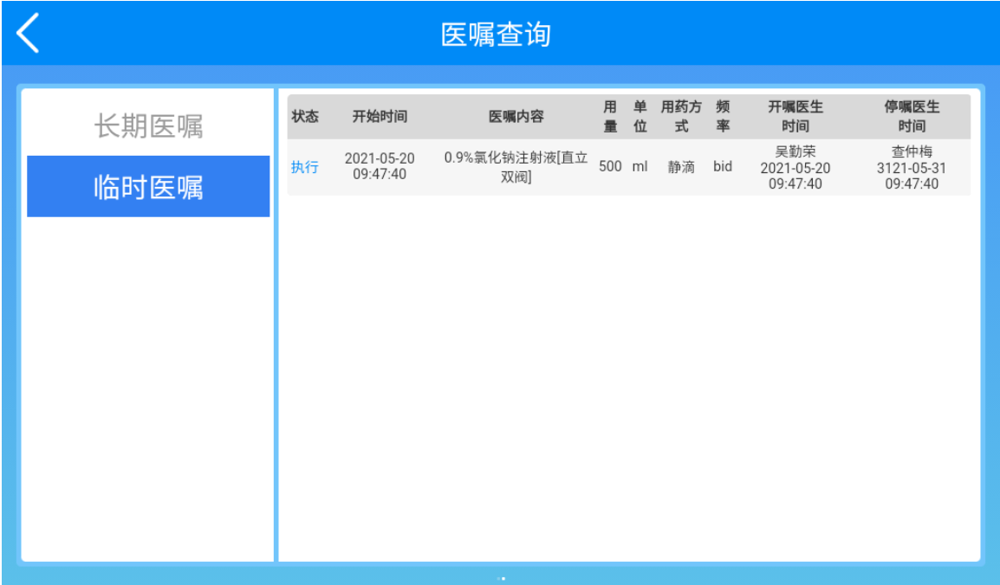{width="6in"}

2.8吸氧计时

护士可以设置吸氧时间，当吸氧时间结束，床头分机会自动呼叫管理机。

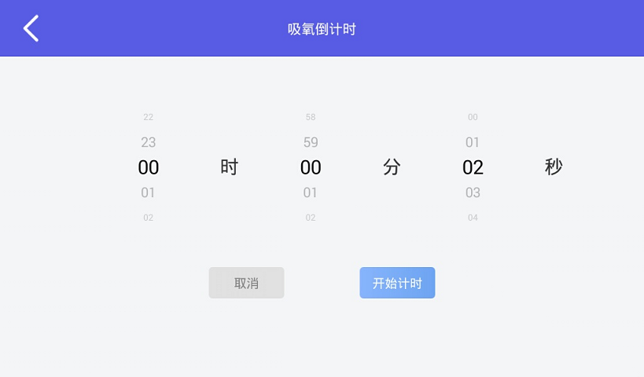{width="6in"}

当点击'开始计时'后，界面跳转至倒计时界面，如下图所示。

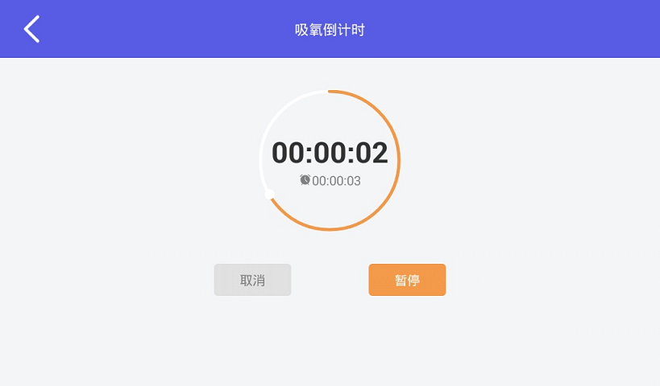{width="6in"}

倒计时结束后，系统显示定时报警弹窗并语音播报信息。如下图所示。

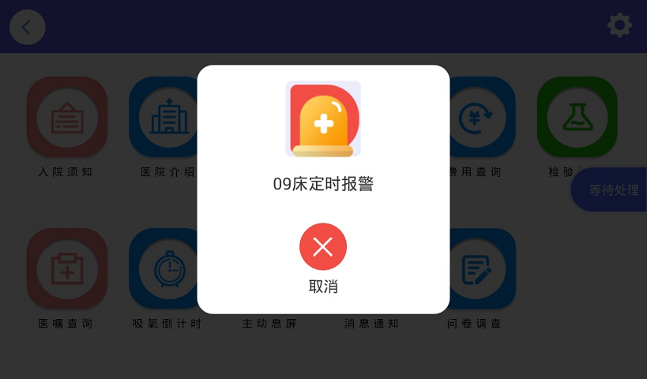{width="6in"}

2.9主动息屏

当点击"主动息屏"，床头分机将熄灭屏幕，再次点击可唤醒屏幕。

2.10消息通知

消息通知可通过管理机向床头终端下发消息。床头分机接收下发的消息，床头分机显示消息列表弹窗。初次接收的消息需弹窗显示，另外，消息通知可在功能页中的"消息通知"模块重复查看，消息通知模块分为消息通知、公告通知两个部分。

消息通知。消息通知页面列表显示所有消息，如下图所示。

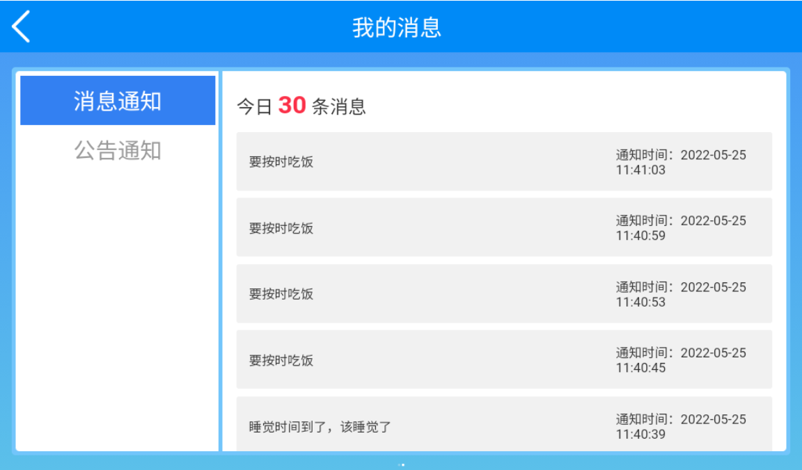{width="6in"}

公告通知，公告通知页面列表显示所有公告的标题，点击"查看"可阅读公告详情。

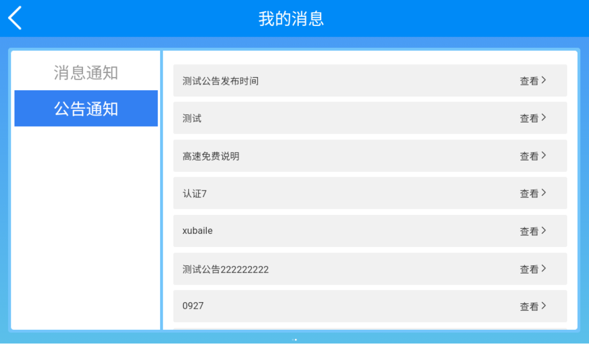{width="6in"}

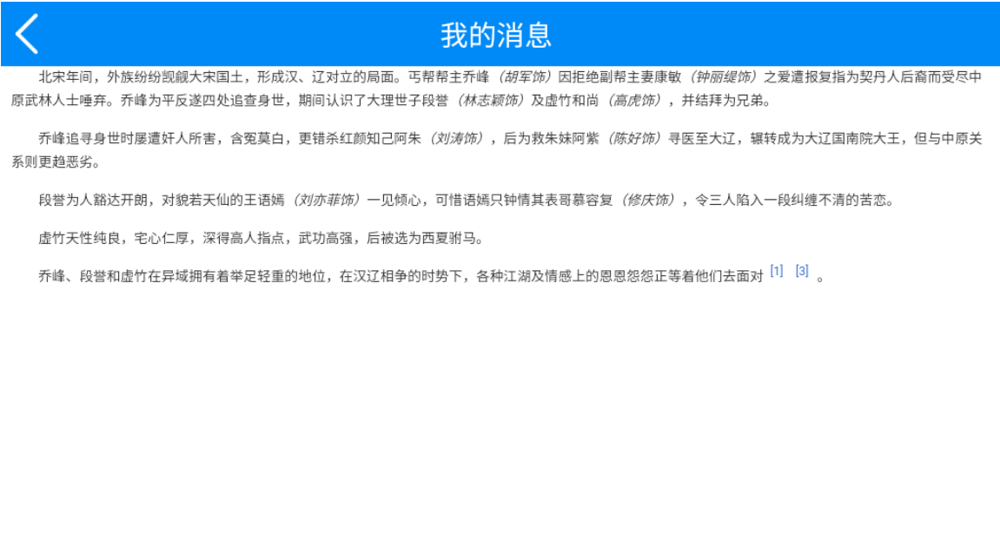{width="6in"}

