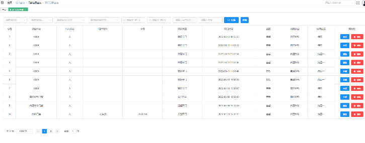

## 门禁管理系统

### 设计方案

**系统架构**

狄耐克智慧门禁管理系统方案通过部署在病区出入口的终端设备，部署在护士站的管理终端、护理交互白板、管理副机，部署在机房服务器中的后台管理服务平台组成。

当访问者需要通过病区出入口时，经病区门口终端进行自如权限识别或者呼叫护士站管理设备由呼叫通过通话进行人工鉴别权限，身份认证后将做门磁控制开门。

{width="6in"}

### 系统概述

狄耐克门禁管理系统可以控制院内人员的出入，还可以控制人员在楼内及敏感区域的行为并准确记录和统计管理数据的数字化出入控制系统。在楼门口、电梯等处安装控制装置，如门禁控制器。访问者要想进入，必须经过人工权限鉴别，或按专用生物密码才能获准通过。门禁管理系统可有效管理门的开启与关闭，保证授权人员自由出入，限制未授权人员进入。它主要解决了医院场所的安全问题。

### 系统功能

**人脸识别**

人员靠近，自动进入人脸识别模式。进行口罩检测、口罩人脸识别、普通人脸识别

{width="6in"}

**智能测温**

体温过高报警、禁止开门、防止疫情扩散

{width="6in"}

**可呼叫管理机，远程对讲**

{width="6in"}

**门禁常开**

设置门禁常开时段以及循环周期

{width="6in"}

**门禁记录可回溯查询**

{width="6in"}
