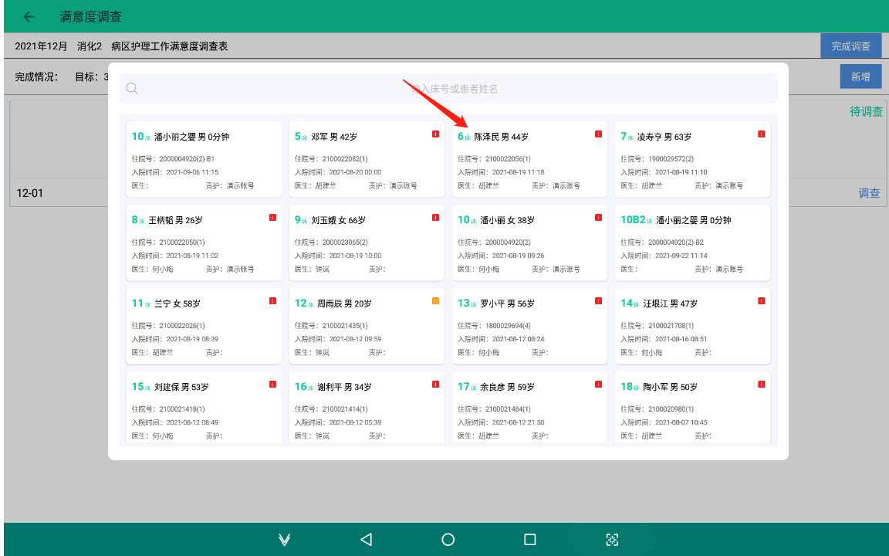

## 智慧护理系统

### 系统概述

系统建立在医院HIS、PACS、LIS、RIS等基础应用数据中心基础之上的整合型平台，系统以无线网络为依托，使用手持数据终端（移动手持终端简称：PDA或平板电脑简称：PAD），将医院各种信息管理系统通过无线网络与PDA或PAD连接，实现医护人员在病床边实时录入、查询、修改病人的基本信息、医嘱信息和生命体征等，以及快速检索病人的护理、营养、检查、化验等临床检查报告信息。通过将二维条码标识技术应用于病人腕带、药品标签、生化标签、器械包标签和标本标签等，采用PDA或PAD扫描腕带等标签信息，实现快速准确地完成出入院、临床治疗、标本采集、检查、手术、急救等不同情况下的病人、药品和标本等识别。

### 设计方案

**软件部分：** 系统采用最先进的微服务框架，前后台系统之间的交互采用REST协议。这种体系结构的好处在于各个层次非常清晰，也符合当今技术发展的趋势。

{width="5.5in"}

**硬件部分：** 系统利用无线网络将医护人员的护理工作通过移动终端设备（移动手持终端）扩展至病房内，以此来加强医护流程的过程控制。过去，诊疗信息的流动到达病区护士站就截止了，病区护士站到病人床边的信息还是靠人工操作和传递。例如，护士在患者床旁无法查询患者的诊疗信息，患者床旁各种查对工作要靠人工识别，患者体征记录要靠人工抄写，诊疗处置操作过程无法自动记录，医嘱执行等等，这限制了患者诊疗全过程的信息化管理和服务。完成移动护理信息系统部署后，当班护士人手一台PDA，可以实时登录系统，进行信息化的移动医疗护理工作，该系统可实现基本信息查询、医嘱信息查询、生命体征查询、护理任务执行提醒，并且具有生命体征录入、医嘱执行、分级数据管理和统计分析等功能，可有效减轻医护人员工作强度，提高其工作效率，进而提升医院效益。

{width="5.5in"}

### 功能描述

#### 移动护理系统

通过无线网络、4G/5G网络，将护理人员的工作通过专用移动医疗终端（PDA）设备，延伸至病房，主要从床旁三查八对、医嘱执行过程的监控管理、床旁记录、床旁计费、床旁宣教、体征监测、护理文书、护理白板、智能提醒等环节进行改进，实现医嘱、护理计划闭环管理，提升护理安全、规范护理流程、提升工作效率、减轻护理工作量，从结果记录转化为过程记录，提供床旁随时查阅患者基本信息及诊疗信息，为护理质控提供大数据支撑。含患者院内服务系统，拉近医院与患者的距离，公开诊疗过程，促进健康宣教的落地，减少患者关注的通用化医疗信息的咨询，将护士的专业更大地发挥价值，系统利用热门微信小程序的便捷性，为患者提供院中便捷的就医体验，提升医护患友好度。系统包含健康宣教、每日清单、诊疗计划、手机支付、手机查报告单等便民措施，让患者及家属实时掌握在院情况。

**功能清单：**

| 序号 | 二级模块 | 三级模块/功能 | 功能描述 |
|------|----------|--------------|----------|
| 1 | 同步模块 | 科室同步 | 同步his系统中已有医院组织信息（科室信息） |
| 2 | 同步模块 | 用户同步 | 同步his系统中所有的用户信息，实现多系统账号共用 |
| 3 | 同步模块 | 在院患者同步 | 同步住院患者信息 |
| 4 | 同步模块 | 医嘱同步 | 同步患者医嘱信息及医嘱状态变更 |
| 5 | 同步模块 | 计费耗材同步 | 同步his系统中的计费耗材信息 |
| 6 | 同步模块 | 药品库同步 | 同步his系统中药品基础库、过敏药品信息、高危药品信息 |
| 7 | 同步模块 | 检验报告单同步 | 同步患者检验报告单结果 |
| 8 | 同步模块 | 检查报告单同步 | 同步患者检查报告单结果 |
| 9 | 同步模块 | 静配药品信息同步 | 针对上线了静配中心的医院，必选静配药品同步 |

| 序号 | 二级模块 | 三级模块/功能 | 功能描述 |
|------|----------|--------------|----------|
| 10 | 同步模块 | 血库血袋信息同步 | 同步血库血袋信息，血袋发放记录 |
| 11 | 同步模块 | 临时医嘱执行回写 | 通过医嘱执行，自动回写his临时医嘱执行签名，减少手工补写签名 |
| 12 | 同步模块 | 耗材计费回写 | 通过医嘱执行时，自动登记相关耗材的使用，自动回写his |
| 13 | 同步模块 | 输血过程信息回写 | 输血执行及核对人、不良反应等信息回写血库系统 |
| 14 | 患者管理 | 患者一览卡 | 以卡片模式，展现患者关键信息及特殊提醒：床号、姓名、性别、年龄、住院天数、住院号、主治医师、责任护士、联系电话、医保类型、护理等级、饮食、诊断；特殊提醒：病危、病重、过敏、欠费、发热、管道、高血糖、高血压、低血糖、低血压、防压疮、防跌倒、压疮、跌倒；支持PC端、PDA端、PAD端应用 |
| 15 | 患者管理 | 患者列表 | 支持两种展现形式，卡片模式、列表模式 |
| 16 | 患者管理 | 病人基本信息详情 | 病人个人基本信息+入院基本情况的查看，含：姓名、性别、年龄、住址、身份证、紧急联系人、联系电话等，入院基本情况包含：医保类型、过敏史、入院时间、入科时间、主治医生、责任护士、病情、饮食、护理等级、入院诊断、身高、体重 |
| 17 | 患者管理 | 检查报告 | 患者在院期间检查结果的查看（不支持影像资料的查看） |
| 18 | 患者管理 | 检验报告 | 患者在院期间检验结果的查看，检验结果异常提醒，查阅状态提醒，支持单指标、多指标进行在院期间的多次检验结果对比分析，采用曲线图的形式展现 |
| 19 | 患者管理 | 电子病历 | 医生病历的查看，入院病历、病程记录、知情文件、手术记录、出院记录等；（需电子病历系统提供查阅接口） |
| 20 | 医嘱管理 | 原始医嘱管理 | 同步his审核通过的医嘱，新开、已停、长期、临时；按医嘱类型区分为：用药、输血、手术、嘱托、检查、检验；包含医嘱详情：医嘱内容、给药途径、剂量、规格、备注说明、开嘱时间、停嘱时间、开嘱医生、停嘱医生； |
| 21 | 医嘱管理 | 医嘱执行记录 | 医嘱的执行全过程记录（环节、执行人、执行时间） |
| 22 | 医嘱管理 | 医嘱补执行 | 因特殊原因（比如手术室用药、血透室用药、抢救口头医嘱等），护士对患者用药、治疗未能及时通过PDA执行，可通过PDA进行强制执行，并记录强制执行原因，便于管理统计、追溯； |
| 23 | 人员流转闭环 | 入院闭环管理 | 根据入院护理工作规范，引导护理人员执行相关入院护理工作，并登记入院相关信息，建议流程为：安排床位、腕带打印、入院评估、入院宣教；自动监控入院护理工作执行情况。 |
| 24 | 人员流转闭环 | 转科闭环管理 | 根据转科护理工作规范，引导护理人员执行相关转科护理工作； 转出科室：按转科交接记录单分解护理工作，并自动生成转科交接记录单，确认患者用药情况、体征情况、带药转科等信息； 转入科室：接收转入患者，并登记患者转入时的情况，核对转出科室提交的患者资料； 根据转出科室、转入科室登记，自动生成转科交接记录单，并归档 |
| 25 | 人员流转闭环 | 换床闭环管理 | 自动根据患者床位变更，产生相关换床提醒，提醒责护确认患者信息，更换患者腕带、床头卡、药品标签码，避免换床产生的不良事件及医疗事故 |
| 26 | 人员流转闭环 | 出院闭环管理 | 根据出院护理工作规范，由责任护士对出院患者执行相关出院护理工作，并形成出院护理记录，落地出院宣教、出院评估。 |
| 27 | 输液闭环管理 | 摆药核对 | 针对病区配药模式时，病区需提前一天摆长期输液用药，由A、P、N三班进行扫描核对确认，避免漏摆、多摆，及时更新已停医嘱的摆药。 |
| 28 | 输液闭环管理 | 新开核对 | 当天新开医嘱，医嘱班与治疗室之间的医嘱转抄确认，避免新开医嘱漏执行 |
| 29 | 输液闭环管理 | 配药 | 扫描药品瓶签码，进行配药确认，形成输液全流程追溯的一环 |
| 30 | 输液闭环管理 | 配药复核 | 通过扫描瓶贴码进行配药复核确认，采集复核人、复核时间 支持自定义配置是否启用配药与配药核对是否为同一人检测 |
| 31 | 输液闭环管理 | 静配中心配药之病区收药 | 静配中心配药的模式中，系统和静配系统对接，同步静配药品标签码，病区按静配中心配送批次接收药品，并记录接收批次、批次实际药品总数、接收人、接收时间。 |
| 32 | 输液闭环管理 | 输液执行核对 | 扫码核对患者与药品信息是否一致，输液执行环节记录（穿刺、换药、拔针），便于护理工作量系数核算，同时针对留置针的患者进行自动登记，临时医嘱执行自动回写执行时间、执行人。 根据用户习惯，支持多种操作模式： 1、扫患者腕带\-\-\--\>扫药品瓶签（先确认患者身份，再确认药品信息与患者信息是否一致）；推荐模式； 2、扫药品瓶签（获取药品信息）\-\--\>扫患者腕带（核对患者身份）； |
| 33 | 输液闭环管理 | 管路输液执行 | 护士执行输液医嘱，扫描患者腕带\-\-\--\>扫药品瓶签\-\-\--\>管路输液注意事项（健康宣教自动推送） 1、已置管患者：系统自动匹配患者静脉置管情况，管路输液时，自动关联开管医嘱，同步执行开管任务，登记开管费用 2、未置管患者：人工选择静脉置管，系统自动生成患者置管记录，同时，自动关联开管医嘱，同步执行开管任务，登记开管费用, 系统自动匹配患者静脉置管情况，支持人工选择静脉置管（自动登记置管信息），管路输液时，自动关联开管医嘱，同步执行开管任务，登记开管费用 |
| 34 | 输液闭环管理 | 输液巡视 | 对执行用药患者情况的查看及一般情况的基本操作，包括暂停，继续，终止，录入滴速和异常情况 |
| 35 | 输液闭环管理 | 输液管理 | 用于全科输液患者管理，替换手写输液巡视卡，输液状态提醒：待输液、输液中、留置针、PICC、CVC等，同时支持输液待执行、已执行数量提醒，新开、今日停嘱提醒；医嘱执行首次数、末次数提醒； |
| 36 | 皮试医嘱执行闭环 | 皮试 | 扫描患者腕带、扫描皮试标签码，提交皮试执行，记录皮试执行时间、执行人，拍照上传皮试位置 |
| 37 | 皮试医嘱执行闭环 | 皮试结果登记 | 记录皮试结果到点语音提醒、弹窗提醒；扫描患者腕带，点击皮试结果登记，查看皮试时的详情，登记皮试结果（阴性、阳性） |
| 38 | 皮试医嘱执行闭环 | 皮试结果确认 | 皮试结果双人扫码核对，系统自动回写his皮试结果，同时自动更新相关过敏用药医嘱备注皮试结果 |
| 39 | 针剂类医嘱执行闭环 | 针剂医嘱执行 | 护理人员在针剂类医嘱执行前首先扫描针剂签上的条码，再扫描患者腕带条码，当两者匹配后继续用药（同时记录用药时间和用药人）；如不匹配进行提醒。针剂由于执行时间较短，不需要记录结束时间。 |
| 40 | 针剂类医嘱执行闭环 | 针剂医嘱执行结果回写 | 将针剂医嘱执行结果回写至HIS或电子病历系统中 |
| 41 | 发药类医嘱执行闭环 | 病区收药 | 在药房自动包药机包装口服药的模式中，护理系统和自动包药机系统对接，病区按配送批次接收药品，并记录接收批次、批次实际药品总数、接收人、接收时间。 |

**部分功能截图：**

医嘱闭环管理：

{width="5.5in"}

护理巡视：

{width="5.5in"}

耗材计费：

{width="5.5in"}

评估高危计划：

{width="5.5in"}

健康宣教：

{width="5.5in"}

床旁交接班：

{width="5.5in"}

智能提醒：

{width="5.5in"}

{width="5.5in"}

{width="5.5in"}

{width="5.5in"}

{width="5.5in"}

#### 患者服务系统

患者服务系统主要基于微信小程序，为住院患者提供在线查询，满意度反馈，注意事项、宣教信息的查看，在线预缴住院费等功能。与临床护理信息系统相结合，实现护患一体化护理平台，辅助护理的落地，提升患者满意度，缓解护患关系。

| 序号 | 功能名称 | 功能描述 |
|------|----------|----------|
| **（一）、在院服务** | | |
| 1 | 检验报告 | 直接在线查看检验报告结果 |
| 2 | 检查报告 | 直接在线查看检查报告结果 |
| 3 | 诊疗计划 | 诊疗计划主要针对每一天的治疗，含输液、服药、输血、检查/检验、手术等各种项目，采用上午、下午、晚上等时段进行区分，解决患者及家属经常询问护士今天打几瓶药水，今天要做哪些检查的问题； |
| 4 | 我的账单 | 用于同步HIS的每日清单及缴费状况，替代原来病房收到的每日的账单明细； |
| 5 | 缴费 | 当查看到账单，余额不足时，可直接在线缴费； |
| 6 | 满意度调查 | 根据科室推送的满意度调查表，完成满意度情况反馈； |

| **（二）、健康宣教** | | |
|------|----------|----------|
| 7 | 查看我的宣教 | 通过微信小程序，可查看护士为患者发送的相关宣教知识； |
| 8 | 宣教提醒 | 绑定微信服务号，可实时接收宣教提醒，快速查看宣教内容； |

| **（三）、个人中心** | | |
|------|----------|----------|
| 9 | 添加就诊人 | 主要用于快速绑定在院患者；可扫描患者腕带绑定或通过患者身份证等信息录入绑定； |
| 10 | 就诊人管理 | 查看绑定的相关就诊人信息；设置当前就诊人；解除绑定就诊人； |
| 11 | 投诉与建议 | 用于收集患者对医院的相关建议或投诉； |

**部分功能截图：**

{width="5.5in"}
{width="5.5in"}

#### 电子大屏系统

PDA数据统计随时随地查看本科室患者统计、输液统计和任务统计；护士站电子大屏实时更新本科室患者动态、医嘱执行、任务监测等。

**功能清单：**
| 序号 | 功能模块         | 功能描述                                                                 |
|------|------------------|--------------------------------------------------------------------------|
| **一、科室护士站电子看板** |                  |                                                                          |
| 1    | 护理看板         | 护士站配备智能电视，安装狄耐克护理看板APP                                |
| 2    | 护理看板         | 病室交接一目了然                                                         |
| 3    | 护理看板         | 支持多种展现形式：图表、表格等                                           |
| 4    | 护理看板         | 看板显示项目支持按科室需求自定义配置                                     |
| 5    | 护理看板         | 普通病房、重症室支持自定义分区，明确规划患者显示，看板显示更简洁、清晰   |
| 6    | 值班表           | 医生、护士值班一览                                                       |
| 7    | 排班监测         | 全科护士排班一览                                                         |
| 8    | 患者监测         | 在科患者一览：查看全科在院患者，护理等级、医保类型、饮食、病情重点提醒   |
| 9    | 患者监测         | 患者总人数、今日出院、今日入院、病危、病重、今日手术、明日手术           |
| 10   | 患者监测         | 科室患者流转一览：转出、转入、换床等                                     |
| 11   | 患者监测         | 患者外出标识提醒                                                         |
| 12   | 输液监测         | 输液监测：全科输液情况展示，输液中、待输液、已输液                       |
| 13   | 任务看板         | 任务监测：全科任务执行情况一览，已执行，待执行                           |
| 14   | 任务看板         | 指定任务分类执行情况统计（支持雷达图的展现）                             |
| 15   | 医嘱监测         | 如：记24小时出入量的患者有哪些、留置引流、留置导尿、测BP、测血糖等；完全可替换现有白板，动态生成，减少医嘱班护士转抄说明性医嘱工作量，支持按科室需求自定义转抄的医嘱 |
| 16   | 医嘱监测         | 停医嘱特殊颜色标识提醒                                                   |
| 17   | 医嘱监测         | 高危提醒：根据评估结果，危机值自动转抄看板提醒：如：压疮高危、跌倒高危、导管滑脱高危等 |
| 18   | 科室备注         | 科室特殊情况备注提醒                                                     |
| **二、护理部电子看板**     |                  |                                                                          |
| 19   | 全院病人统计     | 每日全院收治病人情况统计                                                 |
| 20   | 全院护理任务监测 | 全院工作量统计分析                                                       |
| 21   | 床护比统计       | 全院床护比统计分析                                                       |
| 22   | 三查八对执行情况监控 | 全院三查八对执行情况监控，随时掌握扫码执行情况                         |

| 模块分类 | 功能名称 | 功能描述 |
|----------|----------|----------|
| **一、科室护士站电子看板** | 护理看板 | 护士站配备智能电视，安装狄耐克护理看板APP |
|  | 护理看板 | 病室交接一目了然 |
|  | 护理看板 | 支持多种展现形式：图表、表格等 |
|  | 护理看板 | 看板显示项目支持按科室需求自定义配置 |
|  | 护理看板 | 普通病房、重症室支持自定义分区，明确规划患者显示，看板显示更简洁、清晰 |
|  | 值班表 | 医生、护士值班一览 |
|  | 排班监测 | 全科护士排班一览 |
|  | 患者监测 | 在科患者一览：查看全科在院患者，护理等级、医保类型、饮食、病情重点提醒 |
|  | 患者监测 | 患者总人数、今日出院、今日入院、病危、病重、今日手术、明日手术 |
|  | 患者监测 | 科室患者流转一览：转出、转入、换床等 |
|  | 患者监测 | 患者外出标识提醒 |
|  | 输液监测 | 输液监测：全科输液情况展示，输液中、待输液、已输液 |
|  | 任务看板 | 任务监测：全科任务执行情况一览，已执行，待执行 |
|  | 任务看板 | 指定任务分类执行情况统计（支持雷达图的展现） |
|  | 医嘱监测 | 如：记24小时出入量的患者有哪些、留置引流、留置导尿、测BP、测血糖等；完全可替换现有白板，动态生成，减少医嘱班护士转抄说明性医嘱工作量，支持按科室需求自定义转抄的医嘱 |
|  | 医嘱监测 | 停医嘱特殊颜色标识提醒 |
|  | 医嘱监测 | 高危提醒：根据评估结果，危机值自动转抄看板提醒：如：压疮高危、跌倒高危、导管滑脱高危等 |
|  | 科室备注 | 科室特殊情况备注提醒 |
| **二、护理部电子看板** | 全院病人统计 | 每日全院收治病人情况统计 |
|  | 全院护理任务监测 | 全院工作量统计分析 |
|  | 床护比统计 | 全院床护比统计分析 |
|  | 三查八对执行情况监控 | 全院三查八对执行情况监控，随时掌握扫码执行情况 |

**部分功能截图：**

病区概览：

{width="5.5in"}

{width="5.5in"}

检查预约：

{width="5.5in"}

手术安排：

{width="5.5in"}

护理部看板：

{width="5.5in"}

{width="5.5in"}

{width="5.5in"}

#### 护理文书系统

基于元数据管理的结构化护理病历系统，根据护理文书书写规范，实现护理文书自动化、实时化、结构化、电子化录入，自动监控护理病历，使护理人员更注重病历的及时性、完整性、真实性、专业性和逻辑性；与his系统对接，自动关联患者特殊事件，根据文书书写规范，自动生成相应文书记录，减少手工书写工作量；

{width="5.5in"}

**产品特色：**

- PDF存储管理，为后期的无纸化电子病历管理打下基础
- 元数据管理，支持护理记录单、体温单、评估单数据同步，减少重复录入
- 支持右键引用病情记录知识库、医嘱、评估结果、检验结果
- 支持文书预留特殊项目，根据医嘱开停自动启用相应的字段
- 护理记录单表头固定，预留3-5个格子，根据患者病情自定义项目
- 提供患者事件管理，支持根据事件自动生成护理记录
- 文书链接文书，导入评估结果
- 支持文书三级质控，质控批注，关联文书质控指标

**功能清单：**

| **同步模块** | **功能描述** |
|--------------|--------------|
| 科室同步 | 同步his系统中已有医院组织信息（科室信息） |
| 床位同步 | 同步his系统中已有床位信息 |
| 用户同步 | 同步his系统中所有的用户信息，实现多系统账号共用 |
| 在院患者同步 | 同步住院患者信息 |
| 医嘱同步 | 同步患者医嘱信息及医嘱状态变更 |
| 计费耗材同步 | 同步his系统中的计费耗材信息 |
| 药品库同步 | 同步his系统中药品基础库、过敏药品信息、高危药品信息 |
| 账单同步 | 通过查询his视图，提供患者账单查询功能 |
| 检验报告单同步 | 同步患者检验报告单结果 |
| 检查报告单同步 | 同步患者检查报告单结果 |
| 血糖系统对接 | 针对有单独上线血糖系统的医院，用于与血糖系统对接，自动采集血糖数据 |
| 重症系统对接 | 通过调阅方式，打开重症系统，使护理的查看都通过护理系统完成，统一登录 |

| **功能模块** | **功能描述** |
|--------------|--------------|
| 文书模板自定义 | 1. 支持病情记录模板维护，可自定义患者信息、评估单、医嘱、手术记录等参数引用 2. 配置记录单PC端录入样式（护理记录单、血糖单、新生儿记录单等） 3. 配置评估单PC端录入样式（压疮、跌倒、疼痛、VTE等） 4. 配置告知书PC端展现样式（压疮高危、跌倒高危、入院、出院等） |
| 无纸化管理 | 所有文书支持生成PDF，为无纸化病历管理奠定基础 |
| 文书管理 | 全院文书表单管理，支持收藏常用文书；根据患者入院、转科自动生成文书 |
| 智能提醒 | 1. 三测单待测提醒 2. 评估高危复评、漏评提醒 3. 体征异常提醒 4. 文书书写错误检测 |
| 文书数据共享 | 1. 支持文书中链接文书评估 2. 各文书数据共享，护理记录单与三测单一键互存 3. 自定义评估单生成护理记录 |
| 批量录入 | 支持评估单、护理记录单、血糖单、三测单批量录入 |
| 文书打印 | 支持指定页码打印、当前页打印、双面打印 |
| 文书质控 | 1. 支持三级质控，质控自动锁定 2. 文书错误批注，可定位修正 3. 关联质控标准，质量检查扣分，关联绩效核算 4. 仅质控专员、护士长、护士本人可修改，已质控记录不可修改 |
| 内置文书库 | 基于国家及地方标准，结合50+医院经验，提供文书模板设计服务 |
| 患者事件管理 | 1. 管理患者入院、转科、手术等特殊事件 2. 事件确认后自动生成护理记录 3. 配置事件自动生成护理记录，减少漏写和人工工作量 |
| 调阅电子病历 | 对接电子病历系统，一键打开医生病历，实现医护一体化管理 |
| 文书留痕 | 文书操作和变更留痕，便于追溯 |

| **评估** | **功能描述** |
|----------|--------------|
| 入院护理评估单 | 患者入院护理评估记录；支持PDA床旁评估，支持查询与打印；打印模板支持自定义 |
| 出科护理评估单 | 患者出院护理评估记录；支持PAD、PDA床旁评估，支持查询与打印；打印模板支持自定义 |
| 压疮风险评估单 | 压疮高危时，根据患者评估结果制定护理计划，责班护士按计划执行护理，全过程执行记录；支持PAD、PDA床旁评估，支持查询与打印；打印模板支持自定义 |
| 跌倒/坠床风险评估单 | 跌倒高危时，自动提醒采取预防措施，关联护理计划，落实具体措施执行；支持PAD、PDA床旁评估，支持查询与打印；打印模板支持自定义 |
| 转科交接护理记录单 | 病人住院期间《转科交接护理记录单》记录、查看、编辑、打印 |
| CRBSI监测记录 | 病人住院期间《CRBSI监测记录》评分、查看、编辑、打印 |
| 导尿管感染监测记录 | 病人住院期间《导尿管感染监测记录》评分、查看、编辑、打印 |
| VTE风险评估单 | 病人住院期间《VTE风险评估单》评分、查看、编辑、打印 |
| 新生儿Apgar评分 | 病人住院期间《新生儿Apgar评分》评分、查看、编辑、打印 |
| 日常生活能力评估单 | 病人住院期间《日常生活能力评估单》评分、查看、编辑、打印 |
| 疼痛评估单 | 病人住院期间《疼痛评估单》评分、查看、编辑、打印 |
| 导管滑脱危险因素评估 | 病人住院期间《导管滑脱危险因素评估》评分、查看、编辑、打印 |
| 肺功能评估单 | 病人住院期间《肺功能评估单》评分、查看、编辑、打印 |
| 自杀风险评估单 | 病人住院期间《自杀风险评估单》评分、查看、编辑、打印 |
| 镇静评分 | 病人住院期间镇静评分 |
| CPIS评分 | 病人住院期间的感染评分 |
| 术后镇痛观察记录单 | 病人住院期间《术后镇痛观察记录单》相关信息的录入 |
| 镇痛泵使用记录单 | 病人住院期间《镇痛泵使用记录单》相关信息的录入 |
| 评估单自定义配置 | 现有评估单模板规则，可通过自定义配置引申其它所需评估单，满足80%评估单需求 |

| **告知书** | **功能描述** |
|------------|--------------|
| 入院告知书 | 病人住院期间《入院告知书》查看、编辑、打印 |
| 入科告知书 | 病人住院期间《入科告知书》查看、编辑、打印 |
| 手术风险告知书 | 病人住院期间《手术风险告知书》查看、编辑、打印 |
| 压疮风险告知书 | 病人住院期间《压疮风险告知书》查看、编辑、打印 |
| 跌倒风险告知书 | 病人住院期间《跌倒风险告知书》查看、编辑、打印 |
| 自定义配置 | 支持自定义配置相关告知书 |

| **记录单** | **功能描述** |
|------------|--------------|
| 一般护理记录单 | 支持病人住院期间《一般护理记录单》相关信息的录入、编辑、修改、打印，结构化文书操作，可配置，符合国家护理电子病历文书标准；可根据护理任务的执行，自动生成护理记录单 |
| 重症护理记录单 | 病人住院期间《重症护理记录单》相关信息的录入（仅支持A4版本重症护理记录单） |
| 产前护理记录单 | 病人住院期间《产前护理记录单》相关信息的录入 |
| 产中护理记录单 | 病人住院期间《产中护理记录单》相关信息的录入 |
| 产后护理记录单 | 病人住院期间《产后护理记录单》相关信息的录入 |
| 引产护理记录单 | 病人住院期间《引产护理记录单》相关信息的录入 |
| 受伤肢体观察记录单 | 病人住院期间《受伤肢体观察记录单》相关信息的录入 |
| 出入量监测记录单 | 需监测24小时出入水量的患者情况监控，分类统计出入量情况 |
| 新生儿护理记录单 | 病人住院期间《新生儿护理记录单》相关信息的录入 |
| 宫缩素静滴观察记录单 | 病人住院期间《宫缩素静滴观察记录单》相关信息的录入 |
| 一般三测单 | 病人住院期间《一般三测单》相关信息的录入 |
| 新生儿三测单 | 病人住院期间《新生儿三测单》相关信息的录入 |
| 产程图 | 病人住院期间《产程图》相关信息的录入 |
| 分娩记录单 | 病人住院期间《分娩记录单》相关信息的录入 |
| 新生儿出生记录单 | 病人住院期间《新生儿出生记录单》相关信息的录入 |
| 病房巡视记录单 | 病人住院期间《病房巡视记录》相关信息的录入 |
| 护理计划执行单 | 病人住院期间《护理计划执行单》相关信息的录入 |
| 自定义配置 | 支持自定义配置相关记录单 |

| **体征监测** | **功能描述** |
|--------------|--------------|
| 体征待测提醒 | 根据医院体征测量规范，自动生成体征待测提醒 |
| 体征批量采集（PC端） | 批量录入病人体征信息，生成体温单并支持打印；根据护理规则智能提醒，同步保存至三测单，减少补录 |
| 体征床旁采集（移动端） | 1. 床旁实时采集体征信息，包括体温、脉搏、呼吸等，可根据医院需求调整 2. 根据护理规则生成每日护理任务，自动生成护理记录单和三测单 |
| 体征趋势图 | 支持PDA、PAD、PC端实时查看体征信息，可过滤条件并显示单个体征趋势图 |
| 体征异常提醒 | 智能提醒病区内体征异常患者信息 |

| **中医护理方案** | **功能描述** |
|------------------|--------------|
| 度量指标知识库 | 维护中医护理方案中症状对应的度量指标 |
| 症状知识库 | 维护中医护理方案对应的症状 |
| 辨证施护方法知识库 | 维护中医护理方案中症状对应的辨证施护方法 |
| 中医护理技术知识库 | 维护中医护理方案中症状对应的中医护理技术 |
| 中医辨证分型知识库 | 维护中医护理方案对应的中医辨证分型 |
| 中医护理方案知识库 | 维护中医护理方案模板 |
| 中医护理方案制定 | 通过勾选辨证分型、症状、辨证施护方法、中医护理技术自动生成中医护理方案，并支持编辑 |

| **出入量监测闭环** | **功能描述** |
|--------------------|--------------|
| 记24小时出入量 | 1. 根据医嘱自动更新患者出入量登记状态 2. 提醒护士登记患者出入量 |
| 出入量统计 | 1. 24小时出入量自动统计 2. 执行后自动生成护理记录 3. 支持自定义统计时间点 4. 避免护士人工统计 |

**部分功能截图：**

文书样表：

{width="5.5in"}

{width="5.5in"}

{width="5.5in"}

{width="5.5in"}

{width="5.5in"}

{width="5.5in"}

{width="5.5in"}

{width="5.5in"}

{width="5.5in"}

文书嵌套引用：（如：入院评估时，一键完成压力性损伤、跌倒、血栓等风险评估）

{width="5.5in"}

{width="5.5in"}

体温单批量录入及待测提醒：

{width="5.5in"}

高危患者提醒：

{width="5.5in"}

复评、漏评提醒：

{width="5.5in"}

文书数据共享：

{width="5.5in"}

文书质控：

{width="5.5in"}

{width="5.5in"}

{width="5.5in"}

#### 护理管理系统

护理管理系统以"简约智慧医疗"为理念，融合持续质量改进（PDCA）的科学管理思路，面向护理部，建立一个拥有档案管理、护理排班、绩效考核、护理质控、不良事件管理、病区事务管理、护理看板管理等功能的智能化护理管理平台，协助医院创建标准化、科学化的护理管理新模式。本系统针对护理工作特点，涵盖护理管理中对"人"和"事"的管理。

**护理排班管理**

有效管理医院护理人员的工作成效是提高护理质量和管理效率的关键。系统从人力资源管理角度，实现护理排班管理的电子化和科学化，有利于护理人员绩效评估、护理人员再教育的统一性和公正性。引入狄耐克护士微信小程序版，实现院内、院外随时随地排班、查看排班表。

**不良事件管理**

通过护理质控实现护理流程的进行全过程管理，通过不良事件管理规范不良事件上报流程，将被动式汇报转变为主动式管理，保障上报的准确性和及时性。通过病区事务管理确保病区记录实时传递到护理部，基于系统大数据分析技术，护理部能实时查询护理管理工作数据，实时指导护士长工作，对产生的质量问题进行汇总分析，实现事件质量全过程追溯和持续质量改进。

**质量检查管理**

实现护理质量检查指标管理；质量检查计划制定；检查执行与反馈；检查结果统计分析。全过程信息化管理，以极少的管理人员高效管理全院护理人员，为护理部领导层提供了科学的，完整的，体系化的各类分析报表。

{width="5.5in"}

**1、系统设计**

护理管理系统是根据护理工作的特点，使护理信息按一定逻辑层次关系进行归纳整合，形成具有护理管理特色的信息项集合。该系统基于物联网和数据挖掘技术，充分利用医院现有HIS、电子病历等系统中丰富的信息资源，进行数据采集和再利用，整合形成高组织化、整体化的决策支持系统，使其能够在极为复杂的迅速变化的外部环境中给各级护理人员、管理人员及时提供所需要的信息，有助于提高护理工作全过程管理的质量和效率，最终实现优质护理，大大提高病人满意度。

系统涵括：病区事务管理、重症患者监控、档案管理、排班管理、不良事件管理、质量检查管理、满意度管理、统计分析；

- 系统严格遵循《医院信息系统基本功能规范》、《电子病历基本规范》、《电子病历系统功能规范（试行）》等国家护理规章制度，全面满足国家卫健委对三级医院优质护理服务的评审要求
- 采用系统化、多维度、闭环式的护理质量管理模式，通过深入的质量分析，持续优化质量改进流程，显著提升护理工作质量和PDCA管理能力
- 实现护士长手册的数字化管理，大幅提升科室和病区护士长的工作效率，确保符合医院护理质量控制标准
- 内置强大的统计分析引擎，支持多种可视化统计图表，为管理决策提供直观、准确的数据支持
- 与医院HIS、LIS、PACS、信息集成平台等核心系统实现无缝对接，提供标准化数据交换接口，支持与其他信息系统的深度集成
- 全面满足JCI、HIMSS6等国际标准，以及国家卫健委互联互通五级乙等、电子病历等级六级等国内标准，助力医院实现信息系统互联互通和业务流程闭环管理

**2、护理管理系统功能如下：**

| 二级模块 | 三级模块（功能） | 说明 |
|----------|-----------------|------|
| 工作台 | 病人动态 | 显示科室或全院住院患者情况：新入院、出院、一级护理、病危、压疮高危、VTE高危等；全院床护比情况；PC端、PAD端多平台支持 |
|  | 特殊提醒 | 不良事件审批提醒，会诊提醒，业务查房提醒，质检提醒 |
|  | 护理会诊 | 护理会诊发起，审核，提醒，计费 |
| 病区事务管理 | 护士长例会 | 管理护士长例会的讨论内容 |
|  | 科务会议记录 | 护理科务会登记上报，记录参加科务会的人员、存在的问题、整体改措施、其它问题讨论的结果 |
|  | 工休会记录 | 填写工休会的讨论内容 |
|  | 计划与总结 | 管理填报年度、月度工作计划/总结，护理部查看全院科室年度、月度工作计划/总结 |
|  | 业务查房 | 管理个案查看或者教学查房的相关内容，通过PAD进行业务查房记录 |
|  | 应急预案演练记录 | 管理应急预案演练记录 |
|  | 疑难病例讨论 | 管理疑难病例讨论内容，支持区分科室、护理部 |
|  | 每周护理隐患讨论 | 护理隐患讨论记录，记录讨论时间、护理隐患内容、原困分析、整改措施、参加人数等信息 |
| 查询统计 | 出院病人查询 | 可根据病历号、姓名、时间查阅已经出院的病人记录 |
|  | 床护比统计 | 科室床护比、护患比统计，全院床护比、护患比统计，便于护理部查看全院护理情况，合理安排人员 |
|  | 病人查询 | 支持按科室病人查询；新入院、今日出院查询；病情查询；护理等级查询 |
| 考勤管理 | 岗位职责设置 | 定义各类岗位职责，对应相关的护理任务，用于排班后，根据岗位职责，提醒相关护士执行相应护理任务 |
|  | 班次设置 | 根据科室需求，自定义相应班次及对应班次护士的责任床位 |
|  | 排班规则管理 | 用于定义科室的常用排班组合，同时支持定义护士之间的轮班规则 |
|  | 产假管理 | 用于护理人员产假管理，根据产假自动排班；自动核算产假天数 |
|  | 年假管理 | 用于定义所有护士的年假天数，及年假休假情况管理 |
|  | 排班规则 | 用于定义各种排班规率，使排班更快捷 |
|  | 人员分组管理 | 科室人员分组管理 |
|  | 节假日管理 | 法定节假日配置，便于自动核算工时 |
|  | 期望班次管理 | 支持期望班次管理，护士通过微信提交期望班次申请后，护士长在排班时可查看护士的期望班次情况，快速排期望班次，排班更加人性化 |
|  | 调班管理 | 用于调班的申请与审批管理 |
|  | 请假管理 | 根据护士提交的请假申请，支持自定义审批流程；同时针对审批通过的请假申请，将自动排入排班班，减少护士反复操作 |
|  | 科室排班 | 科室按周、按月排班，支持分病区、分人员按周填报护理人员每天排班数据及备注；支持一次操作多人、复制粘贴备注等功能；支持特殊班次天数统计；支持excel常用操作；支持排班按周期套班复制；支持手机微信随时随地排班；班次发布后通过微信自动发送班次查看消息；提前1小时提醒护士上班；支持手动、自动统计周工时、历史存假、最新余欠、加班工时等；支持启用排班规则，快速排班；按人员轮班规则，一键排班 |
|  | 科室排班-微信小程序 | 同PC端排班功能，支持护士在院外手机上随时随地排班 |
|  | 排班备注 | 支持按天、按人、按科室进行排班备注 |
|  | 休假天数统计 | 根据排班情况，自动统计休假天数 |
|  | 工时统计 | 周工时设置及人员初始剩余工时登记管理；支持自动核算余假情况，支持手动修改余假 |
|  | 排班统计 | 按周实时统计排班情况，一目了然清楚各班次在具体某一天的排班人数，有没有存在漏排的班次，辅助护士长检查排班 |
|  | 排班分享 | 发布排班表后，可通过微信分享到科室群，提醒护士们了解排班情况 |
|  | 科室值班表 | 用于管理每天的科室值班医生、护士 |
|  | 夜班工时统计 | 夜班工时管理，便于核算夜班补贴 |
|  | 班次统计 | 指定日期范围内，全院或指定科室各班安排人员数量统计 |
|  | 考勤统计 | 指定日期范围内，全院或指定科室考勤情况一览 |
| 上报管理 | 压力性损伤管理 | 结合医院压力性损伤上报情况，定制一套完整的压力性损伤管理记录表 |
|  | 高危上报 | 压疮、跌倒等各种高危上报 |
|  | 压疮上报记录 | 压疮上报审核、压疮会诊、压疮护理计划的制定、压疮护理过程跟踪 |
|  | 高危呈报记录 | 高危呈报记录管理，审核 |
|  | 不良事件上报 | 支持护理给药缺陷、皮肤压疮、管路滑脱、意外伤害、跌倒/坠床、烫伤/冻伤等不良事件上报；支持自定义各种不良事件类型及上报模板 |
|  | 不良事件审核 | 支持各类不良事件报告单的更新、删除、导出、打印、审核、回复 |
|  | 不良事件分析 | 提供多种不良事件发生因素知识库，根据不良事件的分析结果，自动生成鱼骨图；不良事件分析后采取的措施可自动分解成具体的护士长任务，跟踪措施的落实情况，实现闭环管理 |
|  | 不良事件统计 | 针对护理隐患（未发生），护理不良事件（已发生）：给药错误、针刺伤、护理投诉、护理事故、烫伤、压疮、高危压疮、坠床、跌倒、药物外渗、管道滑脱等情况进行的上报、管理、整改分析 |
|  | 跌倒统计分析 | 根据跌倒的各项因素，形成统计分析报表，为跌倒不良事件分析提供参考数据 |
|  | 不良事件表单配置 | 用于根据不同的事件类型配置上报模板 |
| 质量管理 | 质控人员设置 | 质控小组人员的维护 |
|  | 检查指标管理 | 质量检查指标的维护 |
|  | 检查模板设置 | 质量检查考评模板的维护 |
|  | 质量整改原因维护 | 每个科室可自定义自己科室的质量整改原因模板，方便护士长填写质量问题的原因分析 |
|  | 制定检查计划 | 制定质量抽查计划，支持多级质检管理 |
|  | 执行质量检查 | 根据检查计划，执行科室检查，支持PAD移动端操作；支持科室问题拍照上传；针对历史检查存在的问题快速复查并评分 |
|  | 质量检查审批 | 护理部对检查结果进行确认 |
|  | 质量分析追踪 | 分析各科存在的问题，并明确问题发生的原因，制定改进措施 |
| 满意度管理 | 调查模板配置 | 配置各种满意度调查问卷模板 |
|  | 调查计划 | 制定满意度调查计划 |
|  | 调查反馈 | 由科室或医院制定满意度调查计划，患者、护士、医生通过手机端反馈满意度情况，与患者小程序、护士小程序结合 |
|  | 满意度调查访谈 | 在患者填写调查结果后，针对性地进行问卷访谈，补充相关建议 |
|  |  | 支持查看科室历史访谈情况及满意度情况，满意度偏低项目提醒，科室排名提醒 |
|  | 病区满意度管理 | 病区快速查看月度、季度、年度满意度情况 |
|  | 病人满意度统计分析 | 对病人及家属的满意度调查结果进行分析汇总 |
|  | 护士满意度统计分析 | 对护士、护士长满意度调查结果进行分析汇总 |
| 质量分析统计 | 全院满意度综合分析 | 门诊、急诊、病区满意度分析汇总，支持满意度排名统计、科室问题建议汇总、历史满意度排名对比分析、最满意护士统计等 |
|  | 质量检查得分分析 | 护理单元间的得分情况总览、对比分析，检查标准间的总览、对比分析；提供柱状图、折线图的分析形式 |
|  | 质量检查得分趋势分析 | 对一个/多个科室的一次/多次质量检查得分情况绘制趋势图和趋势表，提供折线图形式 |
|  | 质量检查得分对比分析 | 统计护理单元/检查内容在多个时间维度上的得分情况对比分析 |
|  | 质量检查问题分析 | 频发问题统计、频发问题护理单元统计，可以根据护理单元、检查内容、质控级别等进行过滤，提供柏拉图、柱状图、折线图分析形式 |

| 编号 | 二级模块 | 三级模块（功能） | 说明 |
|------|----------|-----------------|------|
| 1 | 工作台 | 病人动态 | 显示科室或全院住院患者情况：新入院、出院、一级护理、病危、压疮高危、VTE高危等；全院床护比情况；PC端、PAD端多平台支持 |
| 2 |  | 特殊提醒 | 不良事件审批提醒，会诊提醒，业务查房提醒，质检提醒 |
| 3 |  | 护理会诊 | 护理会诊发起，审核，提醒，计费等 |
| 4 | 病区事务管理 | 护士长例会 | 管理护士长例会的讨论内容 |
| 5 |  | 科务会议记录 | 护理科务会登记上报，记录参加科务会的人员、存在的问题、整体改措施、其它问题讨论的结果 |
| 6 |  | 工休会记录 | 填写工休会的讨论内容 |
| 7 |  | 计划与总结 | 管理填报年度、月度工作计划/总结，护理部查看全院科室年度、月度工作计划/总结 |
| 8 |  | 业务查房 | 管理个案查看或者教学查房的相关内容，通过PAD进行业务查房记录 |
| 9 |  | 应急预案演练记录 | 管理应急预案演练记录 |
| 10 |  | 疑难病例讨论 | 管理疑难病例讨论内容，支持区分科室、护理部 |
| 11 |  | 每周护理隐患讨论 | 护理隐患讨论记录，记录讨论时间、护理隐患内容、原困分析、整改措施、参加人数等信息 |
| 12 | 查询统计 | 出院病人查询 | 可根据病历号、姓名、时间查阅已经出院的病人记录 |
| 13 |  | 床护比统计 | 科室床护比、护患比统计，全院床护比、护患比统计，便于护理部查看全院护理情况，合理安排人员 |
| 14 |  | 病人查询 | 支持按科室病人查询；新入院、今日出院查询；病情查询；护理等级查询 |
| 15 | 考勤管理 | 岗位职责设置 | 定义各类岗位职责，对应相关的护理任务，用于排班后，根据岗位职责，提醒相关护士执行相应护理任务 |
| 16 |  | 班次设置 | 根据科室需求，自定义相应班次及对应班次护士的责任床位 |
| 17 |  | 排班规则管理 | 用于定义科室的常用排班组合，同时支持定义护士之间的轮班规则 |
| 18 |  | 产假管理 | 用于护理人员产假管理，根据产假自动排班；自动核算产假天数 |
| 19 |  | 年假管理 | 用于定义所有护士的年假天数，及年假休假情况管理 |
| 20 |  | 排班规则 | 用于定义各种排班规率，使排班更快捷 |
| 21 |  | 人员分组管理 | 科室人员分组管理 |
| 22 |  | 节假日管理 | 法定节假日配置，便于自动核算工时 |
| 23 |  | 期望班次管理 | 支持期望班次管理，护士通过微信提交期望班次申请后，护士长在排班时可查看护士的期望班次情况，快速排期望班次，排班更加人性化 |
| 24 |  | 调班管理 | 用于调班的申请与审批管理 |
| 25 |  | 请假管理 | 根据护士提交的请假申请，支持自定义审批流程；同时针对审批通过的请假申请，将自动排入排班班，减少护士反复操作 |
| 26 |  | 科室排班 | 科室按周、按月排班；分病区、分人员按周填报护理人员每天排班数据及备注；支持一次操作多人、复制粘贴备注等功能；病区可自定义人员排序、班次颜色等，允许病区人员调出；支持特殊班次天数统计，例：产休(1)~产休(120)；支持excel常用操作，通过Ctrl+C、Ctrl+V复制粘贴班次；支持排班按周期套班复制；支持手机微信随时随地排班；班次发布后，通过微信自动发送班次查看消息，提醒全科所有护士查看排班表；提前1小时提醒护士上班；支持手动、自动统计周工时、历史存假、最新余欠、加班工时等；支持启用排班规则，快速排班；按人员轮班规则，一键排班 |
| 27 |  | 科室排班-微信小程序 | 同PC端排班功能，支持护士在院外手机上随时随地排班 |
| 28 |  | 排班备注 | 支持按天、按人、按科室进行排班备注 |
| 29 |  | 休假天数统计 | 根据排班情况，自动统计休假天数，如：产休1，产休2，产休3...... |
| 30 |  | 工时统计 | 周工时设置及人员初始剩余工时登记管理；支持自动核算余假情况，支持手动修改余假 |
| 31 |  | 排班统计 | 按周实时统计排班情况，一目了然清楚各班次在具体某一天的排班人数，有没有存在漏排的班次，辅助护士长检查排班 |
| 32 |  | 排班分享 | 发布排班表后，可通过微信分享到科室群，提醒护士们了解排班情况 |
| 33 |  | 科室值班表 | 用于管理每天的科室值班医生、护士 |
| 34 |  | 夜班工时统计 | 夜班工时管理，便于核算夜班补贴 |
| 35 |  | 班次统计 | 指定日期范围内，全院或指定科室各班安排人员数量统计 |
| 36 |  | 考勤统计 | 指定日期范围内，全院或指定科室考勤情况一览 |
| 37 | 上报管理 | 压力性损伤管理 | 结合医院压力性损伤上报情况，定制一套完整的压力性损伤管理记录表 |
| 38 |  | 高危上报 | 压疮、跌倒等各种高危上报 |
| 39 |  | 压疮上报记录 | 压疮上报审核、压疮会诊、压疮护理计划的制定、压疮护理过程跟踪 |
| 40 |  | 高危呈报记录 | 高危呈报记录管理，审核 |
| 41 |  | 不良事件上报 | 不良事件报告单（护理给药缺陷）上报；不良事件报告单（皮肤压疮）上报；不良事件报告单(管路滑脱)上报；不良事件报告单(意外伤害)上报；不良事件报告单(其它)上报；不良事件报告单（跌倒/坠床）上报；不良事件报告单（烫伤/冻伤）上报；支持自定义各种不良事件类型及上报模板 |
| 42 |  | 不良事件审核 | 不良事件报告单（护理给药缺陷）更新、删除、导出、打印、审核、回复；不良事件报告单（皮肤压疮）更新、删除、导出、打印、审核、回复；不良事件报告单(管路滑脱)更新、删除、导出、打印、审核、回复；不良事件报告单(意外伤害)更新、删除、导出、打印、审核、回复；不良事件报告单(其它)更新、删除、导出、打印、审核、回复；不良事件报告单（跌倒/坠床）更新、删除、导出、打印、审核、回复；不良事件报告单（烫伤/冻伤）更新、删除、导出、打印、审核、回复 |
| 43 |  | 不良事件分析 | 提供多种不良事件发生因素知识库，根据不良事件的分析结果，自动生成鱼骨图；不良事件分析后采取的措施可自动分解成具体的护士长任务，跟踪措施的落实情况，实现闭环管理 |
| 44 |  | 不良事件统计 | 针对护理隐患（未发生），护理不良事件（已发生）：给药错误、针刺伤、护理投诉、护理事故、烫伤、压疮、高危压疮、坠床、跌倒、药物外渗、管道滑脱等情况进行的上报、管理、整改分析 |
| 45 |  | 跌倒统计分析 | 根据跌倒的各项因素，形成统计分析报表，为跌倒不良事件分析提供参考数据 |
| 46 |  | 不良事件表单配置 | 用于根据不同的事件类型配置上报模板 |
| 47 | 质量管理 | 质控人员设置 | 质控小组人员的维护 |
| 48 |  | 检查指标管理 | 质量检查指标的维护 |
| 49 |  | 检查模板设置 | 质量检查考评模板的维护 |
| 50 |  | 质量整改原因维护 | 每个科室可自定义自己科室的质量整改原因模板，方便护士长填写质量问题的原因分析 |
| 51 |  | 制定检查计划 | 制定质量抽查计划，支持多级质检管理 |
| 52 |  | 执行质量检查 | 根据检查计划，执行科室检查，支持PAD移动端操作；支持科室问题拍照上传；针对历史检查存在的问题快速复查并评分 |
| 53 |  | 质量检查审批 | 护理部对检查结果进行确认 |
| 54 |  | 质量分析追踪 | 分析各科存在的问题，并明确问题发生的原因，制定改进措施 |
| 55 | 满意度管理 | 调查模板配置 | 配置各种满意度调查问卷模板 |
| 56 |  | 调查计划 | 制定满意度调查计划 |
| 57 |  | 调查反馈 | 由科室或医院制定满意度调查计划，患者、护士、医生通过手机端反馈满意度情况，与患者小程序、护士小程序结合； |
| 58 |  | 满意度调查访谈 | 在患者填写调查结果后，针对性地进行问卷访谈，补充相关建议； |
| 59 |  |  | 支持查看科室历史访谈情况及满意度情况，满意度偏低项目提醒，科室排名提醒； |
| 60 |  | 病区满意度管理 | 病区快速查看月度、季度、年度满意度情况 |
| 61 |  | 病人满意度统计分析 | 对病人及家属的满意度调查结果进行分析汇总； |
| 62 |  | 护士满意度统计分析 | 对护士、护士长满意度调查结果进行分析汇总； |
| 63 | 质量分析统计 | 全院满意度综合分析 | 门诊、急诊、病区满意度分析汇总，支持满意度排名统计、科室问题建议汇总、历史满意度排名对比分析、最满意护士统计等； |
| 64 |  | 质量检查得分分析 | 护理单元间的得分情况总览、对比分析，检查标准间的总览、对比分析；提供柱状图、折线图的分析形式 |
| 65 |  | 质量检查得分趋势分析 | 对一个/多个科室的一次/多次质量检查得分情况绘制趋势图和趋势表，提供折线图形式 |
| 66 |  | 质量检查得分对比分析 | 统计护理单元/检查内容在多个时间维度上的得分情况对比分析 |
| 67 |  | 质量检查问题分析 | 频发问题统计、频发问题护理单元统计，可以根据护理单元、检查内容、质控级别等进行过滤，提供柏拉图、柱状图、折线图分析形式 |
| 68 |  | 质量检查问题对比分析 | 频发问题护理单元/频发问题检查内容在时间维度上的对比分析 |
| 69 |  | 质量检查反馈表 | 记录每次检查的得分、问题、整改情况，可根据护理单元、检查内容、质控级别等进行过滤 |
| 70 | 护理档案管理 | 个人档案管理 | 用于护理人员完善个人档案信息；含个人基本信息、科室流转信息、培训信息、获证信息、获奖信息等； |
| 71 |  | 科室档案管理 | 用于护士长管理维护全科人员档案信息，审查档案信息； |
| 72 |  | 人员档案审核 | 针对个人档案关键信息的变更，需护士长审核通过后生效：如资质证书等； |
| 73 |  | 全院档案管理 | 用于查询全院人员档案信息，支持按专科类型、科室流转信息快速调取相关人员档案，便于人员科室调整； 支持人员档案的导出、打印、查询； |
| 66 |  | 人员流转管理 | 用于各管理层针对科室人员进行转科、离职处理记录； |
| 67 |  | 档案统计分析 | 根据全院档案信息，自定义统计指标，统计档案各类信息；例：全院护理人员分布情况；全院护理人员等级情况；全院护理人员职级情况；全院护理人员年龄分布情况；全院护理人员学历情况； |
| 68 |  | 按人员条件统计 | 按人员档案各种数据，定义指标统计分析； |
| 69 | 系统用户管理 | 用户账户管理 | 支持系统密码强度检验，密码有限期管理，密码输入阀值的控制； |
| 70 |  | 用户权限管理 | 系统操作人员权限分配管理 |
| 71 |  | 科室病区管理 | 医院科室、病区的添加、删除、设置等功能 |
| 72 | 敏感指标 | 全院数据采集变量 | 1、结合临床相关数据，自动统计国家护理质量上报数据信息， 2、支持以日、周、月的方式采集指标的数据； 3、支持按科室采集指标数据； 4、支持excel导出，模板完全与国家护理质量上报数据平台一致； |

**3、系统优势**

系统主要包括四大功能模块：人事排班、护理质控、满意度管理、统计分析，重点突出**标准化、科学化、无纸化**管理和以病人为中心的护理理念，具有鲜明的行业特点：

- **强化护理部管理效能**
  - 实现从终末管理向过程管理的转变
  - 从被动汇报转向主动管理
  - 确保护理质控的规范性、即时性和同质性
  - 构建护士长病区事务管理系统，实现：
    - 工作周期性任务化
    - 检查进度、内容、方法系统化记录
    - 病区记录实时反馈至护理部
    - 护理部实时监控、指导和质量分析

- **优化人力资源配置**
  - 解决护理人力紧张与信息不对称问题
  - 实现护理人员信息的全面收集与共享
  - 支持管理者快速获取：
    - 护理人员技能结构
    - 年龄结构
    - 教育结构
  - 结合科室工作量需求，科学合理分配护理人力

- **提升信息共享效率**
  - 解决传统沟通方式效率低下的问题
  - 通过在线阅读签名功能实现：
    - 护士及时获取病区信息
    - 护士长实时监管阅读记录
  - 显著降低沟通成本
  - 将更多护理时间返还给患者

- **数据整合与决策支持**
  - 实现全院护理管理数据的系统化整合
  - 构建护理管理特色信息项集合
  - 形成高组织化、整体化的决策支持系统
  - 支持快速获取和整合利用：
    - 各项护理质量控制标准
    - 电子化护理病历数据
    - 各类统计信息
  - 为医院护理管理提供科学决策依据

**4、部分界面展示**

**工作台**

{width="5.5in"}

**档案管理**

{width="5.5in"}

**护理人员统计分析**

{width="5.5in"}

{width="5.5in"}

**病区情况查询**

{width="5.5in"}

**考勤管理**

{width="5.5in"}

{width="5.5in"}

{width="5.5in"}

**不良事件管理**

{width="5.5in"}

{width="5.5in"}

{width="5.5in"}

{width="5.5in"}

{width="5.5in"}

{width="5.5in"}

{width="5.5in"}

**质量检查**

{width="5.5in"}

{width="5.5in"}

{width="5.5in"}

{width="5.5in"}

{width="5.5in"}

{width="5.5in"}

**满意度管理**

{width="5.5in"}

{width="5.5in"}

{width="5.5in"}

{width="5.5in"}

{width="5.5in"}

{width="5.5in"}

{width="5.5in"}

**国家质量数据**

{width="5.5in"}

{width="5.5in"}

{width="5.5in"}

{width="5.5in"}

### 特点与优势

#### 系统特点

- **护理文书规范化与智能化**
  - 严格遵循电子病历规范，构建结构化文书系统
  - 支持快速配置各科室专属文书模板
  - 实现从录入、保存到打印的全流程文书信息化管理
  - 数字版护理文书包含：
    * 基础文书：护理记录单、三测单、血糖监测表
    * 评估文书：日常生活能力、压疮风险、跌倒/坠床风险、疼痛评估单
    * 巡视文书：输液巡视单（专科/全科）、雾化吸入单、肌肉注射单
  - 多终端支持：
    * WEB端：实现护理文书信息化管理
    * PAD端：辅助护士床旁快速评估
    * PDA端：支持床旁查对巡视、快速录入及数据同步
  - 支持在线打印：护理记录单、三测单、评估单、血糖监测表

- **统一规划与数据共享**
  - 采用统一规划设计，实现业务数据共享
  - 共享数据包括：患者基本信息、生命体征、出入量等
  - 实现一端录入、多端共享：
    * 医嘱、体征、评估、记录等数据实时同步
    * PDA端医嘱执行，PC端实时查看
    * PDA录入数据，PC端实时查询
  - 网络容错机制：
    * 无线网络中断时，PC端可完成所有临床录入
    * 网络恢复后，PDA自动同步最新数据

- **用户体验与操作便捷性**
  - 智能数据传输机制：
    * 无线信号弱时自动缓存，信号恢复后自动上传
    * 关键数据（如医嘱执行）确保实时上传
  - 统一认证体系：
    * 支持使用HIS账号登录移动护理系统
    * 实现HIS与护理系统单点登录
  - 系统自动升级：
    * 支持后台自动更新，确保系统持续优化

#### 系统优势

- **严格遵循国内外医疗评审标准**
  - 系统设计符合三级甲等医院评审要求
  - 通过电子病历系统功能应用水平分级评价
  - 达到国家医疗健康信息互联互通标准化成熟度测评标准
  - 符合HIMSS、JCI等国际医疗认证标准
  - 在多家三甲医院评审中取得优异成绩

- **优化护理操作流程**
  - 采用"三步三秒"交互设计原则
  - 床旁操作步骤不超过三步
  - 护理记录填写时间控制在三秒内
  - 确保操作安全、规范、便捷
  - 显著提升护理工作效率

- **实现多系统无缝集成**
  - 基于HL7和IHE国际标准开发
  - 支持五种系统对接方式：
    * 视图方式
    * Webservice方式
    * 中间表方式
    * 存储过程方式
    * 数据交换平台方式
  - 实现与HIS、LIS、PACS等系统数据互通
  - 支持患者管理、医嘱处理、临床报告等核心业务
  - 确保医疗信息高效流转与共享
