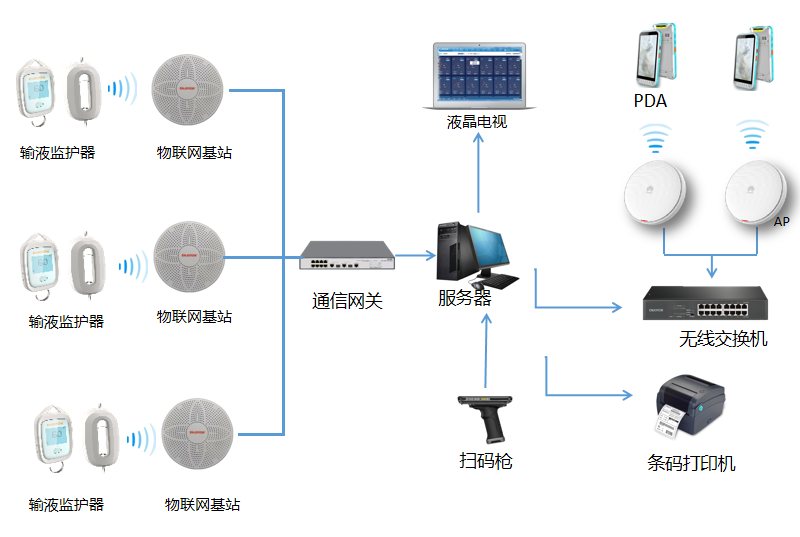
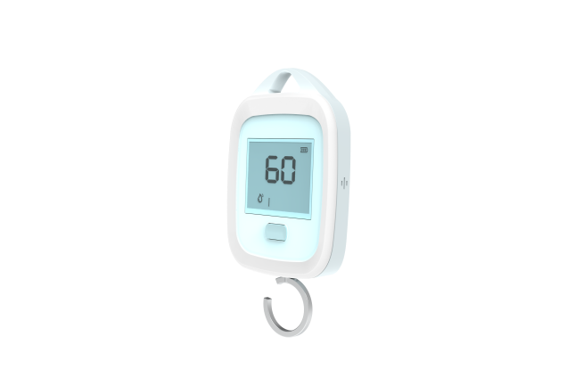
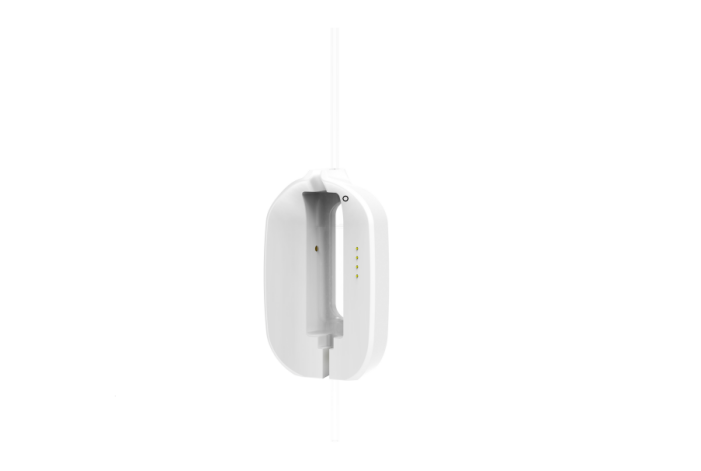
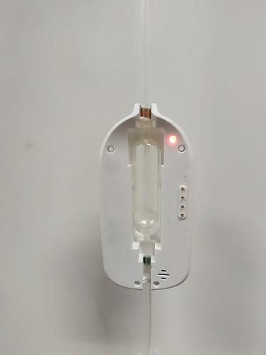
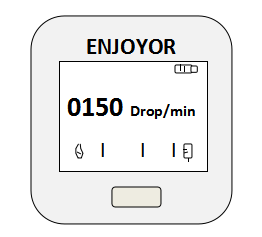
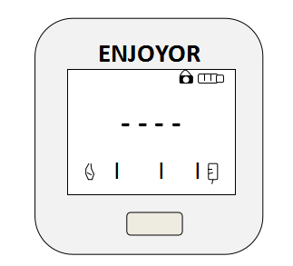

## 智能输液监控管理系统

智能输液监控系统通过实时监测输液状态，重点监测输液滴速情况，并在输液完毕时自动终止，实现对医院病区输液工作流程的集中化、智能化和科学化管理，确保输液过程的安全和高效。

智能输液监控管理系统采用红外线感应和称重技术，实时感应输液管中单位时间内液滴的通过情况，从而获得输液过程中的液体速率。同时，系统能够识别输液瓶信息，通过称重感知剩余输液量和输液时长，并及时将数据发送到输液管理系统，实现输液情况的实时呈现。当输液速率超出设定范围时，系统会自动报警。

### 红外+称重复合技术方案
- **红外线感应技术**：用于实时监测输液管中的液滴，通过感应液滴的通过情况，计算输液速率。
- **称重技术**：用于感知输液瓶的剩余液量和输液时长，确保输液过程的精确监控。
- **RFID射频技术**：实现区域内多个子节点与主节点的无线联网，确保输液操作及终了情况的实时监控。
- **条码技术**：用于信息核对，确保病人与药品、输液监护器终端的信息匹配。

### 应用集成
智能输液监控管理系统集成了多种技术和设备，包括PDA、输液监护器、物联网基站、AP、通信网关、服务器、无线交换机、扫码枪和条码打印机等。系统通过无线组网方式，实现各设备之间的互联互通，确保输液过程的实时监控和数据传输。

### 主要功能
- **输液监护终端**：对静脉导管堵塞、漏针、鼓包等输液异常情况进行报警。患者可在输液监护器上查看当前输液速度。
- **多种报警消息推送**：输液过程中出现异常情况（如输液停滞、过快、过慢、即将输完等），系统会推送报警消息至护士站大屏、PDA、走廊屏等，并进行语音播报提醒护士。
- **集中监控**：护士站通过输液监护系统集中监控大屏，实时掌握病区输液情况，确保护理人员对每个病床的输液状态了如指掌。
- **信息核对**：利用手持PDA核对病人与药品的信息匹配，确保病人与输液监护器终端的信息匹配。
- **报警器和床位绑定**：通过打印报警器标签附贴在报警器背面，条码包含科室编号、科室名称、床位号等信息，便于护士对病人和床位的固定管理。
- **输液终止**：当输液完成即呈现空瓶状态时，输液监护器将自动卡住输液管，防止患者血液回流。

通过这些功能，智能输液监控管理系统有效提高了输液过程的安全性和效率，优化了护理流程，减轻了护理人员的工作负担，提升了护理服务质量。

### 系统拓扑图

本系统结合移动计算和移动识别技术，构造系统拓扑如下：

{width="5.5in"}

实时监测输液的状态，重点监测输液滴速情况，并可在输液完毕时自动终止。

### 软件构架设计

- **输液监测技术**
  - 采用红外线感应+称重技术，实时感应输液管中单位时间内液滴通过情况，从而获得输液过程液体速率
  - 可识别输液瓶信息，通过称重感知剩余输液量、输液时长
  - 及时将数据发送到输液管理系统，实现输液情况实时呈现
  - 当输液速率超出设定范围时，系统自动报警

- **无线组网方式**
  - 采用RFID射频技术，实现区域内多个子节点与主节点的无线联网
  - 确保输液操作及终了情况的实时监控

- **系统使用流程**
  - 为每个输液监护器内嵌唯一ID编码
  - 护士挂上输液袋，进入输液监控状态
  - 输液进行时，报警器发送信号及ID号到"物联网AP"
  - 物联网AP将无线信号通过交互设备上传至PC机，PC机弹出操作窗口
  - 医护人员可通过输液监护感应系统软件解除报警，关闭声音告警

LED指示灯如图所示。

{width="3in"}

工作指示灯，放在在按键下方

{width="3in"}

第一步：开机，按称重模部分上面的按钮，将输液监护器挂在输液杆上，再将药水袋挂在挂钩上，此时输液监护器界面会显示剩余液量。

第二步：取下红外部分，卡在墨菲式滴管上面，卡之前先按下红外部分侧边的按钮如图7。此步骤注意滴管的上下两部分都需要卡进去。当输液管内有药水的时候，药水检测指示灯会点亮，若是没点亮，需要重新取下来，长按侧边按钮，使红外设备传感器重新设置。墨菲斯滴管的药水不能超过红外检测点的水平线，不然检测不到滴数。

{width="3in"}

第三步：通过输液管的调速卡口，调节输液的滴数，此时称重的界面会只显示当前的滴数值。

{width="3in"}

第四步：输液完成，当输液管上端没有药水，药水检测指示灯熄灭5秒内红外部分的齿条会卡住输液管，防止空管血液回流如图8截流，界面显示输液完成。

{width="3in"}

第五步：输液结束，需要换输液袋时，先按下红外侧边按钮，释放齿条，然后取出输液管。不使用的时候吸合到称重部分的背住。不使用时设备会过两分钟自动关机。

- **输液注册**
  - 输液监护器通过RFID网络发送信息到输液管理系统，绑定监控设备和输液任务。

- **流程监控**
  - 输液监护器侦测到输液管中滴液时，实时发送输液管中滴液速度情况到输液管理系统并实时呈现输液情况。

- **输液报警**
  - 输液过程中液体滴速过快或过慢以及输液进度完成时，输液监护器+护士工作站液屏鸣音方式报警。

- **输液终止**
  - 当输液完成即呈现空瓶状态时，输液监护器将自动卡住输液管，有效防止患者血液回流的情况发生。

### 系统功能介绍

本系统结合移动计算技术、RFID移动识别技术和条码技术，对整个输液安全实现有效、高效的管理。

该系统可以为用户实现以下几大功能：

- 输液监护终端：
  - 对静脉导管堵塞、漏针、鼓包等输液异常情况的报警
  - 患者可在输液监护器查看当前输液速度。

- **支持多种报警消息推送：** 输液过程中出现异常情况，（输液停滞、输液过快、输液过慢、即将输完等），输液异常报警支持推送至护士站大屏、PDA、走廊屏等，同时语音播报提醒护士，保证护士在病区的任何地方都不会疏漏对患者的护理。

- **护士站安装液晶监控屏：** 通过输液监护系统集中监控大屏，对病区输液情况了如指掌。哪些病床没输液，哪些病床正在输液，输液的实时状态一目了然。当输液过程中出现异常情况，（输液停滞、输液过快、输液过慢、即将输完等），监控大屏会自动显示，同时语音播报提醒护士。

- **信息核对：** 利用手持PDA(选配)，核对病人与药品的信息匹配，病人与输液监护器终端的信息匹配；

- **设置报警器和床位的绑定功能：** 通过打印报警器标签附贴在报警器背面，条码包含科室编号、科室名称、床位号等信息，以便护士对病人和床位的固定；

### 优势特色
- **实时监测**：采用红外线感应和称重技术，实时感应输液管中液滴的通过情况，获取输液速率，并识别输液瓶信息，感知剩余输液量和输液时长。
- **无线组网**：利用RFID射频技术，实现区域内多个子节点与主节点的无线联网，确保输液操作及终了情况的实时监控。
- **多种报警推送**：在输液过程中出现异常情况（如输液停滞、过快、过慢、即将输完等），系统会通过护士站大屏、PDA、走廊屏等多种方式推送报警消息，并进行语音播报提醒护士。
- **集中监控**：护士站安装液晶监控屏，通过输液监护系统集中监控大屏，实时掌握病区输液情况，确保护理人员对每个病床的输液状态了如指掌。

### 价值收益
- **提高输液安全性**：通过实时监测和报警功能，及时发现并处理输液异常情况，防止静脉导管堵塞、漏针、鼓包等问题，确保患者输液过程的安全。
- **优化护理流程**：集中监控和多种报警推送功能，使护理人员能够高效管理病区输液情况，减少巡视频次，提高工作效率。
- **数据支持决策**：系统记录和分析输液数据，为护理管理提供科学依据，帮助优化资源配置和护理流程。
- **减轻工作负担**：通过智能监控和报警功能，减少护理人员的巡视和手动记录工作，使他们能够将更多时间和精力投入到与患者的直接互动中。
- **提高工作效率**：集中监控和多种报警推送功能，使护理人员能够及时响应患者需求，提高护理工作的响应速度和精准性。
- **增强职业归属感**：系统促进了医护人员与患者之间的互动与沟通，营造了积极向上的工作氛围，提升了护理人员的工作满意度，减少了因工作压力和职业发展受限而导致的人才流失问题。
