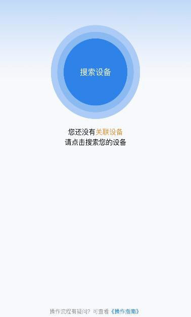

## 跌倒监测雷达

### 产品概述

跌倒监测雷达 
是专为智慧养老研发的一款毫米波雷达，采用传统雷达算法+神经元网络算法融合，产品拥有极强的学习及成长性，可以精准判断各类跌倒姿态，如瘫倒、晕倒、滑倒等，通过AI 技术可以不断的训练、优化， 识别精度持续提升的同时进一步降低误报率。

### 产品特点

- 开放通讯协议，支持接入自有平台/小程序/APP
- 融合多种算法，持续提升识别精确率
- 采用神经元网络算法，具备自主学习能力，可快速迭代升级
- 内置NPU芯片，支持终端部署，不受网络环境限制
- 支持端、边、云多模式融合，提升产品附加值和盈利空间
- 模型精简优化，体积小，硬件资源需求低
- 仅感知动态数据，保护用户隐私

### 产品应用
- 智慧病房：应用于医院病房场景，实时监测患者活动状态，及时预警跌倒风险，提升患者安全
- 智能养老：适用于养老机构及居家养老场景，全天候监测老年人活动，提供跌倒预警和紧急救助
- 智慧家庭：面向家庭用户，提供老人、儿童等特殊人群的跌倒监测和安全保障

### 跌倒监测 目标识别 持续学习

{width="2in"}

{width="2in"}

{width="2in"}

注：跌倒后 10s 内会报警；为防止频繁报警，两次跌倒测试需间隔 15-20s。

### 产品外观
{width="2in"}

### 设备参数

| 参数项       | 参数值                |
|--------------|-----------------------|
| 产品型号     | QH60MI01-A1          |
| 额定电压     | 5V                   |
| 外壳材质     | ABS                  |
| 工作电流     | 400mA~750mA          |
| 产品尺寸     | 81*81*30mm           |
| 频段         | 60GHz                |
| 网络方式     | 蓝牙、WIFI           |
| 供电接口     | TYPE-C               |
| 安装高度     | 置顶安装 2.3~3.3m    |
| 探测范围     | 约 9 ㎡~19 ㎡        |

### 安装说明

本雷达产品主要采用**置顶安装、垂直向下**的方式，设备正面不可有金属物体进行遮挡。

该产品合适安装高度是2.3m\~3.3m，雷达安装的高度与雷达有效波束投影范围，随着雷达安装高度、安装场景的改变，雷达有效作用范围有相应的改变。例如：基准高度3m 情况下，探测范围是雷达正下方 4m x 4m 的区域。

设备正下方应覆盖易发生跌倒事故的区域，若事故发生在探测区域内的边缘位置，将会影响报警准确率;

{width="4in"}

若事故发生在探测区域外，将不会自主报警。如果房间内需布置多个该雷达时，应注意其探测范围，需间隔安装，避免出现空白区域。

**安装高度：2.3~3.3m**

**有效识别范围：3.07~4.4m（正方形边长）** 

### 小程序使用说明

1. 微信扫描下方二维码进入「雷达助手」小程序，或在微信小程序搜索「雷达助手」直接进入；

{width="3in"}

2. 绑定设备

将手机打开蓝牙、WIFI，然后点击"搜索设备"弹跳出设备后，点击"绑定"。多台设备建议区分名称，方便管理。绑定成功后，将开始守护您的家人。

{width="3in"}

{width="3in"}

{width="3in"}

{width="3in"}

3. 高度设置

将设备进行固定安装（安装高度范围2.3\~3.3m）并测量实际安装高度，然后在小程序内进行**高度设置**（此步骤不可跳过，否则影响监测结果）。

{width="3in"}

{width="3in"}
   
操作步骤：在首页点击"查看详情"页面会跳转至详情页，然后找到"雷达高度"在输入框中填写雷达实际安装高度，并点击"确认设置"。

4. 监测结果查看

高度设置成功后，即可实时查看监测结果。

若设备监测到有人员发生跌倒，小程序页面会转变为红色并显示"跌倒"字样，同时蜂鸣器发出"滴------"警报声，在人员起身后警报会自动解除。

{width="3in"}

{width="3in"}

{width="3in"}

5. 重置设备
长按重置按钮约3s，蜂鸣器会发出"滴"声，表示设备重置成功，设备内所有已绑定用户及设置将全部清除。

*注：若需设备对接自有平台或开发 APP/小程序，可联系我司提供通信协议。*

### 注意事项
- **防水注意事项**：请勿将本产品浸没于水中
- **安装注意事项**：产品粘于墙面后，切勿暴力拆除，以免损伤产品和墙面
- **检测范围说明**：本产品检测范围会随安装高度变化而调整
- **边缘检测说明**：边缘区域准确率较弱，若人员从检测范围外跌入监测范围内，可能不会主动报警
- **干扰物注意事项**：金属制品对产品检测有一定干扰，请勿将金属制品及杂物放置于检测产品前方
- **产品定位说明**：本产品为居家生活安全防护使用，不可作为专业检测工具
- **数据说明**：产品检测数据如无特殊说明，均为实验室测试数据，实际使用中可能有所不同
