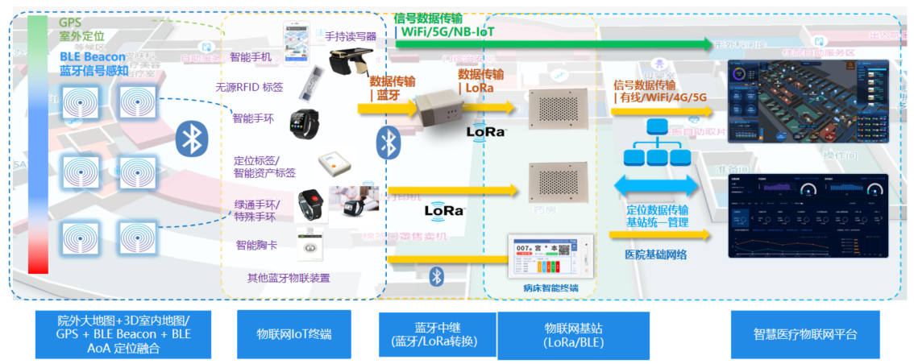

## 患者定位看护系统

### 系统概述

患者定位看护系统，是采用世界级的室内定位技术，室内3D高精地图技术，基于蓝牙5.0的电磁指纹比对技术与蓝牙远距中继器、LoRa传输协议，通过为患者佩戴定位手环的方式，进行绑定物联网标识和看护分类管理，实时定位、查询病患的历史轨迹。**在医院病区内更可以直接使用我司病区内的智能呼叫终端设备作为信号网关与信号基站，接受佩戴设备信号实现实时定位**。提供在全院范围或是需管控的区域范围，部署蓝牙定位信标(iBeacon)，被看护患者佩带蓝牙定位手环，实现医护患者的实时定位、实时追踪、轨迹回放、电子围栏限制区域报警、电子围栏区域超长滞留报警，一键求助报警、电子点名以及统计分析等功能。

### 设计方案

患者定位系统技术架构如下图所示：

{width="6in"}

系统包括：

- **定位基础设施**
  - iBeacon蓝牙信标：部署在医院内，作为定位基础网络设施
  - 病床智能终端：在病区内可替代蓝牙信标与物联网基站，实现定位系统覆盖

- **定位终端设备**
  - 患者定位看护手环
    - 院内模式：接收iBeacon信号，通过蓝牙技术将信号测量结果回传至蓝牙远距中继器
    - 院外模式：通过NB-IoT技术将数据传输至运营商基站，由运营商基站转发至狄耐克智慧病房平台

- **数据传输设备**
  - 蓝牙远距星：作为蓝牙数据中继器，将蓝牙数据转换为LoRa数据，并传输至物联网基站
  - 物联网基站：接收LoRa数据，通过边缘计算架构本地进行位置信息计算，将结果通过网络回传至物联网业务系统

- **数据展示平台**
  - 狄耐克智慧病房平台：对患者定位手环的位置信息及手环信息进行可视化展示

### 系统功能

- **基于可视化地图的实时定位**  
  通过医院室内3D高精地图，在患者定位看护系统页面上进行展示，可实时显示所有病患的位置信息，可实现对病患的定位、追踪。

- **生命体征数据监测**  
  生命体征实时监测，人员定位手环可实时采集患者体温、血压、心率等体征数据，并自动传输至系统，形成体征数据记录，加强对患者的健康监测，当体征数据异常时，提醒医护人员及时处理。

- **电子围栏报警提示**  
  可对病患设置电子围栏，限定其活动区域，一旦超出限定范围及时报警；同时当手环被解开，后台监护人员也能第一时间收到提示，及时查看病患情况。患者定位看护系统可根据医院的实际需求，提供电子围栏。

- **人员统计分析**  
  为方便医院的更好的管理精神病患，晚上需要检查精神病患者是否已回到病区和病房，通过蓝牙定位手环、定位网络和室内3D高精地图自动统计和显示各个区域当前在院精神病患者人数，并可以查看统计人数对应人员名单的功能，便于医院管理全院的病患，发生突发事件能够快速反应。

- **报警分析**  
  精神病患者定位手表所有产生的报警信息进行集中管理和展示，报警信息包括电子围栏限制区域报警、电子围栏超长滞留报警、主动按键报警、防拆报警、低电量报警、离线报警等。