## 设备定位及能效分析系统

### 系统概述

采用室内3D高精地图技术，基于蓝牙5.0的电磁指纹比法的室内定位技术与LoRa传输协议，通过为生命支持类、急诊急救类、移动医疗设备等安装智能资产标签，进行绑定物联网标识和设备分类管理。可自动查询设备的实时位置、可查询设备的历史移动轨迹、可一键实时盘点、可一键状态（故障/可用）提醒、可准确区分设备的不同工作状态(关机、待机、运行、离线)、可分析设备的运行数据，多维度对医院的设备运行状态进行分析和效能分析。

### 设计方案

设备定位及效能分析系统技术架构如下图所示：

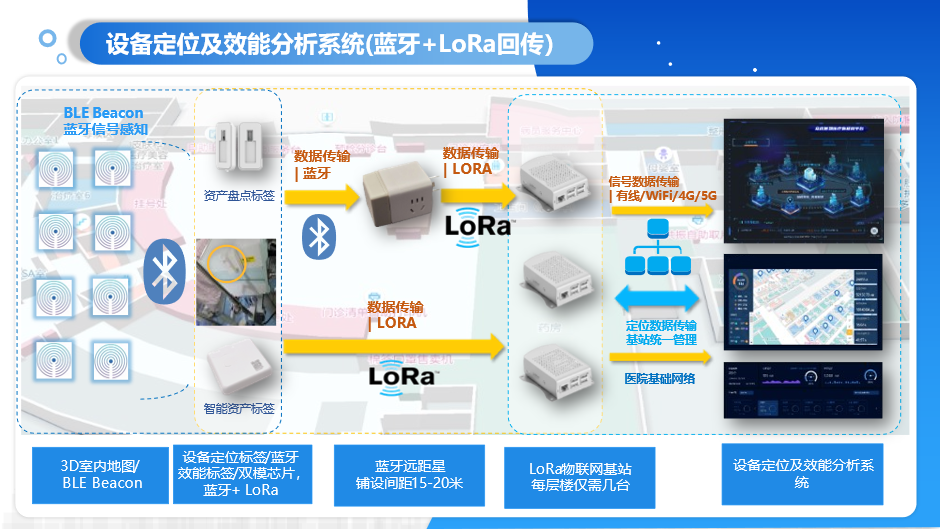{width="6in"}

系统包括：

- iBeacon蓝牙信标：部署在医院内，作为定位基础网络设施
- 智能资产标签：贴在设备之上，接收 iBeacon信号及感知设备的工作状态，将信号测量结果通过最新物联网LoRa技术进行回传
- 简约型资产定位标签：贴在设备上，接收ibeacon信号并通过2.4G标准蓝牙协议回传到蓝牙远距星（蓝牙中继器）上
- 蓝牙远距星：蓝牙中继器，可接收特定的蓝牙封包并进行格式转换成LoRa封包，使其可回传到物联网基站上
- 物联网基站：与智能资产标签通信，并通过边缘计算架构，本地进行位置信息计算，将结果通过网络回传物联网业务系统
- 设备定位及效能分析系统：对所有智能资产标签的位置信息及设备信息等进行处理，最终物联网应用系统功能呈现

### 系统功能

医院设备定位及效能分析系统，通过在全院区域部署医疗物联网，在设备上安装物联网标签，利用先进的物联网技术，实现设备定位管理、设备使用管理、设备入库管理、设备盘点管理、设备预警管理、设备使用分析，多维度对医院的设备运行状态进行分析，实现设备资产的合理利用，对设备资产的配比分析提供参考数据，优化资产配比结构。

#### 监控驾驶舱

通过可视化的监控驾驶舱对所有的设备状态进行可视经的总体呈现。

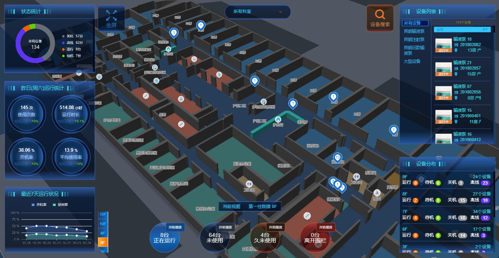{width="6in"}

#### 实时定位/状态监测

对绑定智能资产标签的医疗设备，支持统一在室内3D高精地图上实现所有资产设备的可视化展现。

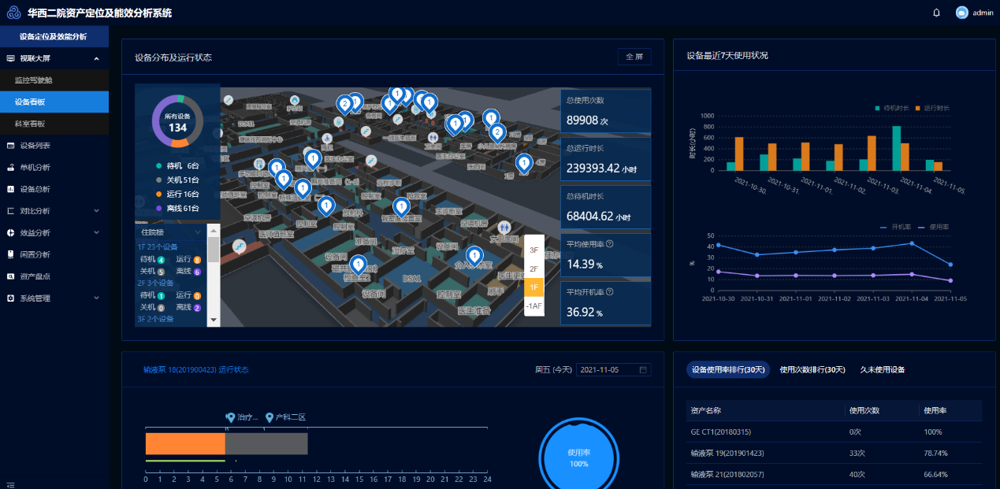{width="6in"}

提供设备实时定位功能，在室内3D地图上进行展现，可随时了解和查询到所关心的设备的位置，实现设备位置实时监控，也可以第一时间查询到设备的报警的位置。

#### 科室看板

科室看板数据展示主要包括全部科室数量统计、使用率最高设备、设备今日使用率、设备昨日使用率、科室使用率对比（按多日、单月、多月或年）、单个科室设备使用率、总待机时长、总运行时长、平均开机率以及平均使用率等等。可与医院大屏对接，在医院大屏上做可视化展示。

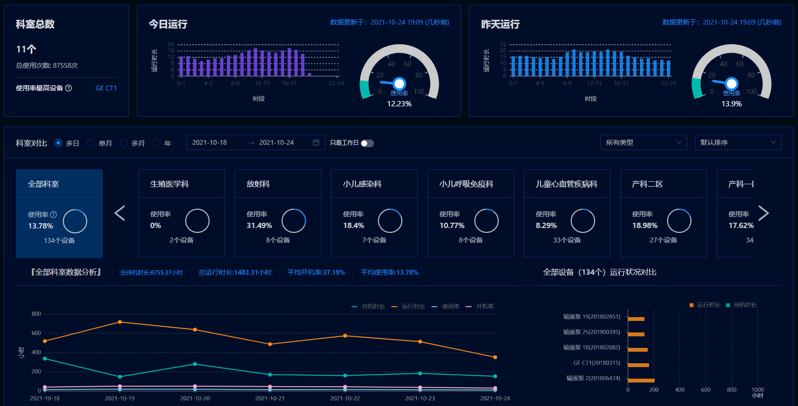{width="6in"}

#### 设备运行状态监测

通过给医疗设备粘贴非介入性的智能资产标签，可准确区分设备的不同工作状态，主要包括待机状态、关机状态、运行状态和离线状态。可通过分析医疗设备的数据记录，实时监测医疗设备的工作状态。并且设备运行的时间、位置、运行状态（关机、待机、运行、离线、脱落五种状态）同时显示在条形图上，一目了然。

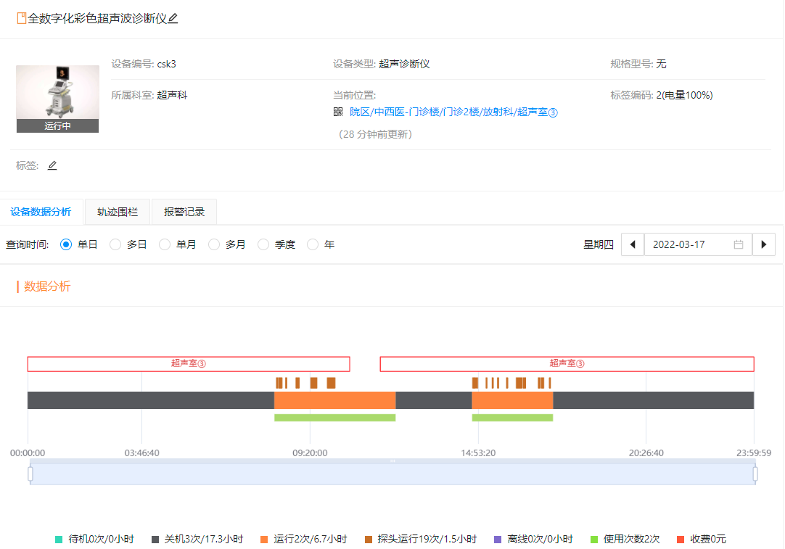{width="6in"}

#### 单机设备运行数据可视化统计

系统可对单机设备运行数据进行统计分析，包括总使用次数、总开机次数、总待机时长、总运行时长、总关机时长、平均开机率、平均使用率等等。

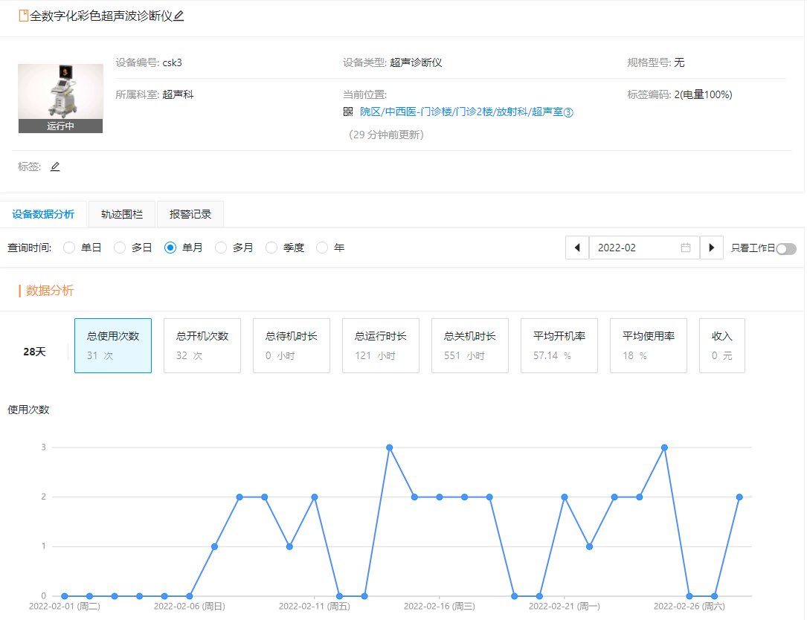{width="6in"}

#### 设备总析

系统可对多台设备运行数据进行统计分析，包括总使用次数、总运行时长、总待机时长、平均使用率、平均开机率、平均达标率等等。

多台设备单日、多日、单月、多月、某年的运行数据，在设备总析的页面中提供了单个设备开机次数、使用次数、开机时长、运行时长、关机时长、开机率、使用率以及状态显示，并可按单日、多日、单月、多月、一年的时间维度进行查看。

设备多天、多月的使用状态的统计或趋势时，显示在指定时间段的总使用次数、总运行时长、总待机时长、平均开机率、平均使用率等数据，并提供多种曲线图与报表。

通过设备效能管理和统计分析实现对医疗设备的精细化管理，利用设备开机启动频率，结合使用时间长短，可为设备折旧、维保核算、能耗提供分析报表，为医院管理人员提供参考依据，为重大决策提供数据支撑，真正实现设备的精细化管理。使用频率高、时间长的设备：设备的维护次数增加以延长设备的使用寿命；提高资源利用效率，为医院设备采购、配置、维保提供合理优化。

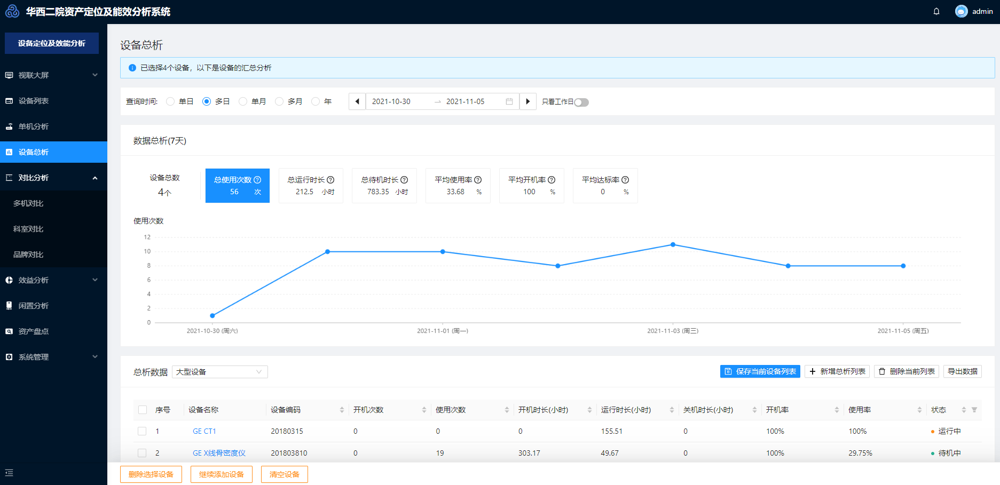{width="6in"}

#### 临床关联应用

通过不同应用场景下，分别与医院的业务系统进行对接，实现"人-物-地"三者相关联，对设备、人员进行进一步的精细化管理。

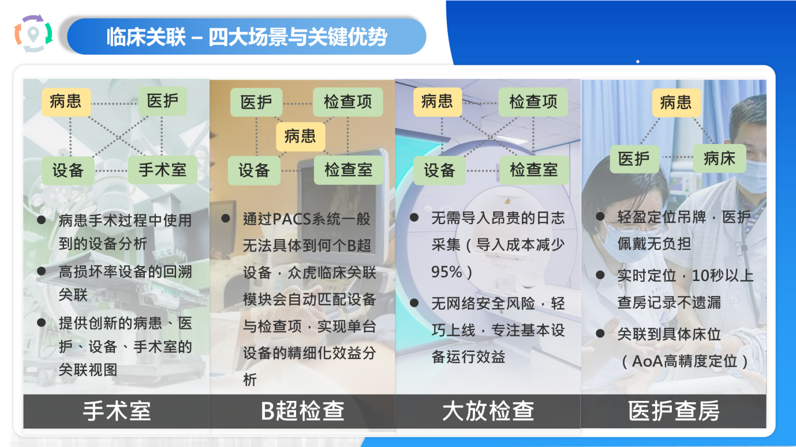{width="6in"}

如超声科，与PACS对接实现患者、检查部位、使用设备、使用探头、使用时长进行统一展示，实现设备的使用效益分析与成本效益分析的挂钩。

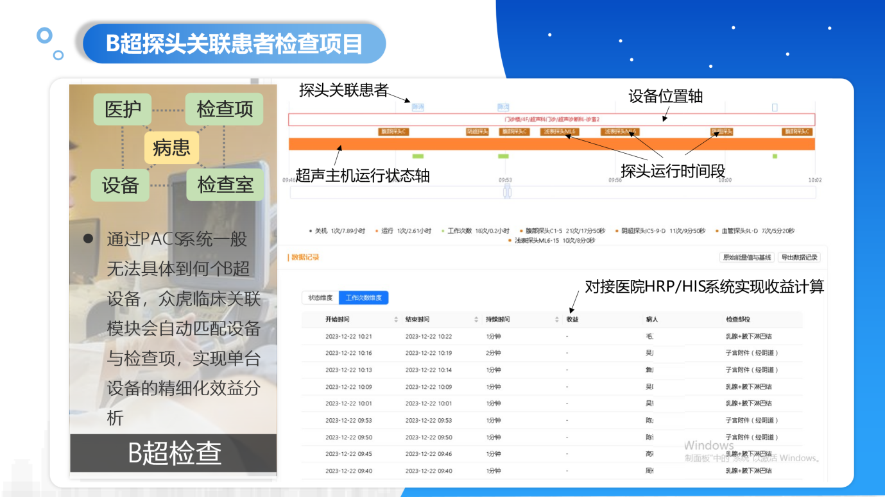{width="6in"}

#### 资产一键盘点

通过对医院设备资产进行实时定位，可实现一键实时盘点，告别人工盘点的的差错，极大地提升院内设备盘点效率。

可根据盘点任务，定期定时对设备进行盘点，实现对设备的快速清查核对管理要求，自动设定盘点任务，对盘点结果进行查看、统计、导出。

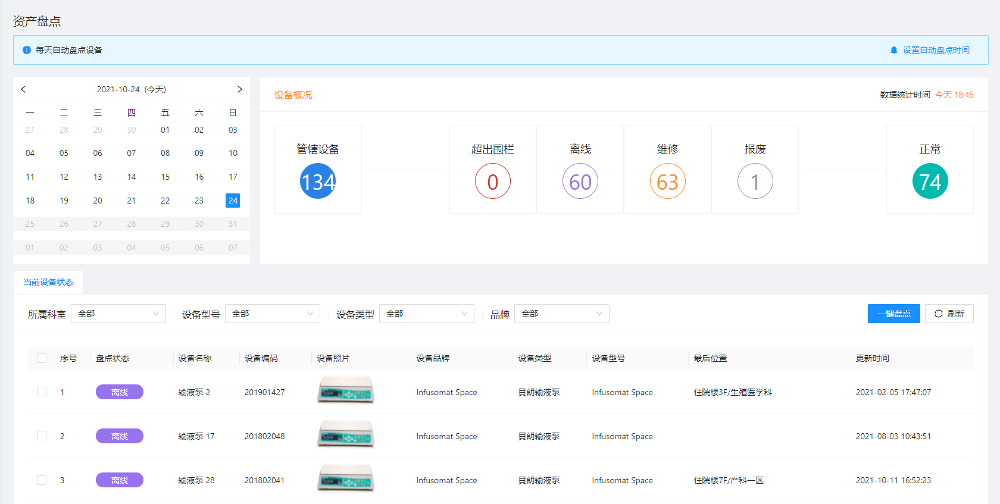{width="6in"}

#### 设备效益分析

强大的AI+设备效能分析引擎和医院的HRP等相关信息系统相结合，通过深度学习运算，可以进一步针对设备做出更多的设备效益分析的精细化管理功能，可以对医疗设备进行效率和效益的分析。

#### 一键导航找设备

设备管理人员通过扫描管理系统设备左上方的导航二维码，成功定位之后，可一键导航到设备的当前位置，实现院内一键找导航找设备。

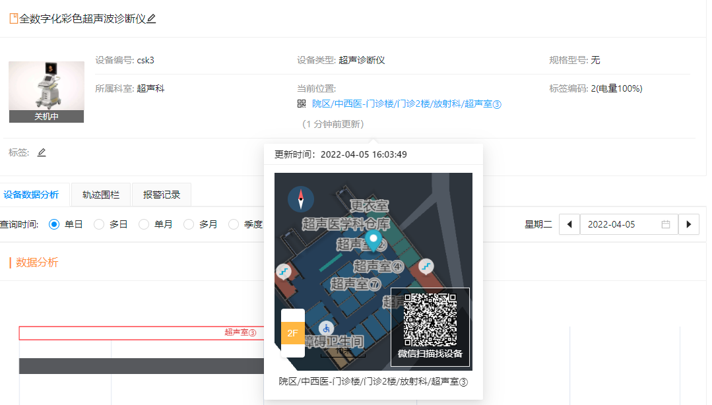{width="6in"}
