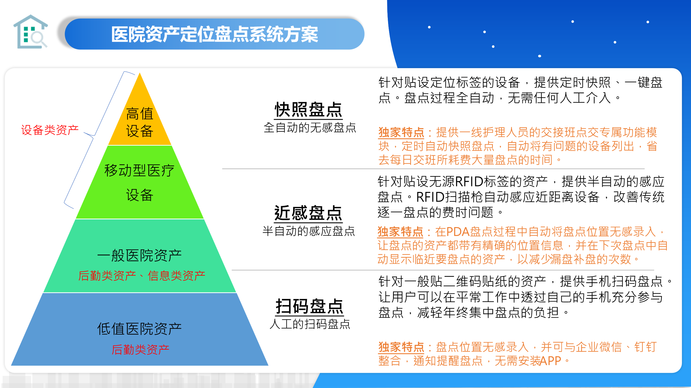
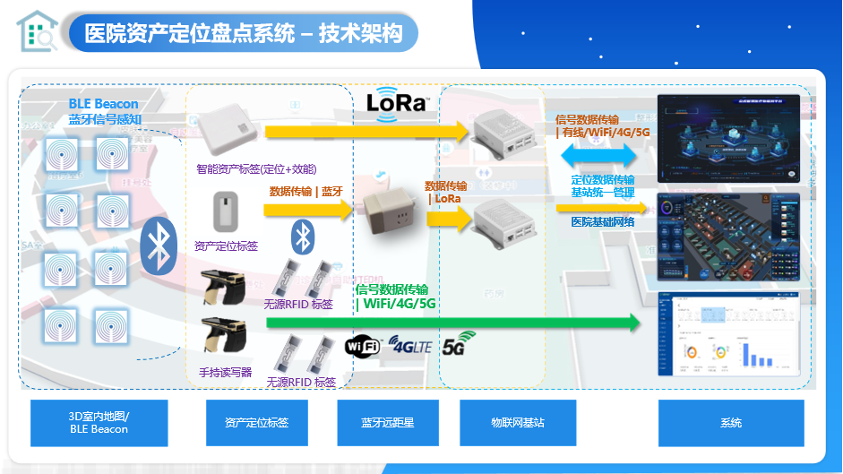
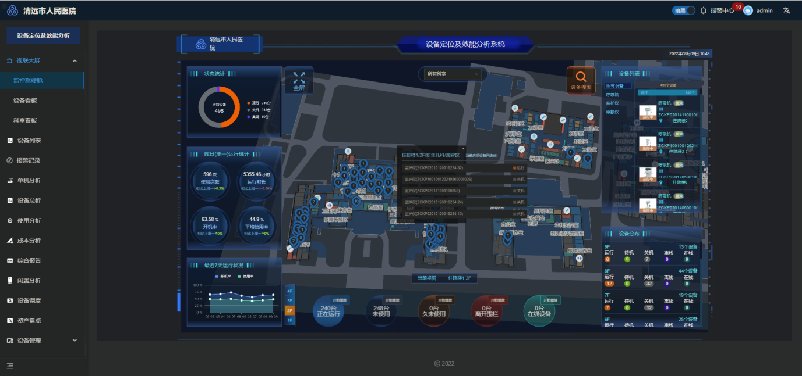
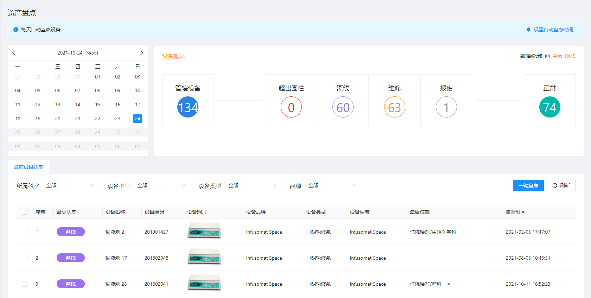
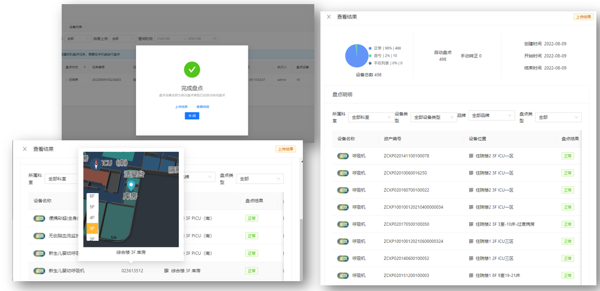
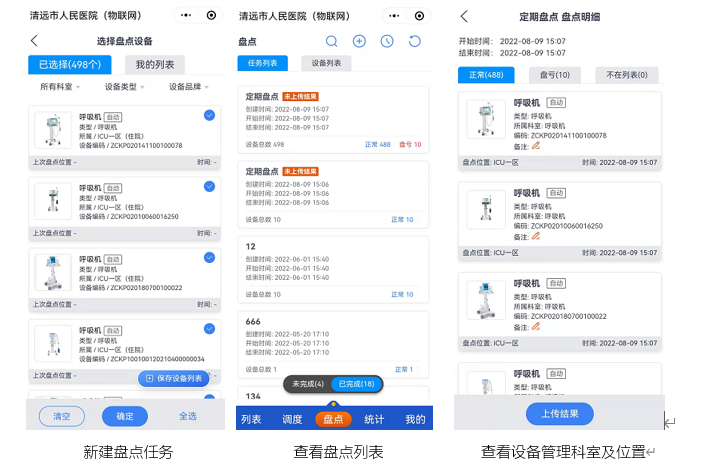
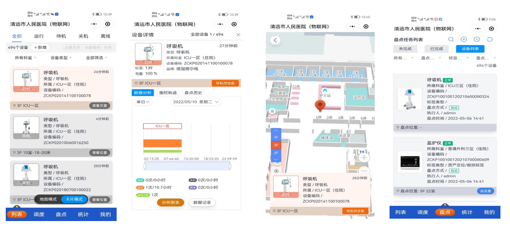

## 资产定位盘点系统

### 系统概述

采用室内3D高精地图技术，基于蓝牙5.0的电磁指纹比法的室内定位技术与LoRa传输协议，可以通过为全院区各种不同的医院资产安装蓝牙资产盘点标签，进行绑定物联网标识和设备分类管理。可自动查询设备的实时位置、可查询设备的历史移动轨迹、可一键实时盘点；完全免去人工盘点的工作，使得盘点数据更加准确，极大地节省人力物力。

{width="6in"}

### 设计方案

与设备定位及效能系统一致，基础定位网不变，物联网传输网中，除了LoRa标签外，本架构可兼容蓝牙传输标签，针对桌椅板凳、固定资产等可采用低成本的蓝牙盘点标签；

采用2.4G蓝牙技术和蓝牙中继远距星实现标签与物联网基站的LoRa的通信。

技术架构如下图所示：

{width="6in"}

- iBeacon蓝牙信标：部署在医院内，作为定位基础网络设施
- 蓝牙电子标签：贴在设备之上，接收iBeacon信号及感知设备的工作状态，将信号测量结果通过蓝牙技术进行回传
- 蓝牙远距星：蓝牙远距中继器，部署间隔约为15-20米，与蓝牙电子标签通信，而后将蓝牙数据转化成LoRa数据后与物联网基站通信
- 物联网基站：接收LoRa数据封包，并通过边缘计算架构，本地进行位置信息计算，将结果通过网络回传物联网业务系统
- 资产盘点定位系统：对所有蓝牙电子标签的位置信息及设备信息等进行处理，最终物联网应用系统功能呈现

### 功能介绍

#### 设备监控可视化驾驶舱

通过可视化的监控驾驶舱对所有的设备状态进行可视经的总体呈现。

{width="6in"}

#### 全院资产一键盘点

- 对全院的资产实时定位，可按其所属科室或资产分类进行一键实时盘点
- 可查看资产盘点位置
- 可根据资产盘点状态筛查盘亏资产，及其对应科室
- 可设置定期盘点，上传盘点记录

{width="6in"}

{width="6in"}

#### 资产监控 | 移动端小程序

通过移动端的小程序，方便实现资产的状态查询，调度、盘点、及相关数据统计分析。

{width="6in"}

{width="6in"}
