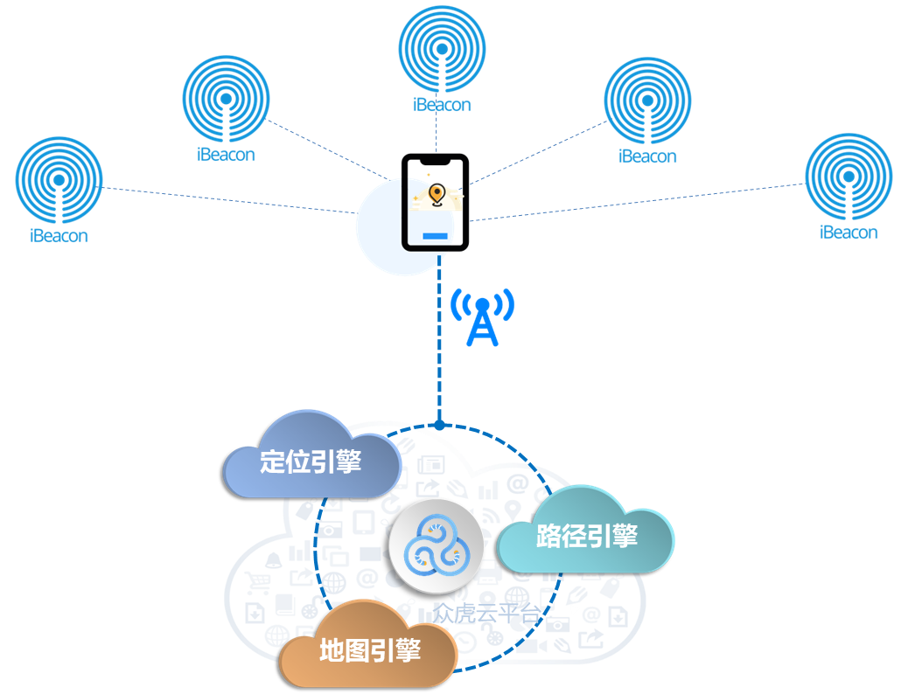
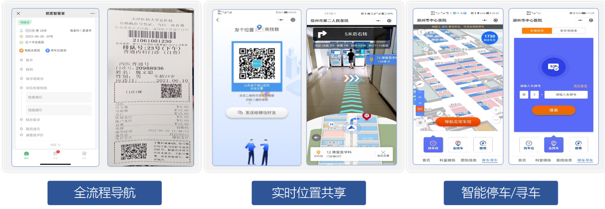
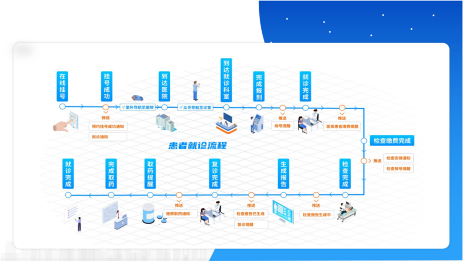
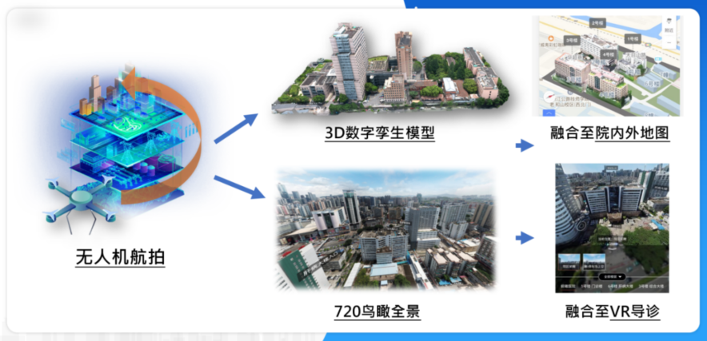

## 院内定位导航系统

### 系统概述

院内定位导航系统采用室内定位技术，室内3D高精地图技术，基于蓝牙5.0的电磁指纹比对技术，实现室内米级别的高精度定位导航；

以"问路"为切入口，向患者提供基于就诊流程的自动导航、基于就诊流程的扫码导航以及用户自搜索导航，协助患者快速到达就诊科室；以"找人"为切入口，向患者提位置发送及实时位置共享功能，彻底解决院内找人难的问题，将位置共享与导航融为一体，大幅提升院内导航使用体验；以"寻车"为切入口，向患者提供停车场的空车位监测引导和反向寻车导航功能，帮助车主快速找到空车位，消除寻车烦恼。基于领先的高精度的室内定位、光标不漂移的技术基础，能真正保证患者的室内导航使用体验，大幅提升患者"最多跑一次"的医疗智慧服务质量。

### 设计方案

导航系统技术架构如下图所示：

{width="6in"}

医院室内导航系统对医院室内手机端提供定位和导航服务，整个系统由以下六个部分构成：

- 室内iBeacon硬件部署
- 室内向量地图制作及地图引擎SDK（跨IOS 和 Android 平台）
- 室内路径规划引擎SDK（跨IOS 和 Android 平台）
- 室内定位引擎SDK（跨IOS 和 Android 平台）
- 室内导航APP 和室内导航SDK（跨IOS 和 Android 平台）
- 室内导航微信公众号或小程序SDK

### 系统功能

医院智能导航系统，以"问路"为切入口，向患者提供基于就诊流程的自动导航、基于就诊流程的扫码导航以及用户自搜索导航，协助患者快速到达就诊科室；以"找人"为切入口，向患者提供院内位置发送及实时位置共享功能，彻底告别院内找人难的问题；以"寻车"为切入口，向患者提供停车场的空车位监测引导和反向寻车导航功能，帮助车主快速找到空车位，消除寻车烦恼。

{width="6in"}

#### 基于患者就医全流程的自动导航

通过室内定位导航SDK与医院现有APP或微信公众号进行对接开发，并结合医院HIS系统，可实现基于患者就诊流程的自动导航。根据患者的就诊环节及流程，向患者推送下一步的就诊提示信息（例如内科诊室、抽血处、影像科、药房等），无需患者主动输入。基于推送的就诊提示信息，患者点击后进入地图，为患者提供基于移动端精准的院内实时导航服务。能有效解决各类型医院就诊流程的繁琐、就医效率低下，减少三长一短现象，优化资源配置，提升服务质量。

{width="6in"}

#### 特色功能: 3D数字孪生+720°鸟瞰全景

导航系统提供各项基本问路导航功能，细致的POI分类数据让用户可文字/语音自搜索导航、院内外路径一体化可让用户足不出户在家查看导航路线、针对疫情期间医院的导航路线管控可分时段进行不同路径规划、设置手扶梯一键反向、院内位置收藏、发送、共享等功能；针对手机、微信可适配夜间模式、关怀模式；在信号不良处能使用离线模式完成导航；

另外独家首创通过无人机搭载高清相机飞越建筑物，从不同角度和高度拍摄照片或录制视频。可以生成全景视角，揭示建筑物的全貌。在院内智能导航小程序上，或者在医院的导航大屏机上，将院区内的楼栋进行实景3D建模展示，这样患者可以很方便地对医院院区内的所有楼栋分布有个大概了解，知道如门诊楼，医技楼，住院楼等主要功能区域在什么院区内的位置。

{width="6in"}