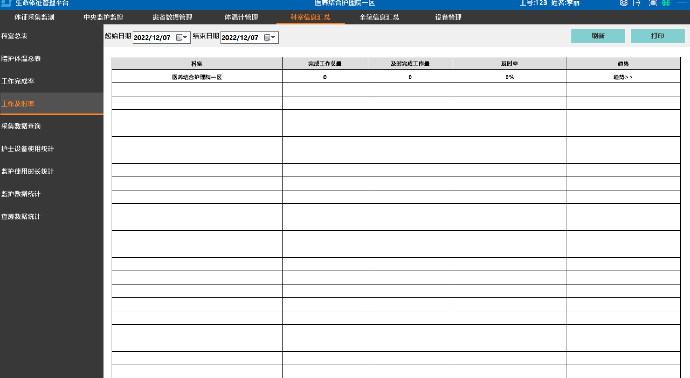

## 生命体征智能采集系统

### 系统概述

生命体征智能采集系统及智能生命体征监测终端结合住院电子病历系统实现对住院患者快速生命体征测量、高效分诊、快速查房；实现生命体征数据实时上传；及同时快速实现对患者进行MEWS评分、患者评估。

一款便携式生命体征智能测量采集设备，手持便携，机身净重350g，可实现血压、血氧、体温、脉搏、呼吸、血糖六种体征一站式集中测量采集，并针对临床设计了点测、持续多种组合测量模式；可根据医院需求定制查房护理中需要录入的内容如：身高、体重、大便次数、尿量、输出入量等问诊输入。机身自带身份识别模块，配合扫描护士工卡和病人腕带，可将护士信息、体征数据和病人信息相匹配，同时可通过Wi-Fi/4G将测量到的体征数据实时传输到医院门、急诊系统中，自动生成表单。实现数据互连互通；加强护理质量控制；进而提升医疗服务质量与医患关系。患者生命体征监测数据自动测量上传、测量数据共享、实现互联互通是智慧病房建设中最重要的一部分。

智慧医疗5G应用：依托5G低时延和精准定位能力，可以支持生命体征设备在使用过程中持续上报患者位置信息，进行生命体征信息的采集、处理和计算，并传输到远端监控中心，远端医护人员可实时根据患者当前状态，做出及时的病情判断和处理。

现阶段临床护理生命体征采集痛点：

- 体征查房
  - 护士日常查房时对病人生命体征测量采集工作量大
  - 效率低
  - 基本是手动在输入病人信息、体征数据

- 重症抢救
  - 病人的病情危重程度属于一级、二级时，需要将病人送到急诊抢救室进行抢救
  - 在重症抢救功能中，分为五个模块：患者治疗、申请、医疗文书、患者评分、患者评估
  - 需要对患者评分、患者评估实时、快速体现出结果

- 质控管理
  - 质控管理功能就是帮助临床对日常工作的各项指标进行分析
  - 帮助急诊医护人员提高工作效率，保证医疗质量，更好地为病人服务

项目实现的功能或者目标分析：

- 管理需要：
  - 加强护理数据质量控制
  - 能优化现有预检分诊工作流程,加强预检患者体征数据质量控制
  - 确保体征数据导入护理表单的及时性、准确性,加强了护理数据质控
  - 同时避免漏测、漏记

生命体征信息管理系统为医院管理层提供科室体征测量数据总表、陪护人员体温监测总表、未按照时间要求监测体征数据统计表、护士使用设备统计表、科室设备使用统计表，把临床实际护理查房工作情况进行数据表格系统分析，进一步用统计数据来提升护理管理。

- 患者需要：
  - 对患者监测的体征数据进行早期预警综合评分（MEWS评分）
  - 将病情危重度分值化，能快速、简捷、科学的对病人危险性进行预测
  - 生命体征信息管理交互平台建立患者病情早期预警工作流程，保障患者安全
  - 将患者的呼吸、SPO2、体温、收缩压、心率/脉搏和AVPU反应共6项进行综合评分
  - 将病情危重度分值化，能快速、简捷、科学的对病人危险性进行预测
  - 同时，自动识别出护士在系统中输入的患者生理参数，并计算出MEWS分值
  - 当分值达到相应的触发值时，系统将给予不同颜色的报警提示，提醒护士呼叫医生并做相应的对策处理
  - 通过对功能的拟定和实施，可以帮助医护人员对早期预警处理的及时性上升至82.3%，目标达成率为121.02%，进步率147.16%

- 护理人员需要：
  - 提高分诊护士的工作效率：按照目前传统方式完成一名患者的生命体征采集和录入至少需要6分钟，而利用生命体征智能信息终端仅仅只需要1分钟，护士便能够轻松实现体征数据的采集和上传
  - 极大提高了预检分诊服务效率和质量，减轻护士工作负荷，可以为医院大大节省人力时间成本

生命体征检测信息终端仪器自带测量参数：无创血压、脉搏/血氧饱和度、体温、呼吸功能，并可直接在床旁录入问诊体征采集：心率、身高值、体重值、大,小便次数值、疼痛评分、神志、瞳孔、出、入量等病人128项体征信息联合生命体征采集信息管理系统使用达到操作快捷、测量准确,工作强度低,受人为因素的影响小,无录入的差错，保证零差错率，大大提高了工作效率。缩短书写护理文书的时间,把时间还给护士,把护士还给患者。既更好的服务了患者,提高了患者满意度,同时也提高护理工作效率和服务质量。

预检分诊工作流程的闭环管理：更好的实现体征医嘱的闭环管理，护理查房生命体征数据实时反馈，从开具体征医嘱--执行--医生通过计算机或移动设备随时随地了解到病人体征数据的变化，时时掌握病人的病情。实时异常体征报警：为生命体征超过正常范围的病人提供及时的治疗。

产品带有的呼吸和血氧、血压、血糖测量、提醒功能及对血糖数据实时监测、上传，实现血糖管理；可以更便利的配合临床医嘱执行。

提升医院信息化、无纸化建设：符合医院信息化建设管理的需要，同时填补了医院护理病历生命体征信息化管理的空白；提升医院形象和竞争力。

安全、预警：医疗设备安全实时监测采集，测量数据安全，并实时异常体征数据报警：为生命体征超过正常范围的病人提供及时的治疗。

### 设计方案

生命体征智能采集系统结构如下图所示：

- 4G移动网络
- Webservice接口网络通讯
- 电子病历、移动护理
- 生命体征智能采集系统
- 病区无线AP
- V5生命体征智能采集设备
- V5生命体征智能采集设备
- V5生命体智能征采集设备
- WIFI网络连接

### 系统功能

生命体征智能采集系统主要由首页体征采集监测、中央监护监控、患者体征数据管理（数据图表）、体温管理、设备管理、统计报表、配置管理、信息审计、人员信息管理等模块组成。

| **模块名称** | **功能模块概述** |
|------------|----------------|
| 首页体征采集监测 | 体征未测提醒、血糖未测提醒、患者生命体征数据展示、体征医嘱下达及显示、异常信息报警 |
| 中央监护监控 | 收集、统计和输出来自多台 K3 智能物联监护仪的监护信息，形成中央监控。 监护仪数据可以实时及定时直接上传护理单、体温单、危重单等护理表单。 科室其他需要的体征项目人工输入一同上传护理表单 远程控制：护士站可控制床旁监护仪接收/解除病人监护，远程控制床旁监护仪启动/停止 NIBP 测量；并进行护士交接班管理 |
| 数据图表 | 实现体征数据图表、体征数据走势图表展示功能 实现病人早期预警评分（NEWS）统计的功能 |
| 体温管理 | 实现体温计与床号一对一进行绑定 体温医嘱执行、自动形成发热及高热患者体温测量计划、异常体温报警提示 |
| 血糖管理 | 血糖测量计划提醒 血糖值实时上传 统计：血糖值和标准差的趋势分析; 7天、30天、90天的平均值，餐前和餐后的最大值、最小值 |
| 设备管理 | 实现对已接入平台的设备的查询、信息修改、新增设备接入到平台和对设备质控的记录和查看的功能。 |
| 统计报表 | 提供科室体征测量数据总表、陪护人员体温监测总表、未按照时间要求监测体征数据统计、护士使用设备统计、科室设备使用统计、K3使用时长统计 监护数据统计：提供患者监护数据统计报告（心律失常、24小时血压监测、呼吸及脉搏氧合图等）供医生参考 |
| 配置管理 | 可由科室自行选择编辑体温单和护理记录单所需上传的生命体征参数 根据科室要求和护理规范定制项目模板录入 |
| 信息审计 | 提供错误日志信息、上传HIS失败信息、监护仪未上传记录 |
| 人员信息管理 | 提供对从HIS系统获取过来的护士信息、科室信息和床位信息详细展现的功能 |
| 系统接口 | 提供与移动护理信息管理系统、住院电子病历系统等接口，实现系统间信息和管理集成。 |

#### 首页/体征采集监测

首页显示生命体征项目待测提醒、血糖未测提醒、患者生命体征数据展示、体征医嘱下达及显示、异常信息报警，心电监护监测中的患者显示

{width="6in"}

#### 中央监护

实现收集、统计和输出来自多台 K3 智能物联监护仪的监护信息，形成中央监控。

监护仪数据可以实时及定时直接上传护理单、体温单、危重单等护理表单。

实现对科室其他需要的体征项目人工输入一同上传护理表单

远程控制：护士站可控制床旁监护仪接收/解除病人监护，远程控制床旁监护仪启动/停止 NIBP 测量；并进行护士交接班管理

##### 中央监护监控

实现收集、统计和输出来自多台K3智能物联监护仪的监护信息，形成中央监护监控；分科独立使用，连接床旁监护仪数量不限制；支持单个科室最大连接台数；展示监护信息：包括患者、护士信息、监护开始时间、使用时长、当前体征数值。

{width="6in"}

##### 确认责任护士及护士交接班管理

{width="6in"}

##### 自动上传

床旁监护数据定时自动上传设置；可勾选监护所需要保存的护理表单、体温单时间点、护理单起始时间和保存间隔、上传体征项目、血压定时测量间隔，方便护士快速依据护理规则设置上传的监护患者数据。

{width="6in"}

##### 手动上传

{width="6in"}

##### 护理表单上传

护理表单是需要的其他体征项目录入同步上传

{width="6in"}

##### 床旁监护实时动态显示及远程控制

{width="6in"}

{width="6in"}

##### 床旁视频监控

具备床旁视频监控功能，护士能够远程监控患者床旁情景及时发现突发异常情况。

{width="6in"}

#### 患者数据管理

##### 病区患者信息一览表

显示所有在院患者信息，体征计划、实测数据、MEWS评分

{width="6in"}

##### 早期预警综合评分（MEWS）

显示MEWS分值，颜色区分不同分值病人，提醒医护人员及时应对处理

{width="6in"}

##### 体温单

表单可编辑、打印

{width="6in"}

##### 体温单编辑

**体温单历史记录：**包含完成采集时间、体温单时间、已上传的体征数据

{width="6in"}

##### 护理记录单

可编辑，可依据不同病区需求进行项目配置，A4纸打印输出

{width="6in"}

{width="6in"}

##### 护理记录单编辑

{width="6in"}

##### 护理记录单历史记录

包含测量日期/时间、体温(℃)、脉搏（bpm）、呼吸(rpm)、血压(mmHg)、神志、疼痛分、血氧、吸氧流量与方式、吸痰/其它措施、静脉置管名称/护理、病情变化及措施、护士签名

{width="6in"}

##### 患者监护仪数据

心率脉搏图：图表显示心率与脉搏数据，横坐标为时间，纵坐标表示心率/脉搏值。鼠标移动到数据点上时显示数据的详细信息，包括数值和采集时间

{width="6in"}

##### 24h动态血压图

图表显示收缩压、舒张压数据，横坐标为时间，纵坐标表示血压值。鼠标移动到数据点上时显示数据的详细信息，包括数值和采集时间。同屏显示24小时血压数据。对24小时血压数据进行分析：24小时血压平均值、白昼血压平均值、夜间血压平均值、最高/最低收缩压、最高/最低舒张压、白昼/夜间血压负荷、血压变异性分析、血压模式分析

{width="6in"}

##### 呼吸氧合图

图表显示心率、血氧、呼吸数据，横坐标为时间，纵坐标分三部分，分别表示心率、血氧、呼吸。鼠标移动到数据点上时显示数据的详细信息，包括数值和采集时间

#### 体温管理

实现体温计与床号一对一进行绑定

{width="6in"}

##### 患者个人体温历史记录

{width="6in"}

##### 体温总数据及体温异常值提示

{width="6in"}

#### 血糖管理

##### 血糖测量计划提醒

{width="6in"}

##### 血糖监测单

包括日期、随机、空腹、早餐前、早餐后2h、午餐前、午餐后2h、晚餐前、晚餐后2h、睡前血糖值。可打印

{width="6in"}

##### 血糖值和标准差的趋势分析

图表显示血糖值趋势，鼠标移动到数据点上时显示数据的详细信息，包括数值和采集时间

{width="6in"}

#### 科室信息汇总

按照科室统计生命体征工作量，包括计划测量总量、完成工作总量、完成率、工作量明细并可打印列表，方便护理管理部门进行绩效考核。

##### 科室总表

统计科室总的生命体征工作量，可打印

{width="6in"}

##### 陪护人员管理

{width="6in"}

##### 科室体征采集完成率

{width="6in"}

##### 科室体征采集及时率

{width="6in"}

##### 体征历史数据查询

{width="6in"}

##### 护士使用设备统计

{width="6in"}

##### 监护仪使用时长统计

{width="6in"}

##### 监护数据统计

{width="6in"}

#### 全院信息汇总

按照科室统计生命体征工作量，包括计划测量总量、完成工作总量、完成率、工作量明细并可打印列表，方便护理管理部门进行绩效考核。

##### 全院体征采集完成率

{width="6in"}

##### 全院体征采集及时率

{width="6in"}

##### 全院体征历史数据查询

{width="6in"}

#### 设备管理

设备接入管理：实现对已接入平台的设备的查询、信息修改、新增设备接入到平台和对设备状态、设备质控的记录和查看的功能。

{width="6in"}

##### 设备状态查询

在"设备管理"页面上输入设备的备注信息、设备接入平台的开始时间和结束时间，单击【查询】按钮，页面以列表形式显示符合条件的已接入平台的设备。

{width="6in"}

##### 设备使用统计

**实时统计和显示所有接入系统设备的使用情况，内容包括：所属科室、设备型号、数量、使用率**

##### 设备报修及故障统计

实时统计和显示所有接入系统设备的故障情况：内容包括：所属科室、设备型号、故障描述、发生时间、处理结果

{width="6in"}

**解决方案优势亮点**

1. 智能化数据采集：通过物联网技术，智能生命体征采集设备能够自动记录患者的体温、脉搏、呼吸频率、血压、血氧饱和度和体重等数据，并实时上传至系统，减少手工录入错误，确保数据的准确性和及时性。
2. 实时监测与预警：系统能够实时监测患者的生命体征，并在发现异常时自动发出警报，通知护理人员进行干预，确保及时响应，降低患者安全风险。
3. 高效数据管理：与HIS/EMR系统无缝对接，通过医嘱、护士/病人信息等数据交互，实现体征医嘱执行与核对、自动采集和上传体征数据、体征数据展示与提醒等功能，优化护理流程。
4. 开放生态系统：支持与多种医疗设备和系统的集成，灵活满足医院的不同需求。系统架构为B/S架构，支持主流操作系统，易于系统实施和维护。
5. 提升工作效率：使用生命体征信息管理交互平台（VSIS系统），完成一名患者的生命体征采集和录入仅需1分钟，极大提高了护理服务效率，减少护士手工录入时间，让护士有更多时间关注患者，提高护理服务满意度。
6. 数据驱动决策支持：通过对护理管理指标的分析，系统生成可视化报告，帮助管理层及时发现问题并采取改进措施，优化资源配置和管理策略。
7. 安全性与稳定性：系统采用统一登录和身份角色识别机制，支持跨平台运行，结合信息安全技术，确保系统的稳定性和数据安全。
8. 多维度信息整合：系统将患者的各类信息（如病历、监测数据、护理记录等）整合在一个平台上，方便护理人员快速获取所需信息，提高工作效率。

**客户价值**

1. 提升患者安全：通过早期识别潜在风险事件（如体征异常、液体失衡等），及时采取干预措施，显著降低医疗事故发生率，保障患者安全。
2. 优化护理流程：智能分析和预警功能帮助护理人员更高效地分配时间和资源，减少不必要的工作负担，提高护理质量。
3. 增强医护人员信心：技术支持使护理人员能够更好地应对突发事件，增强对患者护理的信心，提高工作满意度。
4. 数据驱动决策支持：通过对护理管理指标的分析，医院管理层能够获得数据驱动的决策支持，优化资源配置和管理策略。
5. 提升医院信息化水平：实现生命体征数据的全流程闭环管理，助力医院通过电子病历系统评审，提升医院信息化建设水平。
6. 提高工作效率：减少护士手工录入时间，让护士有更多时间关注患者，提高护理服务满意度。
7. 减少法律风险：自动化的数据采集和记录减少了漏记、漏测和数据主观臆造的风险，降低了医患纠纷带来的法律风险。
8. 支持科研与教学：系统提供的数据支持科研大数据应用，帮助医院进行临床研究和教学，提升医院的科研和教学水平。
9. 推动护理学科发展：通过科学的数据支持和管理工具，推动护理学科的发展和创新，提升医院的整体护理水平。
10. 提升患者体验：通过优化护理流程和提高护理质量，患者能够获得更好的护理体验，提升对医院的满意度和信任度。
