## 医疗设备数据采集系统

### 建设背景

医院信息化加速发展二十多年，物联网、5G移动、云原生、大数据、人工智能、数字孪生等新技术不断得到应用，医院信息系统架构也从传统的信息集成平台加HIS模式过渡到数据中台加业务中台双中台驱动模式，无论在哪种技术架构下，大部分医院的信息化拼图中依然存在一个巨大的缺项------成百上千的病区床旁设备未能实现联网数据采集，所谓数据驱动、数据资产的重要部分------床旁监护设备（监护仪、呼吸机、输注泵、血气、CRRT、PICCO、心电、体温血压血氧仪等）的数据仍然处在手记转抄输入的状态，护士大量时间虚耗在这些机械性重复的文书工作中，患者病情的预警也难以及时察觉，更重要的，这种方式记录数据的真实性、及时性、可用性都可能存在问题。

通过物联网技术，可以实现医疗设备、医疗信息、医疗服务的智能化管理和互联互通，从而提高医疗效率和服务质量，同时降低医疗成本。这种技术的发展背景体现在以下几个方面：

**技术进步与融合**：随着医疗技术和物联网技术的不断进步，将两者融合应用于医疗领域成为可能。物联网技术能够联通医院各类设备，建立起医生、设备和患者之间的纽带，实现医疗器械的远程和智能化运维，帮助医院实现对人的智慧化医疗和对物的智慧化管理。

**提高效率与质量**：通过医疗物联网的建设，可以实现医疗资源的优化配置，提高医疗服务的质量和效率，提升患者的就医体验，打造智慧医疗生态圈。这不仅能够提高医护工作效率、医院科研水平，还能大幅提高病患就医体验。

**解决信息孤岛问题**：医疗物联网的建设有助于解决医疗领域中的信息孤岛和数据碎片化问题，通过物联感知和通信技术，将各类传感器、执行器、基础设施、医疗设备等与医院信息系统联接在一起，实现医疗数据的采集、传输、处理、分析及应用，满足医疗服务和医院运营的需求。

**推动创新发展**：物联网技术与智慧医疗的深度融合，助力智慧医疗走向线下，催生医疗行业新方向。物联网技术的广泛应用，不仅提升了医院信息化能力和患者就医体验度，还推动了医疗制度的创新变革。

综上所述，医疗物联网的建设背景是基于技术进步和市场需求的变化，通过物联网技术的应用，实现医疗服务的智能化、高效化和个性化，提升医疗服务质量和患者满意度，同时促进医疗行业的创新发展。

### 建设意义

医疗物联网建设对于提高医疗服务质量、效率和患者满意度具有重要意义。

医疗物联网通过将各种医疗设备和传感器连接起来，实现对患者生理参数、病情变化等数据的实时监测和收集，使医护人员能够及时了解患者的健康状况，快速作出干预和治疗决策，从而提高医疗效率和患者满意度。通过收集的大数据，可以为患者制定个性化的治疗方案，提高治疗效果。同时，医疗物联网还可以通过监测和分析患者的健康数据，实现早期诊断和预防，降低慢性疾病的发病率，提升公共健康水平。

医疗物联网的建设还能优化医疗资源的分配和利用，减少不必要的资源浪费。通过远程监测和远程手术等技术，可以降低医疗服务的成本，提供更经济高效的医疗方案。此外，医疗物联网基础设施建设为医学研究和创新提供了丰富的数据源，推动医学科技的不断进步。

综上所述，医疗物联网建设能够实现医疗领域的数字化、智能化和个性化，为医疗服务提供更多的可能性，改善患者的健康体验，提高医疗质量和效率，对于未来医疗体系的建设具有重要作用。

### 建设目标

通过物联感知和通信技术，将医疗设备、智能终端等医疗生产要素联接在一起，实现医疗数据的采集、传输、处理、分析及应用。这一技术革新旨在满足医疗服务和医院运营的需求，彻底消除床旁监护设备的"信息孤岛"，从而提高医护工作效率、医疗服务质量、医院科研水平以及病患就医体验。具体来说，医疗物联网建设的目标包括：

#### 构建设备数据平台 

实现一大数据中心、二大支撑平台、三大交互系统，构建新一代全息智慧医疗平台。

一个数据中心为全院设备数据中心，实现患者生命体征客观数据海量永久保存。

两大支撑平台为医疗设备物联平台和信息交互平台，实现各设备之间互联互通、各平台之间信息共享及订阅推送。

三大交互系统分别为床旁设备采集系统、设备数据监测系统、生命监护大屏系统。

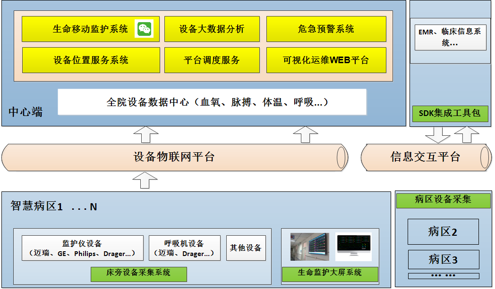{width="6in"}

#### 提升医疗服务效率

医疗设备数据采集可以实现医疗数据的自动化传输和存储，减少人工录入和纸质记录转抄的环节，节省医护人员的时间，同时避免了人工记录的错误，提高医疗数据的准确性和及时性，优化医疗流程，提高医疗效率，将医护人员的时间更多的用于患者诊疗。

#### 保障医疗质量与安全

**精准自动采集**：通过对医疗设备数据的采集，包括监护仪、呼吸机、麻醉机、输注泵、体外循环机、PICCO、血气机、血透机、血滤机、体温计、血压计、血氧仪、血糖仪、暖箱等，可以实时获取患者的生理参数等详细信息。利用这些实时客观数据，为医生提供基于设备数据的临床决策支持，提供更准确的诊断依据，帮助医生做出更精准的诊断和治疗方案。

**实时风险告警**：

1. 通过对医疗设备实时采集到的患者生命数据的实时监控和分析，及时发现潜在的安全隐患和风险，进行预警和处理，保障患者安全。

2. 通过对医疗设备运行时的实时监控，实时抓取设备本身报警信息，保障患者使用设备时的安全。

**优化资源配置**：根据对医疗设备的使用频率、使用时间、故障率等数据进行统计分析，优化医疗资源的配置，提高资源利用效率。帮助其制定更加科学合理的医疗资源配置方案。

#### 推动医疗智能应用

基于医疗数据中心的数据支持，将数据分析结果与医疗过程相结合，实现智能化的医疗应用，如智能诊断、智能治疗等，提高医疗服务质量和效率。

#### 促进医疗科研创新

为医学科研人员提供丰富的设备数据资源，包括多维度的生命体征参数，及长期的诊疗样本数据链，从而建立数据分析模型，支持科研项目的顺利开展。

### 功能设计

#### 床旁设备采集系统

采用先进物联网技术和医疗设备采集技术，突破医疗厂家的数据接口协议壁垒，做到设备兼容性高、部署简单，真正全方位的患者生命监护，特别是重症监护室（ICU）、急诊科等需要密切监测患者生命体征的科室。在ICU中，系统能够实时监测患者的生命体征、波形、血流动力学参数、呼吸机参数等数据，为医护人员提供全面的患者信息支持；在急诊科中，系统则能够快速采集患者的生命体征数据，为急诊救治提供有力支持。

#### 系统特点

**实时性**：系统能够实时采集床旁设备的基础数据和报警数据，确保医护人员能够及时了解患者的病情变化。

**便携性**：系统支持连接院内WIFI，结合移动式医疗设备，实时传输患者生命数据，尤其是患者在转运过程中的体征数据。

**准确性**：通过标准化的数据采集流程和高质量的物联采集盒，毫秒级抓取医疗设备数据，确保采集到的数据准确无误。

**集成性**：系统能够集成多种床旁设备的数据，实现数据的统一管理和分析。

**全面性**：系统支持采集的设备类型包括但不限于：监护仪、呼吸机、输液泵、血气分析仪、心电图机、除颤仪。

- **监护仪**：采集监护仪的生命监护数据（心率、脉搏、呼吸频率、SPO2、体温、无创血压、有创血压、PiCCO模块、脑氧模块、BIS模块等）。

- **呼吸机**：采集呼吸机的呼吸通气参数（呼吸模式、吸呼比、控制呼吸频率、自主呼吸频率、气道最低压、气道压峰值、吸气平台压、气道平均压、呼气末正压、潮气量、吸气压、肺顺应性、吸气时间、每分通气量、动态顺应性、PC、PS、FiO2等）。

- **输液泵**：采集输液泵或输液工作站的输液参数（输液总量、余量、输液时间、泵速等）。

- **血气分析仪**：可采集血气分析仪、POCT机等化验数据（pO2、pCO2、Cl-、pH、Glu、Hb、Hct、BE(B)、Ca++、K+、Na+等）。

- **CRRT**：可采集床边CRRT设备数据（脱水量、废液、置换液、透析液、跨膜压、脉率等）。

- **彩超机**：可采集床边彩超机/超声设备数据（影像、图像、数据报文等）。

- **脑电仪**：可采集床边脑电仪设备数据（肌电、眼电、心电及呼吸、体温、皮肤、加速度、血氧饱和度等）。

#### 系统功能

##### 患者绑定

通过移动设备扫码患者与监护设备，将患者与设备建立绑定关系，护士本班次结束前在护士台软件上一次性选择设备采集的数据，归入病人上，即节省了手记时间，又杜绝了设备数据"张冠李戴"的问题。

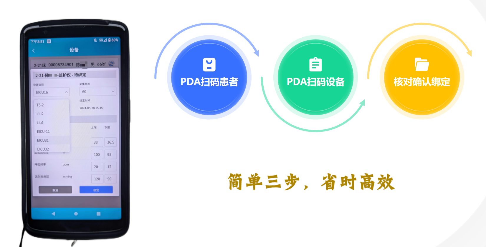{width="6in"}

#### 数据采集模块

设备开机后，结合物联采集盒，将自动进行设备数据获取，根据不同设备类型，自动匹配解析协议，将数据从机器语言转换为系统交互语言，从而被上层系统所使用。

**通信方式**：

- 以太网接口：提供稳定、高速的数据传输，适用于医院内部的局域网连接。可以通过TCP/UDP协议将数据传输到医院的中央服务器或监护系统。

- Wi-Fi模块：支持802.11协议，能够实现无线数据传输。在医院内部的Wi-Fi网络覆盖下，可以通过TCP/UDP协议方便地将数据传输到服务器或移动终端。

- 蓝牙模块：用于近距离的移动设备（如体温计、血压计、指脉氧仪、血糖仪）进行连接和数据传输，方便医护人员在床边进行数据查看和操作。

#### 数据存储

系统将采集到的数据按照一定的格式进行存储，建立数据索引和数据库，以便后续的数据查询和分析。同时，要考虑数据的安全性和完整性，防止数据丢失或损坏。

### 设备数据监测系统

#### 设备管理

系统中可以按照设备类别，以卡片形式查看设备列表，列表中显示当前使用患者，以及最后数据上传时间，并用不同背景色标注设备的在线/离线状态。

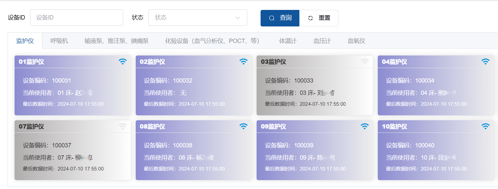{width="6in"}

#### 患者管理

系统与HIS系统进行对接，实时获取当前病区的患者入出转记录，以卡片形式展示床位信息，包含当前使用床位的患者，以及患者所绑定使用的设备列表和使用时长。

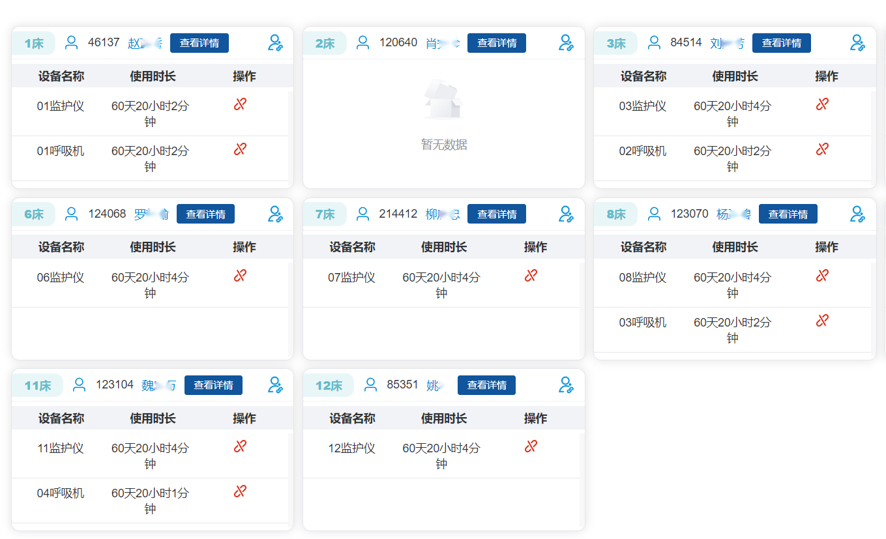{width="6in"}

#### 设备数据查询

系统支持按照时间范围及数据频次查询各设备(包含监护仪、呼吸机、输液泵、血气分析、血滤设备等)的采集数据，展示该设备采集到的体征名称、体征数值、数据时间等。

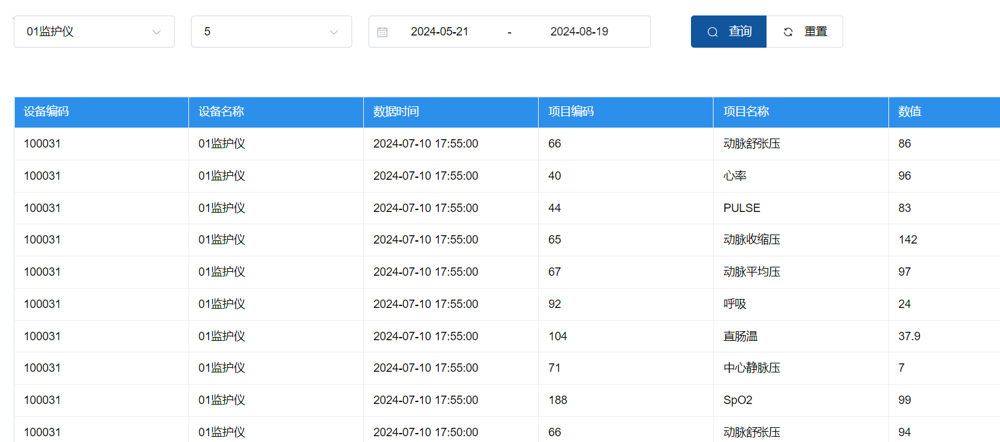{width="6in"}

#### 报警管理

系统详细记录患者体征报警数据，包括产生报警时的体征参数、值、时间，以及解除报警时，体征的值和解除事件的时间。

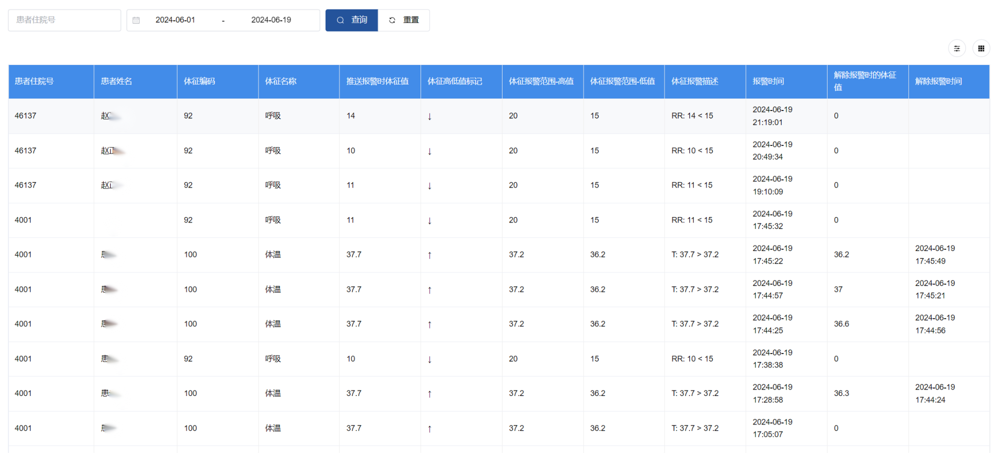{width="6in"}

#### 患者数据追溯

系统对已存储的患者体征数据，支持按时间进行追溯，体征数据按时间轴方式绘制折线图进行展示，波形数据以时间范围进行波形绘制展示。

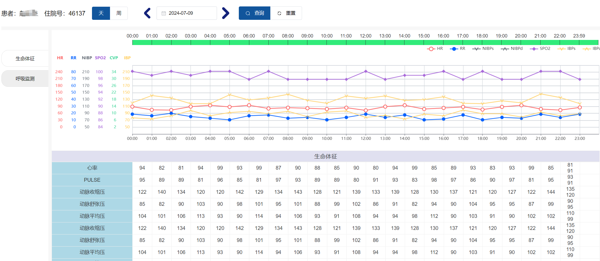{width="6in"}

#### 超声、脑电、心电图采集管理

系统支持患者超声、脑电、心电图实时数据采集，支持按时间进行追溯，采集数据按列表方式进行展示，支持数据下载、在线预览、影像播放等功能，数据以时间范围进行存储展示。

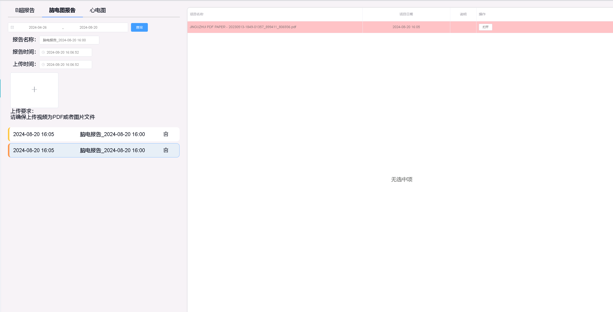{width="6in"}

#### CRRT数据查询

系统支持按照时间范围及数据频次查询CRRT设备的采集数据，展示该设备采集到的项目名称、患者数值、数据时间等。

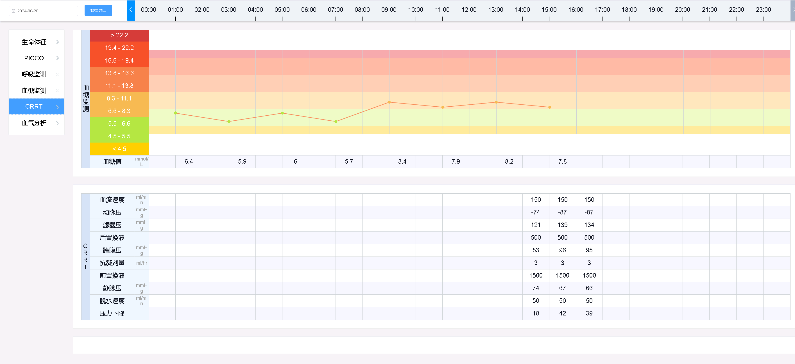{width="6in"}

### 设备数据大屏系统

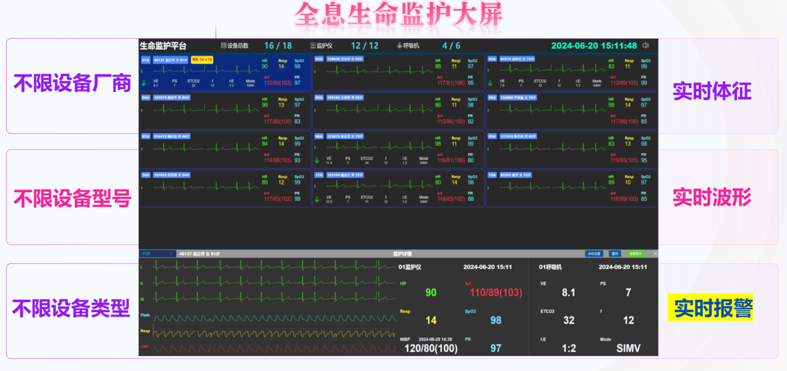{width="6in"}

#### 系统特点

- **不限品牌**：超越常规的监护仪中央站，大屏系统没有限定品牌的要求。

- **不限型号**：不同品牌的不同型号都可以在大屏进行展示。

- **不限类型**：除不限品牌、型号外、大屏系统可以多种类型设备(监护仪、呼吸机、输液泵等)进行同画面显示。

- **融合显示**：系统支持融合显示体征数据、波形数据、呼吸数据、输液数据等多维度、多形态的数据。

- **实时报警**：系统实时接收患者体征或设备报警推送。

#### 系统功能

##### 设备数量统计

系统按病区展示设备总数量及使用数量。

##### 床位列表

系统按照卡片式显示床位列表，包含床位编号、当前患者信息等。支持同屏显示≥15张床位。

##### 实时波形/体征

系统按秒级刷新展示患者的体征和波形，并支持配置需要展示的主波形和其他波形的名称及参数。

##### 患者选择

系统可以使用鼠标或其他遥控方式，滚动下拉整个床位列表，选择需要查看的患者。

##### 患者置顶

系统可以将需要重点关注的患者进行置顶显示，可同屏显示≥6个重点关注患者。

##### 报警信息

系统在床位列表中，实时获取患者体征报警信息，当患者体征存在报警时，以不同卡片背景色进行区分，并展示具体报警参数，以及报警体征值和正常体征值的比对信息。

##### 更多信息

系统通过副页的方式，展示除主屏显示体征外的其他患者生命数据。

### 医疗设备物联平台

医疗设备物联平台利用物联网技术，将医院内的各种医疗设备（如监护仪、呼吸机、输液泵等）与医疗信息系统进行连接和集成，进行数据存储、清洗、整理，从而实现设备间的数据交换、信息共享和协同工作的平台。

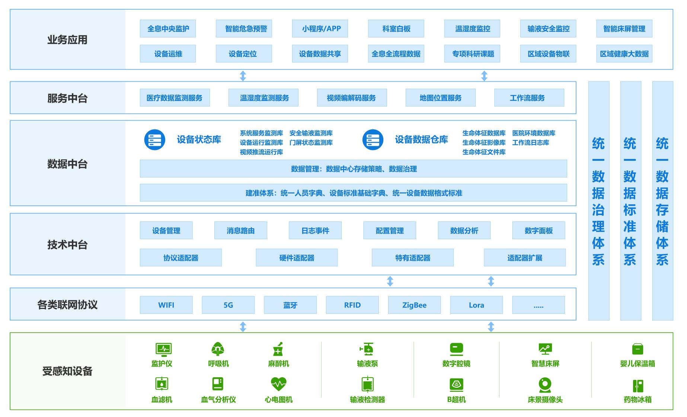{width="6in"}

#### 数据存储

- 利用大数据存储技术，安全地存储大量医疗设备数据。

- 提供数据备份和恢复机制，确保数据的安全性和可靠性。

- 支持数据的分类、索引和检索，方便数据统计及用户快速查找所需信息。

#### 数据整合与共享

**数据集成**：将来自不同医疗设备、不同系统的数据进行集成，打破数据孤岛，实现数据的统一管理和共享。例如，将医院各个科室的医疗设备数据集成到数据中台，医生可以在一个平台上查看患者的所有医疗设备数据，提高诊断和治疗的效率。

**数据共享**：通过数据接口和服务，实现医疗设备数据在医院内部各部门之间、医院与外部机构之间的共享。例如，可以将患者的医疗设备数据共享给移动护理系统、重症信息系统、手麻系统、电子病例系统等，直接将患者体征数据展现到相关的医疗文书中，甚至是将数据共享给科研机构，用于医学研究和临床试验。

#### 数据安全

**数据加密**：对传输和存储的数据进行加密处理，防止数据被窃取和篡改。例如，采用SSL/TLS协议对网络传输的数据进行加密，使用数据库加密技术对存储的数据进行加密。

**访问控制**：设置严格的用户访问权限，只有授权用户才能访问相应的数据和功能。采用基于角色的访问控制等技术，对不同用户角色（如管理员、设备维护人员、第三方医疗系统厂商等）进行权限划分。

**数据备份与恢复**：定期对数据进行备份，以防止数据丢失。制定数据恢复策略，确保在数据丢失或损坏的情况下能够快速恢复数据。

#### 系统监控

实时监控平台的运行状态，包括服务器性能、网络流量、数据存储情况等。及时发现和解决系统故障和性能问题。

#### 统计分析

通过采集设备的使用状态，系统可自动计算各个设备使用率和使用时长，可有效避免原来定性管理中可能遇到的主观性问题，从而节约成本、优化设备配置、提供医疗设备资源的使用效率。利用数据共享技术，通过设备使用情况等因素，可分析出病区内每种医疗设备具体的使用时长，为医院整体效益分析提供数据支撑。

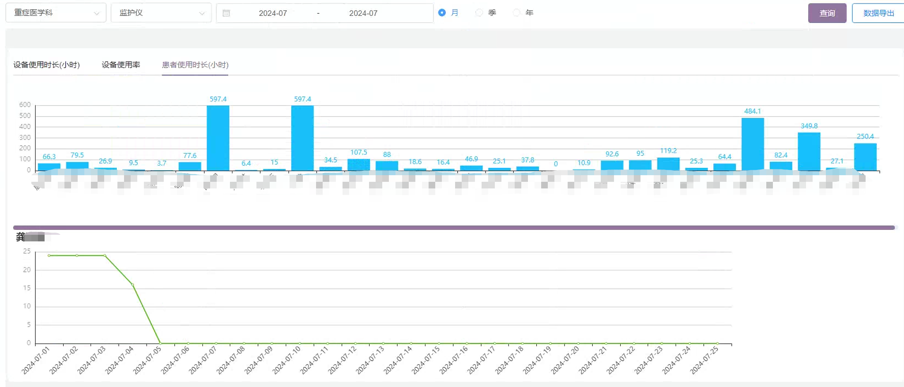{width="6in"}
