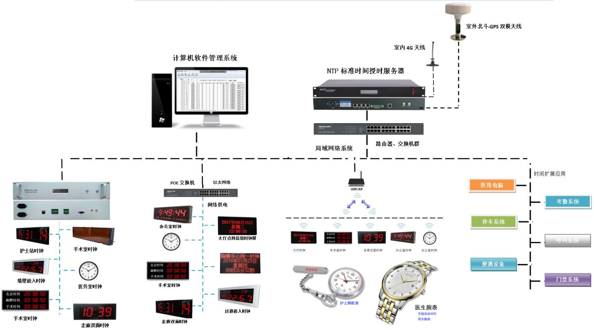

## 时钟系统

### 系统概述

医院时钟系统主要为全医院的计算机系统及呼叫系统、BA系统、手术室控制系统以及其它弱电子系统提供标准的时间源，为医嘱、考勤、财务中心、库房等关键部门都可以获得精确、统一标准时间；子母钟系统为麻醉室、手术室、供氧呼吸系统提供正计时、倒计时、不同项目计时、温度和湿度显示功能，为护士站的工作人员对特护病人，重症观察患者、医生提供及时、精确的护理时间参考，从而使整个医院提供了标准的时间，保证了整个医院准时、安全正常运行。

终端设备管理软件可以对NTP授时服务器、母钟和子钟进行实时管理，巡查和控制功能。

采用终端设备管理软件、GPS/北斗母钟，子钟、通信控制器、NTP时间服务器构成，给医院的各个重要地方提供时间信息。给手术室提供倒计时正计时温度湿度标准时间等。

因此,在医院内重要区域提供一套可靠、经济和有效，能够提供一个统一的、标准的全院时间的子母钟系统对医院的数字化管理和医院各部门的统一协调意义重大。

### 设计方案

{width="6in"}

### 系统功能

医院时钟系统主要为全医院病房、多媒体、停车系统、门禁系统、考勤系统、医生和护士个人、视频监视系统、办公电脑、大厅显示大屏等，提供全方位时间同步服务，实时控制和管理终端设备，同时能长期监控终端设备、故障、报警、工作状态等信息。

终端设备巡查与管理软件统一管理NTP标准授时服务器、点阵时钟屏、数码时钟屏、指针时钟屏等终端设备。能够实现查询所有终端设备，也可以分类查询终端设备，实时配置点阵时钟屏文字显示信息，实现定期巡查终端设备，并将故障记录在文件内，实时配置终端设备的开关机、倒计时、授时服务器IP、时区、授时周期、显示亮度等常规信息，查询终端设备的种类、开关机、倒计时、授时服务器IP、时区、授时周期、显示亮度、显示颜色、供电、尺寸、温湿度等信息。

各病房、楼道的时间显示屏，在脱离管理软件的情况下，均可以通过授时服务器获取准确的时间，并同步本终端的工作与显示时间；断电后，能进入守时模式；

NTP标准时间授时服务器时间来源为GPS/北斗、4G/CDMA或上级授时服务器时间，以保证有准确的授时时间；断电后，能进入守时模式；时间服务器的配置可以根据客户需求选择。

中心母钟时间源时间来源为上级授时服务器时间，以保证有准确的授时时间；断电后，能进入守时模式；时间服务器的配置可以根据客户需求选择。