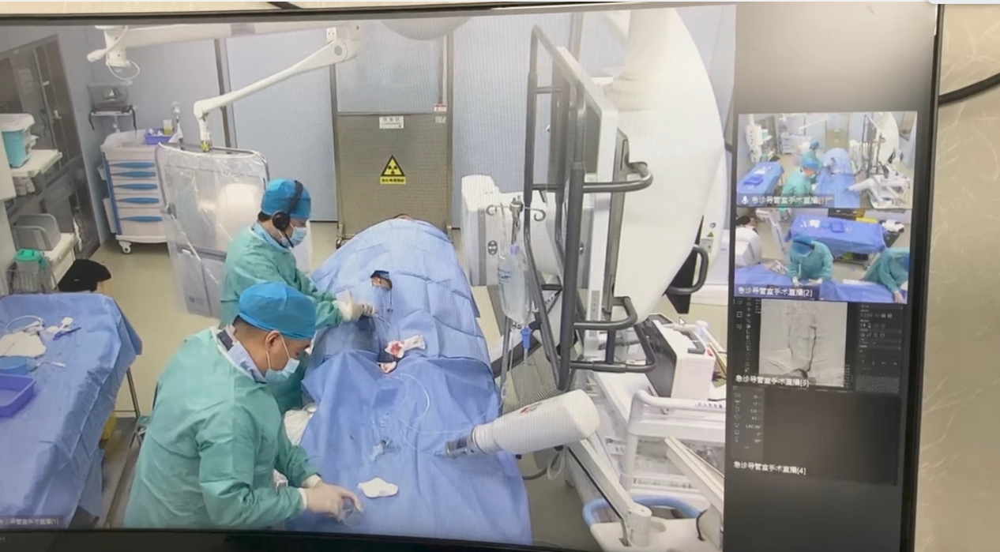
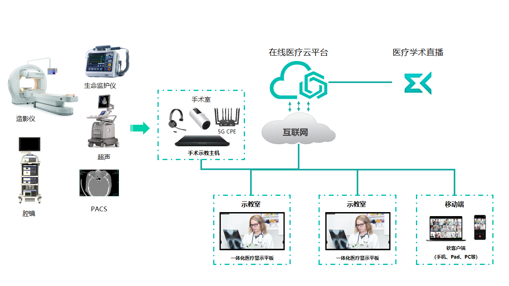
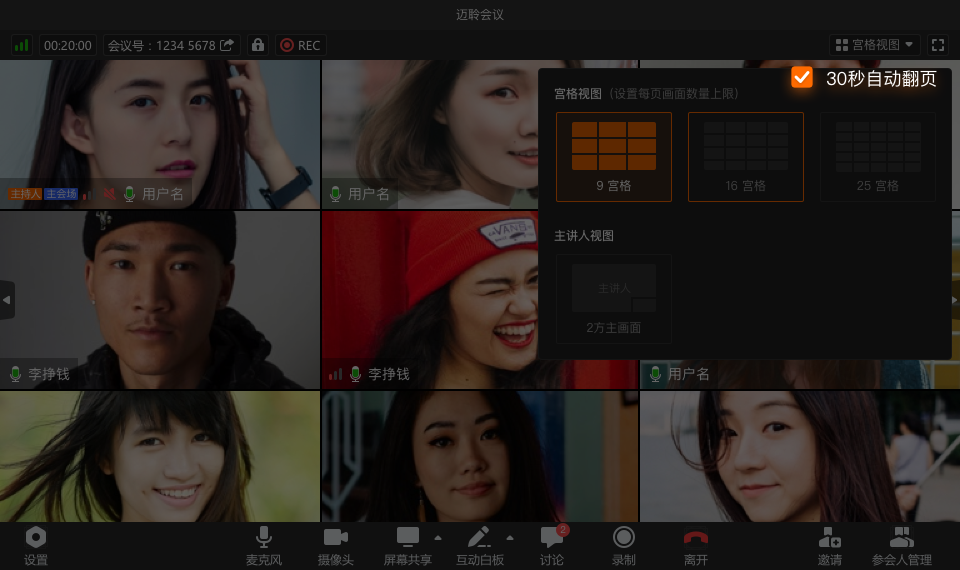
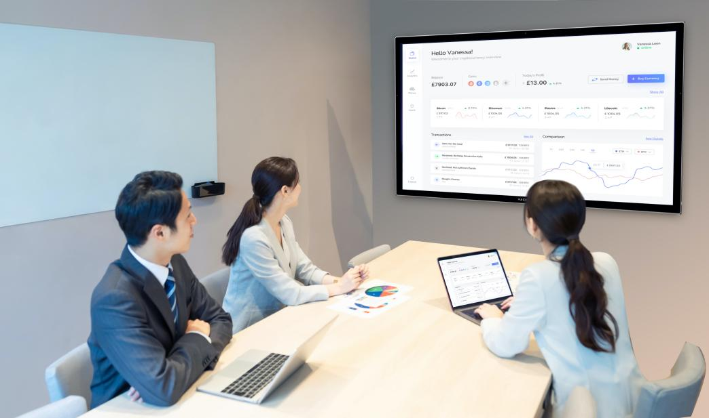
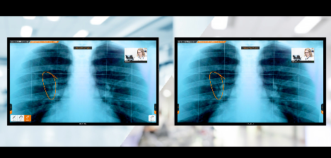
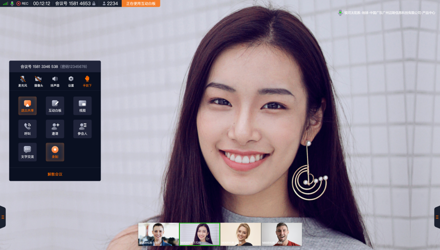

## 手术室示教系统

### 系统概述

传统模式的手术现场示教，受限于手术室空间，观摩人数受众较少；受限于观看角度，手术细节观看不清晰；而且考虑到手术卫生和病人权益，手术示教经常受到病人和家属抵制。

通过远程会诊技术和视频技术的应用，对临床诊断或者手术现场的手术示范画面影像进行全程实时记录和远程传输，使之用于远程手术教学。同时为了适应手术教学以及手术转播需求的不断提高，以及当前国内医院手术转播的现状，手术示教优点在于利用医院现有网络，节省大量建设经费、手术过程和细节信息实时而且高清晰，对接各种微创镜类手术设备，提高教学效果、随时随地的观看想要观看的手术过程，完全摆脱了传统示教模式在时间、空间和人数上的限制、资料的录制和备份方式先进，查询方式简便，观看方式多样、灵活、无地域限制等。

基于远程医疗的新手术示教方案，本次建设系统则解决了上述弊端。在急诊及八号楼两间手术室，通过视频融合系统将手术示教、指导真正融合到现在的临床医疗当中，满足医院其他科室、以及联合医院的帮扶功能。

医生通过网络在示教室或会议室观看手术室手术现场直播情况。在示教室或会议室通过远程会诊终端设备实时观看手术情况，并实现语音视频同步，双向交互，达到观摩者在示教室现场提问，手术室专家同步解答的效果，清晰流畅无延迟；高保真的音视频效果，避免回音与噪音干扰。

{width="5in"}

### 设计方案

{width="5in"}

1. 支持同时传输多路高清音视频信号（术野相机、全景相机、造影、心电监护、内窥镜、PACS等）输入。
2. 医生通可以在报告厅、示教室或个人端观看手术室手术现场情况，并且可以实现与主刀医生双向音视频互动，达到观摩者现场提问，手术室专家同步解答的效果。
3. 支持最高2路4K超高清视频传输或4路1080P高清视频传输，视频高清流畅，音频高保真。
4. 支持多场景接入。
5. 通过互联网连接公有云服务，便可以将手术室内画面直播，通过手机、电脑即可参与，观看手术直播、示教、指导。

### 系统功能

#### 开启会诊及示教方式

可通过医疗显示平板可直接呼叫发起，无需其他人协助，如果呼叫不成功，根据反馈的提示信息（类似于对方忙等），用户做少许操作即可完成呼叫进行高清音视频通话，进行远程会诊、远程手术示教、远程手术指导。需要提前预约时，只需要输入会诊或示教时间、勾选参加科室医生、平台同步发出预约。

{width="5in"}

#### 多画面布局

远程手术录播示教平台支持多种画面布局，支持画面轮训，轮巡间隔时间可设定30s。支持主示教室模式，该模式下所有分示教终端看到的视频与主示教室一致，同时支持语音激励。

{width="5in"}

#### 数据共享

支持参加医生将自己的大屏或电脑屏幕共享给会诊、示教中的所有医生，参会人均可通过大屏、电脑、手机等各种终端观看屏幕演示。最高支持2.5k分辨率。支持通过共享桌面形式共享多媒体文件给其他医生，效果清晰流畅，丰富了会诊、示教的表达方式，提升了远程录播示教平台的功能和市场价值。支持屏幕共享、屏幕选定区域共享、应用程序共享。

{width="5in"}

#### 互动批注

远程会诊过程中，医生分析病患医学影像，专家根据影像资料分析病灶，针对性探讨诊疗方案。医学研讨中，医疗专家针对重点医学诊疗方案，通过系统批注，指导定向优化和修改。

{width="5in"}

#### 双流功能

远程医疗中常常需要同时传送患者的医学诊断图像和患者的图像，支持2.5K超清双流分享，能够集成电子阅片软件，快速调用，解决医疗行业高清阅片痛点。日常院内诊断研讨，要求分享实时数据实现超清效果呈现，远端专家（主任医师）能够精准分析患者医学影像材料判断器官病灶，以便针对性做出科学诊断方案。

{width="5in"}

#### 示教室锁定

支持锁定会诊，当锁定会诊室后，即使有该会诊室的账号和密码，也不能进入远程会诊室。

#### 会诊、示教录制

支持将远程会诊、远程示教、指导过程中所有的音视频信息、屏幕信息如电子白板、文档共享、协同浏览等实时录制下来，录制文件保存类型为MP4格式，录制文件默认存储本地，可选择设置录制文件存储的路径。

{width="5in"}

#### 会诊控制功能

本系统内置主持人会诊控管理，让会诊秩序有条理！可实现主持人权限转移、锁定/解除全体静音、调整布局、锁定会诊室、结束会诊等功能。

支持独立web端会控，无需加入会诊，即可掌控会诊秩序，保障远程会诊、手术示教、指导有序开展。

{width="5in"}

#### 管理后台

管理平台是配合客户端使用，方便医院用户进行管理，其中包括通讯录管理、会诊室管理、医疗显示平板等设备管理、计费管理、医院管理员权限设置等管理模块，并提供医院使用进行的会诊、示教数据统计。
