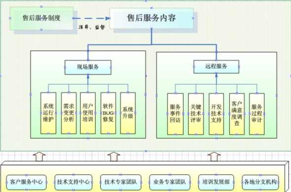

## 售后服务方案

系统的售后体系主要负责系统在终验之后的运行维护阶段，对于各相关用户在云服务+ICU探视系统管理平台运行使用过程中产生的问题解答、故障处理以及包含软件升级、第三方软件支持在内的应用系统日常运行维护，并负责系统的需求变更等服务。

售后服务的主要目标

- 保证护理呼叫、云服务+ICU探视系统正常运转
- 日常维护与排除故障并重
- 保证护理呼叫、云服务+ICU探视系统无故障运行的同时优化系统性能
- 收集服务评价，不断改进服务质量

一、售后服务体系

本项目将基于公司总体的售后服务组织体系，为提供更加快捷、更高质量的售后服务，特别设计如下组织机构：

二、售后服务内容

在产品维护期限内，我方提供如下服务：

1. 服务内容

协助医院完成软件产品的安装；软件产品的基本配置；对医院在使用软件过程中遇到的技术疑难问题进行解答，对医院日常使用过程中的操作问题进行技术指导；对软件在应用中发生的故障及时进行查核和排除。

2. 服务方式

客户服务热线、传真、远程访问、工程师到现场进行技术服务等方式。

2.1 本地工作日电话支持（Local Business-Day Telephone Support）

医院可以在本地工作时间内拨打我方技术支持热线，我方在设有研发中心和技术支持中心：

- 支持电话: 0592-5760256
- 工作时间：周一至周五 9:00～17:30（北京时间）

2.2 远程诊断服务（Remote Diagnostic Service）

医院通过自身尝试仍不能解决故障时，可请求我方工程师进行远程诊断。
工作时间：周一至周五 9:00～17:30（北京时间）

3. 服务级别及响应时间

医院的每次技术支持服务请求分为三种级别，服务级别的划分取决于对应用系统运行的关键程度和备用资源的合理调用，并依服务等级的不同，决定相应的服务响应方式和响应时间。

3.1 全面加急服务：指软件故障对全部系统的运行产生关键性影响，导致应用系统无法正常运行或者系统瘫痪的情况。

3.2 加急服务：指软件故障对系统运行产生部分影响，导致个别网点业务停顿或者应用系统中非关键部分失效、性能部分下降但对全部系统运行不构成关键影响的情况。

3.3 常规服务：指对系统不构成影响的技术支持服务请求等。

| 服务级别 | 电话和远程服务时间 | 现场支持服务响应时间 |
|----------|-------------------|-------------------|
| 全面加急服务 | 24小/天，7天/周 | 现场维护2小时之内答复、24小时之内到达；或者依服务请求发生时间及交通运输的实际情况最快到达用户现场 |
| 加急服务 | 9:00～17:30（周一至周五）| 4小时；或者在医院同意下第2个工作日到达用户现场 |
| 常规服务 | 9:00～17:30（周一至周五，公共假期除外）| 不提供现场支持服务；提供邮件支持服务、在线支持服务、电话支持服务、远程诊断服务 |

注：如果不是我方软件故障，而是医院遇到自身无法解决的与我方软件相关的问题时，可请求我方通过远程或到现场协助解决。如果需要我方到现场支持，双方根据具体情况，协商收取现场服务费用，一般按实际工作日收费。

4. 产品升级服务

产品在安装验收免费提供软件版本升级，免费提供补丁包。

根据服务内容的性质，不同的服务拥有不同范围的服务级别，不同级别的服务将配备不同的流程与资源：

| 服务编号 | 服务内容 | 服务分析 |
|----------|---------|----------|
| A | 日常问题与故障服务 | 用户发起，可能出现紧急需求，处理可能短时间完成 |
| B | 基础环境保障服务 | 用户发起，可能出现紧急需求，处理可能短时间完成 |
| C | 应用系统升级（含补丁）服务 | 需求一般不紧急，处理也很难在短时间完成 |
| D | 应用系统软件Bug的修复 | 用户发起，可能出现紧急需求，处理可能短时间完成 |
| E | 第三方软件支持服务 | 需求一般不紧急，处理也很难在短时间完成 |
| F | 收集反馈需求、需求变更落实 | 需求一般不紧急，处理也很难在短时间完成 |
| G | 收集服务评价 | 不紧急，处理需要时间 |

4.1 日常问题与故障服务

在应用系统运行维护过程中，对用户碰到的日常功能操作、流程执行等问题给予技术支持。包括：

- 应用系统操作使用问题解答并落实
- 业务流程执行操作问题解答
- 将应用系统常见问题与解答整理成FAQ文档，提交给用户

4.2 基础环境保障服务

针对系统运行过程中相关软硬件、网络、操作系统等基础环境故障的处理。

4.3 应用系统升级（含补丁）服务

在应用系统升级时启动系统升级服务支持。我公司系统升级服务支持是核心服务方式之一，目的是保证系统在升级之后新功能可以正常、有效地发挥作用，同时保证原有功能不受升级的影响。应用系统升级服务包括针对软件问题的补丁服务。

系统升级支持服务由售后服务组提供。

4.4 应用系统软件Bug的修复

对于应用系统软件出现的任何Bug进行修复。

4.5 第三方软件支持服务

对于由我公司采购的第三方系统软件或其他相关软件出现问题，我公司将协调原厂商，对第三方软件提供质量保证期内的免费维护和技术支持服务。

4.6 需求收集整理与需求变更

对用户在使用应用系统过程中产生的使用不便、业务需求变更甚至功能增加等情况，服务团队负责收集用户反馈，并对于小范围功能改动进行需求变更工作的服务。

4.7 收集服务评价

在整个售后服务阶段，积极收集用户对于服务的评价，并进行总结，进而优化流程，改进服务质量。

三、售后服务方式

主要包括常规服务和应急服务两种方式。

1. 常规服务的方式

通常情况下，提供6种服务方式，客户可以根据自己的实际情况选用：

| 服务方式 | 及时性 | 友好性 | 独立性 | 公开性 | 可用性 |
|----------|--------|--------|--------|--------|--------|
| 现场沟通 | **** | ***** | * | *** | 5×8 |
| 电话沟通 | ***** | **** | * | * | 7×8 |
| 远程登录 | ** | *** | * | * | 7×8 |
| 网上教程 | ***** | * | ***** | * | 7×24 |
| 用户培训 | * | **** | * | ***** | 5×8 |

服务的需求千变万化，客户可根据需求的实际特点进行选择，比如：

- 当客户需要非常快速的响应时，推荐首选的是电话沟通
- 当客户需要较独立的分析和思考时，推荐首选的是电子邮件的方式
- 当客户需要较多的讨论时，推荐首选的现场沟通的方式
- 当客户需要的是操作指导时，推荐首选的是网上培训的方式
- 当客户中很多人面临相同问题时，推荐首选的是用户培训的方式

1.1 现场沟通方式

售后人员在客户处通过面对面的方式进行交流，通过分析、定位、排查等方法解决问题，并做好工作日志的记录。

1.2 电话沟通方式

客户对系统有疑问或者需要投诉时，拨打双方协商的电话号码，获取相应的支持服务。

1.3 远程登录方式

根据故障情况，可采用远程登录的方式，为用户提供售后技术服务。

1.4 网上教程方式

把应用系统的培训内容、应用实例、经典案例以及优秀推广经验作为共享知识资源，制作成简明易懂、形象生动的学习课件，放置在服务网站中，用户只需要提供登陆的用户名和密码就可以获取以往所有培训课程的课件资料，方便用户重复学习与提高。

1.5 用户培训方式

售后人员根据客户提出的培训需求，基于实施过程中的培训材料进行个性化修改，按照要求的时间和地点进行培训讲解，并将培训材料提供给客户，以方便客户的重复学习。

2. 应急服务的方式

对系统的故障和重大技术问题，售后工程师将在最短时间内赶到用户现场，及时进行现场技术支持。

- 灾难性事件：因应用系统原因造成灾难事件发生的，本公司立即组织开发队伍进行协作处理；由于病毒或其他非应用系统原因造成的灾难性事件（包括系统不能启动等），本公司协作解决，恢复到可运行状态
- 严重程序错误：确因系统开发问题而可能造成程序错误，本公司立即组织开发队伍进行修改，并升级原有系统
- 一般程序错误：程序出现开发上的微小影响的错误，本公司组织开发队伍进行修改
- 属于用户使用不当发生问题的，本公司将通过电话进行指导

当用户的系统发生技术问题后，客户服务系统允许用户定义自己的严重程度和委托响应时间，用户可从以下几种严重程度中选择一种：灾难性的、严重的、一般的。

在下面的表格中，"立即通知"表示本公司将立即把用户需要告诉相应的工程师。

| 分类 | 严重程度 | 电话(传真) | 到达现场 |
|------|----------|------------|----------|
| 已在现场 | 任意 | 立即 | 立即 |
| 未在现场 | 灾难性(系统严重损坏) | 立即通知 | 在接到服务请求电话后 1 小时内到达现场，8 小时内出故障诊断 |
| 未在现场 | 严重(系统错误) | 在接到电话后的 30 分钟内响应 | 2 小时内到达现场，24 小时内出故障诊断 |
| 未在现场 | 一般 | 在接到电话后的 30 分钟内响应 | 4 小时内到达现场 |

到场维护时间：系统发生灾难性和严重故障，本公司将在电话回复之后，以最快的方式赶到客户现场提供维护服务。

四、专业服务团队

项目进行专人专项定点服务，如有变动会及时转告。服务团队主要联系人、联系电话等如下：

| 服务单位名称 | 厦门狄耐克物联智慧科技有限公司 |
|--------------|--------------------------------|
| 服务单位地址 | 火炬高新区创新路2号 |
| 服务单位电话 | 4000-300-884 |

| 姓名 | 职务 | 电话 | 担任服务角色 |
|------|------|------|--------------|
| 季伟平 | 项目经理 | 13799288317 | 项目总负责人 |
| 江育威 | 售后系统调试技术员 | 18016100227 | 系统升级调试负责人 |
| 夏小彬 | 技术经理 | 15980969875 | 技术保障负责 |

五、售后服务流程

1. 故障报修

当故障出现时：

1.1 可拨打公司技术支持电话，我们的技术人员会和您进行交流，在了解具体情况之后，转交给技术工程师尽快解决问题。

1.2 可通过公司的邮箱：进行留言，商务人员会尽快处理这些邮件信息，并将相关情况通知技术工程师，以便尽快解决问题。

2. 故障诊断

通过对故障情况的分析，工程师将采取相应的方法进行诊断

2.1 电话协助
在问题清楚，易于操作的情况下，技术工程师可以通过电话直接和用户沟通，协助用户进行问题诊断。

2.2 远程协助
如果问题相对复杂，无法使用语言准确说明情况，工程师将在获得用户允许之后，通过远程登录对设备进行检查，调试，以帮助用户诊断问题。

2.3 现场协助
如果问题很严重，电话和远程都无法进行协助的时候，工程师将以最快的速度赶到现场，在现场进行检查调试，帮助用户判断问题。

3. 故障处理

经过多方面的检查、调试和诊断

3.1 属于调试、软件升级等软故障的，工程师以最快的速度协助或当场解决问题；如果当场解决不了的，有义务向用户说明详细原因，并拿出合理有效的解决方案。

3.2 属于配件故障、损坏等硬故障的，在与用户协商并获得同意后，工程师将及时的把信息反馈给公司的商务人员；在核对完设备所需的配件型号准确无误后，商务人员会在第一时间向公司申请配件。   

4. 处理结果的反馈

不论使用那种解决方式，我们的技术工程师都会紧跟全过程，并与用户随时保持联系；对处理细节进行有效沟通，并把故障发生的原因，处理的方法以及最终的处理结果形成文字报告，记录存档以进行产品的服务跟踪，并把结果反馈给用户，直到用户要求得到最终满意为止。

5. 服务响应时间及措施

5.1 正常状态

(1) 10分钟内对服务作出电话响应，服务人员现场反应时间为60分钟，普通故障排除时间为4小时。

(2) 如果故障现象在4小时内未能得到解决，我们将在故障发生的12小时内提供代用设备以替换故障件，确保在解决问题的过程中用户的工作能继续进行。

5.2 应急状态（重大事件）

在接到用户的紧急设备故障通知后，我们会立即准备应急方案和工具、备件。技术人员将利用身边最快的交通工具尽快赶赴现场，60分钟内到达。我们将利用公司的所有资源在12小时内解决问题，有硬件报修的立即进入硬件报修流程。

我们将采取应急措施：

(1) 主管技术工程师7*24小时无间断技术响应。确保故障发生后，用户能在第一时间内联系上我们并得到技术支持。

(2) 针对情况复杂，难以迅速找出准确原因的疑难故障。公司将组织资深技术工程师进行技术会诊，并拿出最合理有效的解决方案。

(3) 对设备上的常用配件，公司长期备有库存。当发生配件损坏需要返修时，我们将提供可供更换的配件。把对用户的影响降至最低点，以确保用户的使用，完成配件返修的完美衔接。

(4) 在必要的情况下，我们将联系制造厂家的技术人员以取得进一步的支持，甚至协调安排厂家技术工程师上门维修。

6. 定期回访服务

6.1 我们将提供每季度一次的对用户的定期回访制度，保证同用户的交流和沟通。为用户带去最新的技术资讯，及设备厂商发布关于设备的最新注意事项。

6.2 通过回访，根据用户的使用环境、对设备具体要求等的变化，对我们的原有服务方式进行调整和修改，以提高我们服务的质量和水平。

6.3 每年315国际消费者权益日，狄耐克定于此时启动全国扫雷活动，为每一位客户进行免费更换维修损坏的本司出厂设备。
